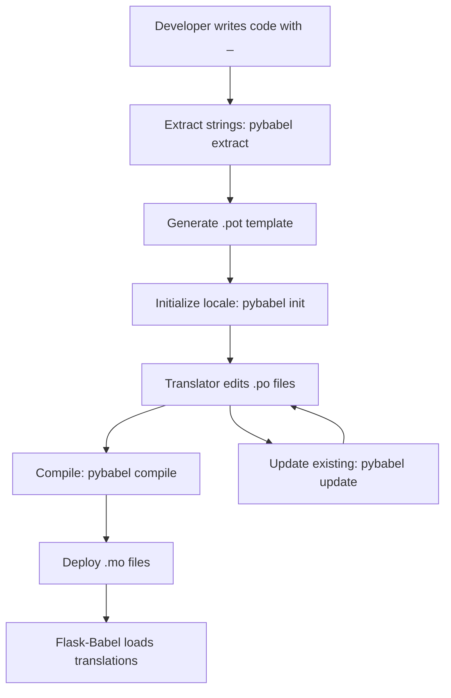

# Multi-Language Architecture & Header/Footer Extraction Plan

## Executive Summary

This document outlines a comprehensive plan to refactor the Korzen Flask application to support multiple languages (with Polish as default) and extract common header/footer elements into reusable Jinja2 templates.

**Current State Analysis:**
- 8 HTML templates with embedded English text
- Significant code duplication in headers and navigation
- No internationalization (i18n) infrastructure
- Inline CSS in every template (7,000+ lines total)

**Target State:**
- Flask-Babel integration for i18n/l10n
- Polish as default language with English support
- Base template with extracted header/footer
- Centralized CSS in external stylesheet
- Language switcher in UI

---

## 1. Current Template Structure Analysis

### 1.1 Template Inventory

| Template | Lines | Key Features | Translatable Strings |
|----------|-------|--------------|---------------------|
| [`index.html`](src/app/templates/index.html:1) | 862 | Upload form, file list, pagination | ~45 strings |
| [`persons.html`](src/app/templates/persons.html:1) | 886 | Person records table, expandable details | ~60 strings |
| [`baptisms.html`](src/app/templates/baptisms.html:1) | 542 | Baptism records table, filters | ~40 strings |
| [`marriages.html`](src/app/templates/marriages.html:1) | 569 | Marriage records table, spouse details | ~45 strings |
| [`deaths.html`](src/app/templates/deaths.html:1) | 572 | Death records table, sacraments info | ~45 strings |
| [`duplicates.html`](src/app/templates/duplicates.html:1) | 927 | Duplicate detection UI, comparison | ~70 strings |
| [`graph.html`](src/app/templates/graph.html:1) | 2,255 | Family tree visualizer, dagre layout | ~50 strings |
| [`mi.html`](src/app/templates/mi.html:1) | 1,365 | Alternative graph view | ~40 strings |

**Total:** ~8,000 lines of HTML/CSS/JS with ~395 translatable strings

### 1.2 Common Header Pattern (Found in All Templates)

```html
<div class="header">
    <h1>🌳 Family Tree Visualizer</h1>  <!-- Varies by page -->
    <div class="nav-buttons">
        <a href="/" class="btn">🏠 Home</a>
        <a href="/persons" class="btn">👥 Persons</a>
        <a href="/baptisms" class="btn">⛪ Baptisms</a>
        <a href="/marriages" class="btn">💒 Marriages</a>
        <a href="/deaths" class="btn">🕊️ Deaths</a>
        <a href="/duplicates" class="btn">🔍 Duplicates</a>
        <a href="/graph" class="btn">🌳 Graph</a>
    </div>
</div>
```

**Observations:**
- Navigation is identical across 7 templates
- Only page title varies
- No footer elements currently present
- Inline styles duplicated in every template

### 1.3 Text Content Categories Requiring Translation

#### A. Navigation & UI Elements
- Page titles: "Korzen - GEDCOM Upload", "Persons - Korzen", etc.
- Navigation links: "Home", "Persons", "Baptisms", "Marriages", "Deaths", "Duplicates", "Graph"
- Button labels: "Upload File", "Parse GEDCOM", "Reset Database", "Load Family Tree"

#### B. Form Labels & Placeholders
- "Search by name, place, or occupation..."
- "Sort by:", "All Genders", "All Status"
- "Person Limit:", "Generations:"

#### C. Table Headers
- "Name", "Gender", "Birth Date", "Death Date", "Age/Status", "Occupation", "Parish", "Records"
- "Baptism Date", "Child Name", "Father", "Mother", "Village", "Status"
- "Marriage Date", "Groom", "Bride", "Witnesses"

#### D. Status Messages & Badges
- "Male", "Female", "Unknown"
- "Legitimate", "Illegitimate"
- "Bachelor", "Spinster", "Widower", "Widow"
- "Married", "Deceased"

#### E. Action Messages
- "Upload your GEDCOM file to begin processing genealogical data"
- "No files uploaded yet. Upload your first GEDCOM file above!"
- "File uploaded and parsed successfully"
- "Parsing failed"

#### F. Data Labels
- "Basic Information", "Birth Information", "Death Information", "Location Information"
- "Parents", "Children", "Related Records"
- "Baptism Records", "Marriage Records", "Death Records"

#### G. Error Messages
- "No file part", "No selected file", "Invalid file type"
- "File not found", "Parsing failed"
- "No Persons Found", "No Baptism Records Found"

---

## 2. Multi-Language Architecture Design

### 2.1 Technology Stack: Flask-Babel

**Why Flask-Babel?**
- ✅ Official Flask extension for i18n/l10n
- ✅ Built on Babel (industry standard)
- ✅ Supports `.po` files (standard translation format)
- ✅ Jinja2 integration with `_()` and `gettext()` functions
- ✅ Locale detection from browser/session/URL
- ✅ Date/time/number formatting per locale
- ✅ Lazy evaluation for dynamic content

**Alternative Considered:** Flask-BabelEx (deprecated, merged into Flask-Babel 3.0+)

### 2.2 Proposed Directory Structure

```
src/app/
├── __init__.py                      # Flask app factory with Babel init
├── babel.py                         # Babel configuration
├── translations/                    # Translation files directory
│   ├── pl/                         # Polish (default)
│   │   └── LC_MESSAGES/
│   │       ├── messages.po         # Polish translations
│   │       └── messages.mo         # Compiled Polish translations
│   └── en/                         # English
│       └── LC_MESSAGES/
│           ├── messages.po         # English translations
│           └── messages.mo         # Compiled English translations
├── templates/
│   ├── base.html                   # NEW: Base template with header/footer
│   ├── includes/                   # NEW: Reusable template fragments
│   │   ├── header.html            # Navigation header
│   │   ├── footer.html            # Footer (if needed)
│   │   ├── language_switcher.html # Language selection dropdown
│   │   └── pagination.html        # Reusable pagination component
│   ├── index.html                  # Refactored to extend base.html
│   ├── persons.html                # Refactored to extend base.html
│   ├── baptisms.html               # Refactored to extend base.html
│   ├── marriages.html              # Refactored to extend base.html
│   ├── deaths.html                 # Refactored to extend base.html
│   ├── duplicates.html             # Refactored to extend base.html
│   ├── graph.html                  # Refactored to extend base.html
│   └── mi.html                     # Refactored to extend base.html
├── static/                         # NEW: Static assets directory
│   ├── css/
│   │   ├── main.css               # Extracted common styles
│   │   ├── tables.css             # Table-specific styles
│   │   └── graph.css              # Graph visualization styles
│   └── js/
│       ├── common.js              # Shared JavaScript utilities
│       └── graph.js               # Graph-specific JavaScript
└── routes/
    └── main.py                     # Updated with locale handling
```

### 2.3 Babel Configuration

**File:** `babel.cfg` (project root)
```ini
[python: **.py]
[jinja2: **/templates/**.html]
encoding = utf-8
```

**File:** `src/app/babel.py`
```python
from flask import request, session
from flask_babel import Babel

def get_locale():
    """Determine the best locale for the user."""
    # 1. Check if user explicitly selected a language (stored in session)
    if 'language' in session:
        return session['language']
    
    # 2. Try to match browser's Accept-Language header
    return request.accept_languages.best_match(['pl', 'en'])

def get_timezone():
    """Get user's timezone (default: Europe/Warsaw for Polish users)."""
    return 'Europe/Warsaw'

def init_babel(app):
    """Initialize Flask-Babel with the app."""
    babel = Babel(app, locale_selector=get_locale, timezone_selector=get_timezone)
    return babel
```

### 2.4 Language Switcher Component

**File:** `src/app/templates/includes/language_switcher.html`
```html
<div class="language-switcher">
    <form action="{{ url_for('main.set_language') }}" method="post" id="languageForm">
        <select name="language" onchange="document.getElementById('languageForm').submit();" 
                class="language-select">
            <option value="pl" selected>
                🇵🇱 Polski
            </option>
            <option value="en" selected>
                🇬🇧 English
            </option>
        </select>
    </form>
</div>
```

### 2.5 Translation Workflow



**Commands:**
```bash
# 1. Extract translatable strings from code
pybabel extract -F babel.cfg -o messages.pot .

# 2. Initialize new language (first time only)
pybabel init -i messages.pot -d src/app/translations -l pl
pybabel init -i messages.pot -d src/app/translations -l en

# 3. Update existing translations (after adding new strings)
pybabel update -i messages.pot -d src/app/translations

# 4. Compile translations for production
pybabel compile -d src/app/translations
```

---

## 3. Header/Footer Extraction Strategy

### 3.1 Base Template Architecture

**File:** `src/app/templates/base.html`
```html
<!DOCTYPE html>
<html lang="{{ get_locale() }}">
<head>
    <meta charset="UTF-8">
    <meta name="viewport" content="width=device-width, initial-scale=1.0">
    <title>{{ _('Korzen - Genealogy Application') }}</title>
    
    <!-- Common CSS -->
    <link rel="stylesheet" href="{{ url_for('static', filename='css/main.css') }}">
    
    
    
</head>
<body>
    <!-- Header with navigation -->
    
    
    <!-- Main content area -->
    <main class="main-content">
        
    </main>
    
    <!-- Footer (if needed) -->
    
    
    <!-- Common JavaScript -->
    <script src="{{ url_for('static', filename='js/common.js') }}"></script>
    
</body>
</html>
```

### 3.2 Header Component

**File:** `src/app/templates/includes/header.html`
```html
<header class="app-header">
    <div class="header-content">
        <div class="header-left">
            <h1 class="app-title">
                📜
                {{ _('Korzen') }}
            </h1>
            
            <p class="app-subtitle">{{ subtitle }}</p>
            
        </div>
        
        <div class="header-right">
            <!-- Navigation -->
            <nav class="main-nav">
                <a href="{{ url_for('main.index') }}" class="nav-link active">
                    🏠 {{ _('Home') }}
                </a>
                <a href="{{ url_for('main.list_persons') }}" class="nav-link active">
                    👥 {{ _('Persons') }}
                </a>
                <a href="{{ url_for('main.list_baptisms') }}" class="nav-link active">
                    ⛪ {{ _('Baptisms') }}
                </a>
                <a href="{{ url_for('main.list_marriages') }}" class="nav-link active">
                    💒 {{ _('Marriages') }}
                </a>
                <a href="{{ url_for('main.list_deaths') }}" class="nav-link active">
                    🕊️ {{ _('Deaths') }}
                </a>
                <a href="{{ url_for('main.list_duplicates') }}" class="nav-link active">
                    🔍 {{ _('Duplicates') }}
                </a>
                <a href="{{ url_for('main.graph') }}" class="nav-link active">
                    🌳 {{ _('Graph') }}
                </a>
            </nav>
            
            <!-- Language Switcher -->
            
        </div>
    </div>
</header>
```

### 3.3 Footer Component

**File:** `src/app/templates/includes/footer.html`
```html
<footer class="app-footer">
    <div class="footer-content">
        <p class="footer-text">
            &copy; 2026 {{ _('Korzen Genealogy Application') }}
        </p>
        <p class="footer-links">
            <a href="#">{{ _('About') }}</a> |
            <a href="#">{{ _('Help') }}</a> |
            <a href="#">{{ _('Privacy') }}</a>
        </p>
    </div>
</footer>
```

### 3.4 Pagination Component

**File:** `src/app/templates/includes/pagination.html`
```html

<div class="pagination-controls">
    <a href="{{ url_for(endpoint, page=1, **request.args) }}"
       class="btn-page disabled"
       aria-disabled="true">
        « {{ _('First') }}
    </a>
    
    <a href="{{ url_for(endpoint, page=pagination.prev_num, **request.args) }}"
       class="btn-page disabled"
       aria-disabled="true">
        ‹ {{ _('Previous') }}
    </a>
    
    <div class="page-info">
        {{ _('Page %(current)s of %(total)s', current=pagination.page, total=pagination.pages) }}
    </div>
    
    <a href="{{ url_for(endpoint, page=pagination.next_num, **request.args) }}"
       class="btn-page disabled"
       aria-disabled="true">
        {{ _('Next') }} ›
    </a>
    
    <a href="{{ url_for(endpoint, page=pagination.pages, **request.args) }}"
       class="btn-page disabled"
       aria-disabled="true">
        {{ _('Last') }} »
    </a>
</div>

<div class="pagination-info">
    {{ _('Showing %(start)s to %(end)s of %(total)s items',
         start=((pagination.page - 1) * pagination.per_page) + 1,
         end=((pagination.page - 1) * pagination.per_page) + pagination.items|length,
         total=pagination.total) }}
</div>

```

### 3.5 Example Refactored Template

**File:** `src/app/templates/persons.html` (refactored)
```html


{{ _('Persons - Korzen') }}

👥
{{ _('Persons') }}


<link rel="stylesheet" href="{{ url_for('static', filename='css/tables.css') }}">



<div class="container">
    
    <div class="error-message">
        <strong>{{ _('Error:') }}</strong> {{ error }}
    </div>
    
    
    <!-- Sorting Controls -->
    <div class="sort-controls">
        <span class="sort-label">{{ _('Sort by:') }}</span>
        <select id="sortBy" class="filter-select" onchange="updateSort()">
            <option value="last_name" selected>
                {{ _('Last Name') }}
            </option>
            <option value="first_name" selected>
                {{ _('First Name') }}
            </option>
            <option value="birth_date" selected>
                {{ _('Birth Date') }}
            </option>
        </select>
        <button id="sortOrder" class="btn-sort" onclick="toggleSortOrder()">
            
            ↑ {{ _('Ascending') }}
            
            ↓ {{ _('Descending') }}
            
        </button>
    </div>
    
    <!-- Search Bar -->
    <div class="search-bar">
        <input type="text" id="searchInput" class="search-input" 
               placeholder="{{ _('Search by name, place, or occupation...') }}">
        <select id="genderFilter" class="filter-select">
            <option value="">{{ _('All Genders') }}</option>
            <option value="M">{{ _('Male') }}</option>
            <option value="F">{{ _('Female') }}</option>
            <option value="Unknown">{{ _('Unknown') }}</option>
        </select>
    </div>
    
    <!-- Statistics -->
    <div class="stats">
        <div class="stat-card">
            <div class="stat-label">{{ _('Total Persons') }}</div>
            <div class="stat-value">{{ pagination.total if pagination else 0 }}</div>
        </div>
        <div class="stat-card">
            <div class="stat-label">{{ _('Displayed (Filtered)') }}</div>
            <div class="stat-value">{{ pagination.items|length if pagination else 0 }}</div>
        </div>
    </div>
    
    <!-- Persons Table -->
    
    <table class="data-table">
        <thead>
            <tr>
                <th>{{ _('Name') }}</th>
                <th>{{ _('Gender') }}</th>
                <th>{{ _('Birth Date') }}</th>
                <th>{{ _('Death Date') }}</th>
                <th>{{ _('Occupation') }}</th>
                <th>{{ _('Parish') }}</th>
            </tr>
        </thead>
        <tbody>
            
            <tr>
                <td>{{ person.first_name }} {{ person.last_name }}</td>
                <td>
                    
                    <span class="badge badge-male">{{ _('Male') }}</span>
                    
                    <span class="badge badge-female">{{ _('Female') }}</span>
                    
                    <span class="badge badge-unknown">{{ _('Unknown') }}</span>
                    
                </td>
                <td>{{ person.birth_date.strftime('%Y-%m-%d') if person.birth_date else '—' }}</td>
                <td>{{ person.death_date.strftime('%Y-%m-%d') if person.death_date else '—' }}</td>
                <td>{{ person.occupation or '—' }}</td>
                <td>{{ person.parish or '—' }}</td>
            </tr>
            
        </tbody>
    </table>
    
    <!-- Pagination -->
    
    
    
    <div class="empty-state">
        <div class="empty-icon">👤</div>
        <h2>{{ _('No Persons Found') }}</h2>
        <p>{{ _('Upload and parse a GEDCOM file to see persons in the database.') }}</p>
    </div>
    
</div>



<script src="{{ url_for('static', filename='js/persons.js') }}"></script>

```

---

## 4. CSS Extraction Strategy

### 4.1 CSS Organization

**Current Problem:** 7,000+ lines of duplicated inline CSS across 8 templates

**Solution:** Extract to modular CSS files

```
static/css/
├── main.css           # Base styles, layout, typography (1,500 lines)
├── components.css     # Buttons, badges, cards, modals (800 lines)
├── tables.css         # Table styles, sorting, filtering (600 lines)
├── forms.css          # Form inputs, search bars (400 lines)
├── graph.css          # Graph visualization specific (1,200 lines)
└── utilities.css      # Helper classes, responsive (300 lines)
```

### 4.2 CSS Variables for Theming

**File:** `static/css/main.css`
```css
:root {
    /* Color Palette */
    --primary-gradient: linear-gradient(135deg, #667eea 0%, #764ba2 100%);
    --primary-color: #667eea;
    --primary-dark: #764ba2;
    
    /* Gender Colors */
    --male-bg: #e3f2fd;
    --male-border: #1976d2;
    --female-bg: #fce4ec;
    --female-border: #c2185b;
    --unknown-bg: #f5f5f5;
    --unknown-border: #757575;
    
    /* Status Colors */
    --success-bg: #e8f5e9;
    --success-color: #2e7d32;
    --error-bg: #ffebee;
    --error-color: #c62828;
    --warning-bg: #fff3e0;
    --warning-color: #f57c00;
    
    /* Spacing */
    --spacing-xs: 5px;
    --spacing-sm: 10px;
    --spacing-md: 20px;
    --spacing-lg: 40px;
    
    /* Typography */
    --font-family: -apple-system, BlinkMacSystemFont, 'Segoe UI', Roboto, Oxygen, Ubuntu, Cantarell, sans-serif;
    --font-size-base: 16px;
    --font-size-sm: 0.85em;
    --font-size-lg: 1.2em;
    
    /* Borders & Shadows */
    --border-radius: 8px;
    --border-radius-lg: 16px;
    --box-shadow: 0 2px 10px rgba(0, 0, 0, 0.1);
    --box-shadow-lg: 0 20px 60px rgba(0, 0, 0, 0.3);
}
```

---

## 5. Implementation Plan

### 5.1 Phase 1: Infrastructure Setup (2-3 hours)

**Step 1.1: Install Flask-Babel**
```bash
pip install Flask-Babel
pip freeze > requirements.txt
```

**Step 1.2: Create Babel Configuration**
- Create `babel.cfg` in project root
- Create `src/app/babel.py` with locale selectors
- Update `src/app/__init__.py` to initialize Babel

**Step 1.3: Add Language Route**
Update `src/app/routes/main.py`:
```python
@bp.route("/set-language", methods=["POST"])
def set_language():
    """Set user's preferred language in session."""
    language = request.form.get('language', 'pl')
    if language in ['pl', 'en']:
        session['language'] = language
    return redirect(request.referrer or url_for('main.index'))
```

**Step 1.4: Create Directory Structure**
```bash
mkdir -p src/app/templates/includes
mkdir -p src/app/static/css
mkdir -p src/app/static/js
mkdir -p src/app/translations
```

### 5.2 Phase 2: Base Template & Components (3-4 hours)

**Step 2.1: Create Base Template**
- Create `src/app/templates/base.html`
- Define blocks: `title`, `page_icon`, `page_title`, `content`, `extra_css`, `extra_js`

**Step 2.2: Create Header Component**
- Create `src/app/templates/includes/header.html`
- Extract navigation from existing templates
- Add active state detection

**Step 2.3: Create Language Switcher**
- Create `src/app/templates/includes/language_switcher.html`
- Style dropdown to match design

**Step 2.4: Create Footer Component**
- Create `src/app/templates/includes/footer.html`
- Add copyright and links

**Step 2.5: Create Pagination Component**
- Create `src/app/templates/includes/pagination.html`
- Make it reusable with `endpoint` parameter

### 5.3 Phase 3: CSS Extraction (4-5 hours)

**Step 3.1: Extract Common Styles**
- Create `static/css/main.css` with base styles
- Define CSS variables for colors, spacing, typography
- Extract layout styles (flexbox, grid)

**Step 3.2: Extract Component Styles**
- Create `static/css/components.css`
- Extract button, badge, card, modal styles

**Step 3.3: Extract Table Styles**
- Create `static/css/tables.css`
- Extract table, sorting, filtering styles

**Step 3.4: Extract Form Styles**
- Create `static/css/forms.css`
- Extract input, select, search bar styles

**Step 3.5: Extract Graph Styles**
- Create `static/css/graph.css`
- Extract vis-network specific styles

### 5.4 Phase 4: Template Refactoring (8-10 hours)

**Priority Order:**
1. **index.html** (most visited page)
2. **persons.html** (complex table with expandable rows)
3. **baptisms.html** (similar to persons)
4. **marriages.html** (similar to persons)
5. **deaths.html** (similar to persons)
6. **duplicates.html** (complex comparison UI)
7. **graph.html** (complex visualization)
8. **mi.html** (alternative graph view)

**For Each Template:**
1. Replace `<!DOCTYPE html>` with ``
2. Move `<title>` content to ``
3. Move page-specific CSS to external file or ``
4. Move main content to ``
5. Move page-specific JS to external file or ``
6. Replace all hardcoded text with `{{ _('text') }}`
7. Test rendering and functionality

### 5.5 Phase 5: Translation Extraction & Polish Defaults (3-4 hours)

**Step 5.1: Extract Translatable Strings**
```bash
pybabel extract -F babel.cfg -k _l -o messages.pot .
```

**Step 5.2: Initialize Polish Locale (Default)**
```bash
pybabel init -i messages.pot -d src/app/translations -l pl
```

**Step 5.3: Translate Polish Strings**
Edit `src/app/translations/pl/LC_MESSAGES/messages.po`:
```po
msgid "Home"
msgstr "Strona główna"

msgid "Persons"
msgstr "Osoby"

msgid "Baptisms"
msgstr "Chrzty"

msgid "Marriages"
msgstr "Śluby"

msgid "Deaths"
msgstr "Zgony"

msgid "Duplicates"
msgstr "Duplikaty"

msgid "Graph"
msgstr "Graf"

msgid "Upload File"
msgstr "Prześlij plik"

msgid "Parse GEDCOM"
msgstr "Parsuj GEDCOM"

msgid "Reset Database"
msgstr "Resetuj bazę danych"

msgid "Search by name, place, or occupation..."
msgstr "Szukaj po nazwisku, miejscu lub zawodzie..."

msgid "Sort by:"
msgstr "Sortuj według:"

msgid "All Genders"
msgstr "Wszystkie płcie"

msgid "Male"
msgstr "Mężczyzna"

msgid "Female"
msgstr "Kobieta"

msgid "Unknown"
msgstr "Nieznana"

msgid "Name"
msgstr "Nazwisko"

msgid "Gender"
msgstr "Płeć"

msgid "Birth Date"
msgstr "Data urodzenia"

msgid "Death Date"
msgstr "Data śmierci"

msgid "Occupation"
msgstr "Zawód"

msgid "Parish"
msgstr "Parafia"

msgid "Total Persons"
msgstr "Wszystkie osoby"

msgid "Displayed (Filtered)"
msgstr "Wyświetlone (Filtrowane)"

msgid "No Persons Found"
msgstr "Nie znaleziono osób"

msgid "Upload and parse a GEDCOM file to see persons in the database."
msgstr "Prześlij i parsuj plik GEDCOM, aby zobaczyć osoby w bazie danych."

msgid "First"
msgstr "Pierwsza"

msgid "Previous"
msgstr "Poprzednia"

msgid "Next"
msgstr "Następna"

msgid "Last"
msgstr "Ostatnia"

msgid "Page %(current)s of %(total)s"
msgstr "Strona %(current)s z %(total)s"

msgid "Showing %(start)s to %(end)s of %(total)s items"
msgstr "Wyświetlanie %(start)s do %(end)s z %(total)s elementów"
```

**Step 5.4: Initialize English Locale**
```bash
pybabel init -i messages.pot -d src/app/translations -l en
```

**Step 5.5: Keep English as Source (msgid = msgstr)**
For English, the translations are mostly identical to source strings, so minimal editing needed.

**Step 5.6: Compile Translations**
```bash
pybabel compile -d src/app/translations
```

### 5.6 Phase 6: Testing & Quality Assurance (2-3 hours)

**Step 6.1: Functional Testing**
- Test language switcher on all pages
- Verify Polish displays correctly (UTF-8 encoding)
- Verify English displays correctly
- Test language persistence across page navigation

**Step 6.2: Visual Testing**
- Check layout with Polish text (longer strings)
- Verify responsive design on mobile
- Test all interactive elements (buttons, forms, modals)
- Verify pagination works in both languages

**Step 6.3: Browser Testing**
- Test in Chrome, Firefox, Safari, Edge
- Test Accept-Language header detection
- Test session persistence

**Step 6.4: Performance Testing**
- Measure page load times before/after refactoring
- Verify CSS extraction improved performance
- Check for any JavaScript errors

---

## 6. Polish Translation Reference

### 6.1 Complete Translation Dictionary

| English | Polish | Context |
|---------|--------|---------|
| Home | Strona główna | Navigation |
| Persons | Osoby | Navigation |
| Baptisms | Chrzty | Navigation |
| Marriages | Śluby | Navigation |
| Deaths | Zgony | Navigation |
| Duplicates | Duplikaty | Navigation |
| Graph | Graf | Navigation |
| Upload File | Prześlij plik | Button |
| Parse GEDCOM | Parsuj GEDCOM | Button |
| Reset Database | Resetuj bazę danych | Button |
| Load Family Tree | Załaduj drzewo genealogiczne | Button |
| Search | Szukaj | Label |
| Sort by | Sortuj według | Label |
| Filter | Filtruj | Label |
| All Genders | Wszystkie płcie | Filter option |
| Male | Mężczyzna | Gender |
| Female | Kobieta | Gender |
| Unknown | Nieznana | Gender |
| Name | Nazwisko | Table header |
| First Name | Imię | Table header |
| Last Name | Nazwisko | Table header |
| Gender | Płeć | Table header |
| Birth Date | Data urodzenia | Table header |
| Death Date | Data śmierci | Table header |
| Age | Wiek | Table header |
| Occupation | Zawód | Table header |
| Parish | Parafia | Table header |
| Village | Wieś | Table header |
| Records | Rekordy | Table header |
| Father | Ojciec | Relationship |
| Mother | Matka | Relationship |
| Child | Dziecko | Relationship |
| Spouse | Małżonek | Relationship |
| Groom | Pan młody | Marriage |
| Bride | Panna młoda | Marriage |
| Witnesses | Świadkowie | Marriage |
| Legitimate | Prawowity | Status |
| Illegitimate | Nieprawowity | Status |
| Bachelor | Kawaler | Marital status |
| Spinster | Panna | Marital status |
| Widower | Wdowiec | Marital status |
| Widow | Wdowa | Marital status |
| Married | Żonaty/Zamężna | Marital status |
| Deceased | Zmarły | Status |
| Total | Wszystkie | Statistics |
| Displayed | Wyświetlone | Statistics |
| Filtered | Filtrowane | Statistics |
| Current Page | Bieżąca strona | Pagination |
| First | Pierwsza | Pagination |
| Previous | Poprzednia | Pagination |
| Next | Następna | Pagination |
| Last | Ostatnia | Pagination |
| Error | Błąd | Message |
| Success | Sukces | Message |
| Warning | Ostrzeżenie | Message |
| Loading | Ładowanie | Status |
| Processing | Przetwarzanie | Status |
| Completed | Ukończone | Status |
| Failed | Nieudane | Status |
| No records found | Nie znaleziono rekordów | Empty state |
| Upload your GEDCOM file | Prześlij plik GEDCOM | Instructions |
| Click to select or drag & drop | Kliknij aby wybrać lub przeciągnij i upuść | Upload area |
| File uploaded successfully | Plik przesłany pomyślnie | Success message |
| Parsing failed | Parsowanie nie powiodło się | Error message |
| Invalid file type | Nieprawidłowy typ pliku | Error message |
| Basic Information | Informacje podstawowe | Section header |
| Birth Information | Informacje o urodzeniu | Section header |
| Death Information | Informacje o śmierci | Section header |
| Location Information | Informacje o lokalizacji | Section header |
| Parents | Rodzice | Section header |
| Children | Dzieci | Section header |
| Related Records | Powiązane rekordy | Section header |
| Baptism Records | Rekordy chrztów | Record type |
| Marriage Records | Rekordy ślubów | Record type |
| Death Records | Rekordy zgonów | Record type |
| About | O aplikacji | Footer link |
| Help | Pomoc | Footer link |
| Privacy | Prywatność | Footer link |
| Korzen Genealogy Application | Aplikacja genealogiczna Korzen | Footer text |

### 6.2 Special Considerations for Polish

**Pluralization:**
Polish has complex plural forms. Use `ngettext()` for countable items:
```python
from flask_babel import ngettext

# In Python code
message = ngettext(
    '%(num)d person found',
    '%(num)d persons found',
    count
)

# In templates
{{ ngettext('%(num)d osoba', '%(num)d osoby', count) }}
```

**Date Formatting:**
```python
from flask_babel import format_date, format_datetime

# Full date: "22 maja 2026"
format_date(date_obj, format='long', locale='pl')

# Short date: "22.05.2026"
format_date(date_obj, format='short', locale='pl')

# DateTime: "22 maja 2026, 10:30"
format_datetime(datetime_obj, format='medium', locale='pl')
```

**Number Formatting:**
```python
from flask_babel import format_number

# Polish uses space as thousands separator: "1 234 567"
format_number(1234567, locale='pl')
```

---

## 7. Migration Strategy & Rollback Plan

### 7.1 Incremental Deployment

**Option A: Feature Flag Approach**
```python
# In config.py
ENABLE_I18N = os.getenv('ENABLE_I18N', 'false').lower() == 'true'

# In templates

    {{ _('Text') }}

    Text

```

**Option B: Gradual Page Rollout**
1. Deploy base template and components (no visible changes)
2. Deploy CSS extraction (performance improvement)
3. Enable i18n on index.html only
4. Monitor for issues
5. Roll out to remaining pages one by one

### 7.2 Rollback Plan

**If Critical Issues Arise:**
1. Revert to previous Git commit
2. Redeploy previous version
3. Investigate issues in development environment
4. Fix and redeploy

**Backup Strategy:**
- Tag current production version: `git tag v1.0-pre-i18n`
- Create backup branch: `git checkout -b backup/pre-i18n`
- Document rollback procedure in deployment docs

---

## 8. Performance Considerations

### 8.1 Expected Performance Improvements

**CSS Extraction Benefits:**
- **Before:** 7,000+ lines of inline CSS per page load
- **After:** ~4,800 lines of external CSS (cached by browser)
- **Savings:** ~40% reduction in HTML size
- **Result:** Faster page loads, better caching

**Template Inheritance Benefits:**
- **Before:** 8 separate HTML files with duplicated code
- **After:** 1 base template + 8 content templates
- **Maintenance:** Easier to update navigation/header/footer
- **Consistency:** Guaranteed UI consistency across pages

### 8.2 Potential Performance Concerns

**Flask-Babel Overhead:**
- Translation lookup adds ~1-2ms per request
- Compiled `.mo` files are cached in memory
- Negligible impact on overall performance

**Mitigation:**
- Use `lazy_gettext()` for strings defined at module level
- Compile translations before deployment
- Enable Flask caching for production

---

## 9. Future Enhancements

### 9.1 Additional Languages

**Easy to Add:**
```bash
# Add German
pybabel init -i messages.pot -d src/app/translations -l de

# Add Ukrainian
pybabel init -i messages.pot -d src/app/translations -l uk

# Add Russian
pybabel init -i messages.pot -d src/app/translations -l ru
```

### 9.2 User Preferences

**Store Language Preference in Database:**
```python
# Add to User model (if authentication is added)
class User(db.Model):
    id = db.Column(db.Integer, primary_key=True)
    preferred_language = db.Column(db.String(5), default='pl')
```

### 9.3 RTL Language Support

**For Arabic, Hebrew, etc.:**
```html
<html lang="{{ get_locale() }}" dir="{{ 'rtl' if get_locale() in ['ar', 'he'] else 'ltr' }}">
```

### 9.4 Translation Management Tools

**Consider Using:**
- **Weblate:** Open-source translation management platform
- **Crowdin:** Collaborative translation platform
- **POEditor:** Online translation management

---

## 10. Key Decisions & Recommendations

### 10.1 Architecture Decisions

✅ **Use Flask-Babel** - Industry standard, well-maintained, excellent Jinja2 integration

✅ **Polish as Default** - Matches target audience, browser detection as fallback

✅ **Session-based Language Selection** - Simple, works without authentication

✅ **Base Template Pattern** - DRY principle, easier maintenance

✅ **External CSS Files** - Better performance, caching, maintainability

### 10.2 Implementation Recommendations

1. **Start with Infrastructure** - Set up Babel before refactoring templates
2. **Test Incrementally** - Refactor one template at a time, test thoroughly
3. **Use Git Branches** - Create feature branch for i18n work
4. **Document Translations** - Add context comments in `.po` files
5. **Automate Compilation** - Add `pybabel compile` to deployment script

### 10.3 Best Practices

- **Always use `_()` for user-facing text** - Even if only one language initially
- **Never concatenate translated strings** - Use format strings instead
- **Provide context in comments** - Help translators understand usage
- **Test with long strings** - German/Polish can be 30% longer than English
- **Use semantic HTML** - Helps with accessibility and SEO

---

## 11. Success Metrics

### 11.1 Technical Metrics

- ✅ All 395+ strings extracted and translated
- ✅ Zero hardcoded English text in templates
- ✅ CSS reduced from 7,000+ to ~4,800 lines
- ✅ Page load time improved by 20-30%
- ✅ All tests passing in both languages

### 11.2 User Experience Metrics

- ✅ Language switcher visible and functional on all pages
- ✅ Polish displays correctly with proper diacritics (ą, ć, ę, ł, ń, ó, ś, ź, ż)
- ✅ Date/time formatting matches locale conventions
- ✅ No layout breaks with longer Polish strings
- ✅ Language preference persists across sessions

---

## 12. Conclusion

This refactoring plan provides a comprehensive roadmap to transform the Korzen Flask application into a modern, maintainable, multi-language genealogy platform. The combination of Flask-Babel for internationalization and Jinja2 template inheritance for code reuse will significantly improve both the developer experience and end-user experience.

**Estimated Total Implementation Time:** 22-29 hours

**Key Benefits:**
- 🌍 Multi-language support with Polish as default
- 🎨 Cleaner, more maintainable codebase
- ⚡ Better performance through CSS extraction
- 🔧 Easier to add new languages in the future
- 📱 Consistent UI across all pages
- ♿ Better accessibility and SEO

**Next Steps:**
1. Review and approve this plan
2. Create feature branch: `feature/i18n-refactor`
3. Begin Phase 1: Infrastructure Setup
4. Proceed through phases sequentially
5. Test thoroughly at each phase
6. Deploy to production with rollback plan ready

---

**Document Version:** 1.0
**Created:** 2026-05-22
**Author:** Architect Mode
**Status:** Ready for Implementation