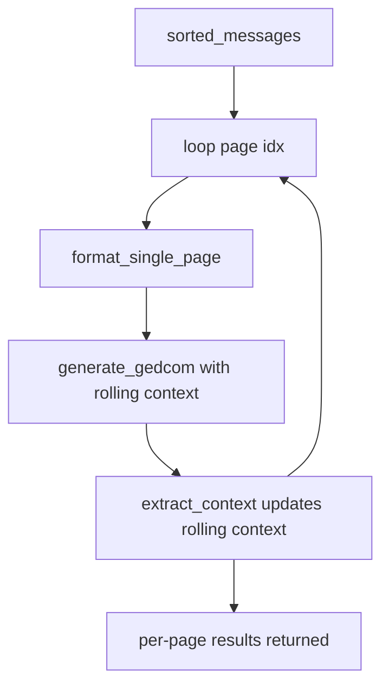
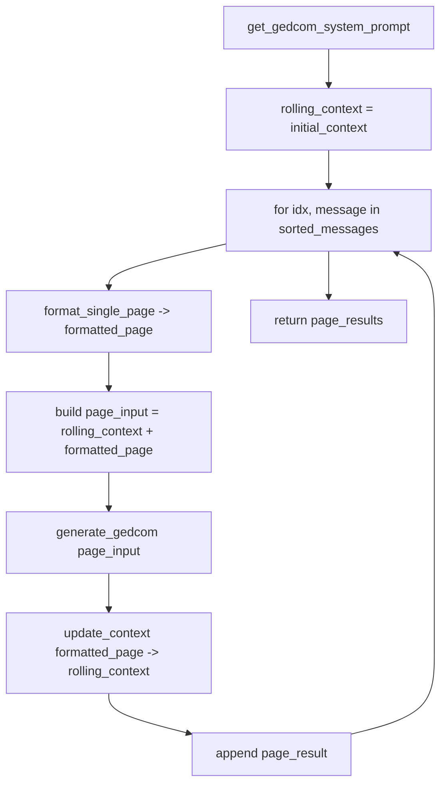

# Context Extractor Service — Design

## 1. Purpose & Overview

This document specifies a new **Context Extractor** service for the GEDCOM
generation microservice. The service uses an LLM (via the existing OpenRouter
client) to maintain a **rolling, lightweight context** that is carried forward
between pages of a multi-page document.

- **Input:** the current (accumulated) context string + the current page content (the formatted page text already produced by [`MetadataFormatter.format_single_page()`](src/services/metadata_formatter.py:52)).
- **Output:** the updated context string, to be fed into the next page's GEDCOM generation and into the next context-extraction call.

> **Scope of the carried-forward context (important):** the context is kept
> **deliberately small**. It must **NOT** accumulate per-person, per-family, or
> per-relationship data (these grow unbounded across pages and bloat the
> context). It tracks only **document-level / register-level** information that
> helps interpret later pages: active places, active date range, and the
> register's conventions (language, terminology, abbreviations, layout, date
> formats). See §3.3.

The service is implemented as a **new service class** in
[`src/services/`](src/services/) with a **corresponding prompt file** in
[`src/prompts/`](src/prompts/), following the conventions established by
[`OpenRouterClient`](src/services/openrouter_client.py:22),
[`GedcomGenerator`](src/services/gedcom_generator.py:16),
[`MetadataFormatter`](src/services/metadata_formatter.py:13), and
[`get_gedcom_system_prompt()`](src/prompts/gedcom_generation.py:6).

### Why this fits the existing flow

Pages are already processed **sequentially**, one page per LLM call, inside
[`GedcomGenerator.generate_pages_from_document_group()`](src/services/gedcom_generator.py:38).
The `for idx, message in enumerate(sorted_messages, start=1)` loop
([line 83](src/services/gedcom_generator.py:83)) is the natural place to:

1. Generate GEDCOM for the current page (existing behavior).
2. Update the rolling context **after** the page is processed.
3. Pass the rolling context **into** the next page's GEDCOM generation.



---

## 2. New LLM Client Method

A new LLM call is needed because the existing
[`OpenRouterClient.generate_gedcom()`](src/services/openrouter_client.py:75)
returns **GEDCOM** (it calls `_extract_gedcom()` which requires a `0 HEAD`
header). Context extraction returns **free-form text**, so it must not reuse the
GEDCOM extraction path.

### 2.1 Recommended approach: add a method to `OpenRouterClient`

Add a sibling method to `generate_gedcom`, keeping the same retry/trace/log
conventions but returning the raw text content.

**File:** [`src/services/openrouter_client.py`](src/services/openrouter_client.py)
**New method signature:**

```python
@langfuse_tracer.observe(name="openrouter-context-extraction", as_type="generation")
async def generate_text(
    self,
    user_content: str,
    system_prompt: str,
    temperature: float = 0.0
) -> str:
    """
    Generic chat-completion call returning the raw text response.

    Unlike generate_gedcom(), this does NOT run _extract_gedcom() and is
    suitable for free-form responses such as the carried-forward context.

    Args:
        user_content: The user-role message content.
        system_prompt: The system-role prompt.
        temperature: Sampling temperature (default 0.0 for determinism).

    Returns:
        The raw text content of the LLM response (stripped).

    Raises:
        APIError / APITimeoutError / RateLimitError on persistent API failure.
        ValueError if the response is empty.
    """
```

Its body mirrors [`generate_gedcom()`](src/services/openrouter_client.py:75)
exactly — same `messages` shape, same `temperature=0.0`, same `extra_headers`
(`HTTP-Referer`, `X-Title`), same `for attempt in range(self.max_retries)` retry
loop, the same `RateLimitError` / `APITimeoutError` / `APIError` handling with
[`langfuse_tracer.log_error(...)`](src/utils/langfuse_tracer.py:119) — **but**
the success path is:

```python
content = response.choices[0].message.content
if not content:
    raise ValueError("Empty response from OpenRouter API")
return content.strip()
```

> Note: The decorator on `generate_gedcom` is `@langfuse_tracer.observe(name="openrouter-llm-call", as_type="generation")` ([line 74](src/services/openrouter_client.py:74)). The new method uses the same decorator form with a distinct `name`.

> This is the only change required to `openrouter_client.py`. It is purely additive and does not alter existing behavior.

---

## 3. Prompt File

### 3.1 File to add

**Filename:** `src/prompts/context_extraction.py`

Style follows [`src/prompts/gedcom_generation.py`](src/prompts/gedcom_generation.py):
module docstring, builder functions returning strings, `f"""..."""` templates.

### 3.2 Constants / builder function signatures

```python
"""
LLM prompts for carrying lightweight document-level context forward between
document pages.
"""


def get_context_extraction_system_prompt() -> str:
    """
    Get the system prompt for the context extraction (carry-forward) task.

    Returns:
        System prompt string.
    """


def get_context_extraction_user_prompt(
    current_context: str,
    page_content: str,
    page_index: int,
    total_pages: int
) -> str:
    """
    Build the user prompt combining the accumulated context and the current
    page content.

    Args:
        current_context: The accumulated context so far (empty string for the
            first page).
        page_content: The formatted text of the current page (output of
            MetadataFormatter.format_single_page()).
        page_index: 1-based index of the current page within the document group.
        total_pages: Total number of pages in the document group.

    Returns:
        User prompt string ready to send as the "user" message.
    """
```

### 3.3 Exact prompt text

> The context is intentionally restricted to **document/register-level**
> information. It does **NOT** track individual people, families, or
> relationships — that data lives in the per-page GEDCOM output, not the rolling
> context, and tracking it would make the context grow without bound.

```python
def get_context_extraction_system_prompt() -> str:
    return """You are a genealogy expert maintaining a small, running summary of DOCUMENT-LEVEL context across the pages of a single historical document (e.g., a parish register of baptisms, marriages, or deaths).

Your job: given the CONTEXT SO FAR (a compact summary built from earlier pages) and the CURRENT PAGE text, produce an UPDATED CONTEXT that carries forward only the information needed to correctly interpret later pages.

WHAT TO TRACK AND CARRY FORWARD (document-level only):

1. Places: village, parish, county, province, country as they are clarified for the register.
2. Dates: the active year(s) / date range and any ordering convention used in the register.
3. Record conventions: language(s), Latin/Polish terminology and abbreviations, column/layout structure, and date formats.
4. Naming conventions: how names are written in this register (e.g., patronymic/matronymic patterns, surname spelling habits, diacritics usage) - as GENERAL conventions, not lists of specific people.
5. Open items: an entry that visibly continues onto the next page (note only that a continuation is expected, not the person's details).

WHAT NOT TO TRACK (do NOT include any of these):

- Do NOT list individual people, names, or biographical details.
- Do NOT track families, parent/child links, spouses, or any relationships.
- Do NOT accumulate per-entry data of any kind.

RULES:

- OUTPUT ONLY THE UPDATED CONTEXT as plain text. No explanations, no markdown fences, no preamble.
- Keep it SHORT - a few concise bullet lines grouped by the categories above. This summary must stay small as pages accumulate.
- MERGE the current page's document-level information into the prior context; do not repeat the page text.
- Preserve original spelling and diacritics when noting place names or terminology.
- Do NOT generate GEDCOM.
- If the current page adds no new document-level context, return the prior context unchanged."""


def get_context_extraction_user_prompt(
    current_context: str,
    page_content: str,
    page_index: int,
    total_pages: int
) -> str:
    context_block = current_context.strip() if current_context and current_context.strip() else "(none - this is the first page)"
    return f"""CONTEXT SO FAR (from pages before page {page_index} of {total_pages}):
{context_block}

CURRENT PAGE ({page_index} of {total_pages}):
{page_content}

Produce the UPDATED CONTEXT to be used when processing the next page. Output only the updated context text."""
```

> The first-page case is handled inside the user-prompt builder: when
> `current_context` is empty, the context block reads
> `"(none - this is the first page)"`.

---

## 4. Service Class: `ContextExtractor`

### 4.1 File and class

- **File:** `src/services/context_extractor.py`
- **Class:** `ContextExtractor`

Modeled on [`GedcomGenerator`](src/services/gedcom_generator.py:16): takes the
`OpenRouterClient` as a constructor dependency, uses
[`get_logger(__name__)`](src/utils/logger.py), and decorates its public async
method with [`@langfuse_tracer.observe(...)`](src/utils/langfuse_tracer.py:19).

### 4.2 Module skeleton

```python
"""
Context extractor service that maintains a small rolling document-level context
carried forward between pages of a document, using the OpenRouter LLM.
"""

from typing import Optional
from .openrouter_client import OpenRouterClient
from ..prompts.context_extraction import (
    get_context_extraction_system_prompt,
    get_context_extraction_user_prompt,
)
from ..utils.logger import get_logger
from ..config import Config
from ..utils import langfuse_tracer

logger = get_logger(__name__)


class ContextExtractor:
    """Maintains a small, carried-forward document-level context across pages."""

    def __init__(
        self,
        openrouter_client: OpenRouterClient,
        enabled: bool = True,
        max_context_chars: int = 4000,
    ):
        """
        Args:
            openrouter_client: OpenRouter client for LLM calls (shared instance).
            enabled: Master on/off switch (Config.ENABLE_CONTEXT_EXTRACTION).
            max_context_chars: Hard cap on the carried-forward context length;
                the returned context is truncated if it exceeds this. Kept small
                because the context is document-level only (no per-person data).
        """
        self.openrouter_client = openrouter_client
        self.enabled = enabled
        self.max_context_chars = max_context_chars
        logger.info(
            f"Initialized ContextExtractor "
            f"(enabled={enabled}, max_context_chars={max_context_chars})"
        )

    @staticmethod
    def initial_context() -> str:
        """Return the empty starting context used before the first page."""
        return ""

    @langfuse_tracer.observe(name="context-extraction")
    async def update_context(
        self,
        current_context: str,
        page_content: str,
        page_index: int,
        total_pages: int,
        document_id: str = "unknown",
    ) -> str:
        """
        Produce the updated rolling context given the prior context and the
        current page.

        Args:
            current_context: Accumulated context so far ("" for the first page).
            page_content: Formatted current-page text
                (MetadataFormatter.format_single_page output).
            page_index: 1-based page index within the document group.
            total_pages: Total pages in the document group.
            document_id: Document identifier (for logging/tracing context).

        Returns:
            The updated context string. On any failure, returns current_context
            unchanged (fail-soft) so page GEDCOM generation is never blocked.
        """
```

### 4.3 `update_context` behavior

```python
        # Master switch: skip the LLM call entirely if disabled.
        if not self.enabled:
            return current_context

        # First-page short-circuit is NOT required: the prompt builder handles
        # empty context. We still log it for observability.
        is_first_page = not (current_context and current_context.strip())
        if is_first_page:
            logger.info(
                f"Context extraction for document {document_id}: first page "
                f"({page_index}/{total_pages}), starting from empty context"
            )

        system_prompt = get_context_extraction_system_prompt()
        user_prompt = get_context_extraction_user_prompt(
            current_context=current_context,
            page_content=page_content,
            page_index=page_index,
            total_pages=total_pages,
        )

        try:
            logger.info(
                f"Updating rolling context for document {document_id} "
                f"after page {page_index}/{total_pages}"
            )
            updated = await self.openrouter_client.generate_text(
                user_content=user_prompt,
                system_prompt=system_prompt,
            )
        except Exception as e:
            # Fail-soft: never block GEDCOM generation because context failed.
            logger.warning(
                f"Context extraction failed for document {document_id} "
                f"page {page_index}/{total_pages}; carrying forward prior "
                f"context unchanged: {e}"
            )
            langfuse_tracer.log_error(
                e,
                context={
                    "document_id": document_id,
                    "operation": "context_extraction",
                    "page_index": page_index,
                    "total_pages": total_pages,
                    "model": self.openrouter_client.model,
                },
                level="WARNING",
            )
            return current_context

        updated = (updated or "").strip()
        if not updated:
            logger.warning(
                f"Context extraction returned empty for document {document_id} "
                f"page {page_index}; keeping prior context"
            )
            return current_context

        # Enforce the max-length cap (keep the tail, which is most recent).
        if len(updated) > self.max_context_chars:
            logger.info(
                f"Truncating context for document {document_id} from "
                f"{len(updated)} to {self.max_context_chars} chars"
            )
            updated = updated[-self.max_context_chars:]

        logger.debug(
            f"Updated context for document {document_id} "
            f"({len(updated)} chars) after page {page_index}/{total_pages}"
        )
        return updated
```

### 4.4 Error handling & empty/first-page summary

| Case | Behavior |
|------|----------|
| `enabled=False` | Return `current_context` immediately; no LLM call. |
| First page (empty context) | Prompt builder emits `(none - this is the first page)`; the LLM produces the initial context. Logged at INFO. |
| LLM exception | Caught, logged at WARNING via [`langfuse_tracer.log_error`](src/utils/langfuse_tracer.py:119) with `level="WARNING"`, returns prior context (fail-soft). |
| Empty LLM response | Returns prior context. |
| Over-long context | Truncated to `max_context_chars` (keeps the most-recent tail). |

The fail-soft contract guarantees that **a context-extraction failure never
breaks per-page GEDCOM generation** — consistent with the rest of the loop where
each page is independent.

---

## 5. Config Additions

**File:** [`src/config.py`](src/config.py).
Add the following near the OpenRouter block ([lines 29–39](src/config.py:29)),
following the existing `os.getenv(...)` typed-attribute pattern:

```python
    # Context Extraction Configuration (carry-forward document-level context)
    ENABLE_CONTEXT_EXTRACTION: bool = os.getenv(
        "ENABLE_CONTEXT_EXTRACTION", "true"
    ).lower() == "true"
    CONTEXT_EXTRACTION_MODEL: str = os.getenv(
        "CONTEXT_EXTRACTION_MODEL",
        os.getenv("OPENROUTER_MODEL", "google/gemini-flash-1.5")
    )
    MAX_CONTEXT_CHARS: int = int(os.getenv("MAX_CONTEXT_CHARS", "4000"))
```

Notes:
- `MAX_CONTEXT_CHARS` defaults to a small value (`4000`) because the context is
  document-level only — it must not grow with per-person data.
- `CONTEXT_EXTRACTION_MODEL` defaults to the same model as
  [`OPENROUTER_MODEL`](src/config.py:35). See §6.2 for how a *dedicated* model
  is optionally wired (requires a small `OpenRouterClient` change or a second
  client instance).
- Add the new fields to the dict returned by
  [`Config.to_dict()`](src/config.py:117) for observability:

```python
            "enable_context_extraction": cls.ENABLE_CONTEXT_EXTRACTION,
            "context_extraction_model": cls.CONTEXT_EXTRACTION_MODEL,
            "max_context_chars": cls.MAX_CONTEXT_CHARS,
```

- No change to [`Config.validate()`](src/config.py:74) is needed — these are all
  optional with defaults.
- Optionally document the new vars in `.env.example`.

---

## 6. Integration Points

There are two coordinated integration edits: **wiring** in
[`main.py`](src/main.py) and **usage** in
[`gedcom_generator.py`](src/services/gedcom_generator.py).

### 6.1 Inject the extractor into `GedcomGenerator`

The rolling context must be available exactly where each page is sent to the
LLM, i.e. inside
[`generate_pages_from_document_group()`](src/services/gedcom_generator.py:38).
Therefore the `ContextExtractor` is best injected into `GedcomGenerator`.

**Edit constructor** of
[`GedcomGenerator.__init__`](src/services/gedcom_generator.py:19) to accept an
optional extractor:

```python
    def __init__(
        self,
        openrouter_client: OpenRouterClient,
        gedcom_version: str = "5.5.1",
        context_extractor: Optional["ContextExtractor"] = None,  # NEW
    ):
        self.openrouter_client = openrouter_client
        self.gedcom_version = gedcom_version
        self.metadata_formatter = MetadataFormatter()
        self.context_extractor = context_extractor   # NEW
```

Add the import at the top of
[`gedcom_generator.py`](src/services/gedcom_generator.py:1):

```python
from .context_extractor import ContextExtractor
```

### 6.2 Wire it in `main.py`

In [`GedcomGenerationService.__init__`](src/main.py:39), after the
`OpenRouterClient` is created ([lines 77–86](src/main.py:77)) and **before** the
`GedcomGenerator` ([lines 98–102](src/main.py:98)):

```python
        # Context Extractor (carry-forward document-level context between pages)
        self.context_extractor = ContextExtractor(
            openrouter_client=self.openrouter_client,
            enabled=Config.ENABLE_CONTEXT_EXTRACTION,
            max_context_chars=Config.MAX_CONTEXT_CHARS,
        )

        # GEDCOM Generator
        self.gedcom_generator = GedcomGenerator(
            openrouter_client=self.openrouter_client,
            gedcom_version=Config.GEDCOM_VERSION,
            context_extractor=self.context_extractor,   # NEW
        )
```

Add the import alongside the other service imports
([lines 22–28](src/main.py:22)):

```python
from .services.context_extractor import ContextExtractor
```

**Dedicated model (optional).** The simplest reuse shares the single
`OpenRouterClient` (and thus `OPENROUTER_MODEL`). To use
`CONTEXT_EXTRACTION_MODEL` distinctly, create a **second** `OpenRouterClient`
in `main.py` with `model=Config.CONTEXT_EXTRACTION_MODEL` and pass that to
`ContextExtractor`. This requires remembering to `await ...close()` it in
[`shutdown()`](src/main.py:601). If a dedicated model is not required for the
first iteration, share the existing client and treat
`CONTEXT_EXTRACTION_MODEL` as future-proofing config.

### 6.3 Use the rolling context inside the page loop

This is the core change to
[`generate_pages_from_document_group()`](src/services/gedcom_generator.py:38).

**(a) Initialize the rolling context before the loop** (after `system_prompt`
is fetched at [line 78](src/services/gedcom_generator.py:78)):

```python
        # Initialize rolling, carried-forward context for the first page.
        rolling_context = (
            self.context_extractor.initial_context()
            if self.context_extractor is not None
            else ""
        )
```

**(b) Pass the context into per-page GEDCOM generation.** The current call at
[lines 116–119](src/services/gedcom_generator.py:116) is:

```python
                page_gedcom = await self.openrouter_client.generate_gedcom(
                    formatted_page,
                    system_prompt
                )
```

The rolling context is supplied to the GEDCOM call by **prepending it to the
formatted page** so the existing
[`generate_gedcom()`](src/services/openrouter_client.py:75) signature is
unchanged:

```python
                # Prepend carried-forward context (if any) to the page content.
                if rolling_context:
                    page_input = (
                        "CONTEXT FROM PREVIOUS PAGES:\n"
                        f"{rolling_context}\n\n"
                        "---\n\n"
                        f"{formatted_page}"
                    )
                else:
                    page_input = formatted_page

                page_gedcom = await self.openrouter_client.generate_gedcom(
                    page_input,
                    system_prompt
                )
```

> This keeps [`OpenRouterClient.generate_gedcom()`](src/services/openrouter_client.py:75)
> and [`get_gedcom_system_prompt()`](src/prompts/gedcom_generation.py:6)
> unchanged. (The GEDCOM system prompt already references
> *"Cross-Page Relationships"* at [lines 84–87](src/prompts/gedcom_generation.py:84),
> so the prepended document-level context reinforces existing instructions.)

**(c) Update the rolling context after the page is processed**, just before the
result is appended at [lines 138–143](src/services/gedcom_generator.py:138):

```python
            # Carry context forward for the next page (fail-soft inside).
            if self.context_extractor is not None:
                rolling_context = await self.context_extractor.update_context(
                    current_context=rolling_context,
                    page_content=formatted_page,
                    page_index=idx,
                    total_pages=total_pages,
                    document_id=document_id,
                )
```

> Ordering: extract context from the **original** `formatted_page` (not the
> context-prepended `page_input`) to avoid feeding the context back into itself.
> The update runs once per page; on the last page it is harmless (the result is
> simply unused).

#### Updated loop flow



---

## 7. Export Updates

### 7.1 `src/prompts/__init__.py`

Current content is only a docstring
([`src/prompts/__init__.py`](src/prompts/__init__.py:1)). The existing
`gedcom_generation` prompt is imported via a fully-qualified path
(`from ..prompts.gedcom_generation import get_gedcom_system_prompt` in
[`gedcom_generator.py`](src/services/gedcom_generator.py:8)), so package-level
re-exports are **optional but recommended for consistency**:

```python
"""LLM prompts for GEDCOM generation."""

from .gedcom_generation import (
    get_gedcom_system_prompt,
    get_gedcom_user_prompt_template,
)
from .context_extraction import (
    get_context_extraction_system_prompt,
    get_context_extraction_user_prompt,
)

__all__ = [
    "get_gedcom_system_prompt",
    "get_gedcom_user_prompt_template",
    "get_context_extraction_system_prompt",
    "get_context_extraction_user_prompt",
]
```

> The `ContextExtractor` itself imports directly from
> `..prompts.context_extraction` (matching the existing direct-import style),
> so this re-export is for discoverability and does not change required imports.

### 7.2 `src/services/__init__.py`

Current content is only a docstring
([`src/services/__init__.py`](src/services/__init__.py:1)). Existing services are
imported by full path in [`main.py`](src/main.py:22) (e.g.
`from .services.gedcom_generator import GedcomGenerator`), so a re-export is
again **optional but recommended**:

```python
"""Services for GEDCOM generation microservice."""

from .context_extractor import ContextExtractor

__all__ = [
    "ContextExtractor",
]
```

> To stay maximally consistent with the existing import style, `main.py` and
> `gedcom_generator.py` should import `ContextExtractor` via the full module
> path (`from .services.context_extractor import ContextExtractor` /
> `from .context_extractor import ContextExtractor`) regardless of this
> re-export.

---

## 8. Summary of Files Touched

| File | Change |
|------|--------|
| `src/prompts/context_extraction.py` | **NEW** — `get_context_extraction_system_prompt()`, `get_context_extraction_user_prompt(...)`. |
| `src/services/context_extractor.py` | **NEW** — `ContextExtractor` class with `initial_context()` and `async update_context(...)`. |
| [`src/services/openrouter_client.py`](src/services/openrouter_client.py) | **EDIT (additive)** — add `async generate_text(...)` returning raw text. |
| [`src/services/gedcom_generator.py`](src/services/gedcom_generator.py) | **EDIT** — constructor accepts optional `context_extractor`; loop initializes/prepends/updates rolling context. |
| [`src/main.py`](src/main.py) | **EDIT** — construct `ContextExtractor`, pass into `GedcomGenerator`, add import. |
| [`src/config.py`](src/config.py) | **EDIT** — add `ENABLE_CONTEXT_EXTRACTION`, `CONTEXT_EXTRACTION_MODEL`, `MAX_CONTEXT_CHARS`; extend `to_dict()`. |
| [`src/prompts/__init__.py`](src/prompts/__init__.py) | **EDIT (optional)** — re-export prompt builders. |
| [`src/services/__init__.py`](src/services/__init__.py) | **EDIT (optional)** — re-export `ContextExtractor`. |
| `.env.example` | **EDIT (optional)** — document the new env vars. |

## 9. Conventions Honored

- **Context kept small:** document-level only (places, dates, register conventions, naming conventions, continuation notes). **No** people, families, or relationships are accumulated — preventing unbounded context growth.
- **LLM access:** via [`OpenRouterClient`](src/services/openrouter_client.py:22) with the same retry loop, `temperature=0.0`, and `extra_headers`.
- **Tracing:** `@langfuse_tracer.observe(name=...)` on public async methods and `langfuse_tracer.log_error(..., level="WARNING")` for soft failures, matching [`openrouter_client.py`](src/services/openrouter_client.py:160) and [`gedcom_generator.py`](src/services/gedcom_generator.py:99).
- **Logging:** module-level `logger = get_logger(__name__)` ([logger.py](src/utils/logger.py)), INFO/DEBUG/WARNING levels as used elsewhere.
- **Config:** typed class attributes via `os.getenv(...)` with defaults, surfaced in `to_dict()` — matching [`config.py`](src/config.py:29).
- **Service shape:** constructor dependency injection of the shared `OpenRouterClient`, mirroring [`GedcomGenerator`](src/services/gedcom_generator.py:19).
