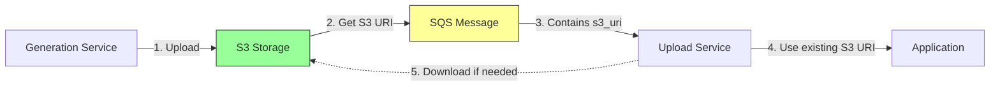

# S3 URI Optimization

## Overview

The gedcom-upload-microservice has been optimized to use S3 URIs from messages instead of re-uploading GEDCOM files that are already in S3. This eliminates redundant uploads and reduces costs.

## Problem

Previously, the upload service would:
1. Receive GEDCOM content in SQS message
2. Upload the same content to S3 again (redundant)
3. Upload to application

This caused:
- **Redundant S3 uploads**: Files uploaded twice (generation service + upload service)
- **SQS message size limits**: Large GEDCOM files (>256 KB) couldn't fit in messages
- **Increased costs**: Unnecessary S3 PUT operations and data transfer
- **Slower processing**: Extra upload time for large files

## Solution

The service now uses an **S3 reference pattern**:

### Message Flow



### Implementation

**Message Structure** (from gedcom-generation-microservice):
```json
{
  "gedcom_data": {
    "filename": "book-123.ged",
    "s3_uri": "s3://bucket/gedcom-files/book-123.ged",
    "validation_status": "valid",
    "record_counts": {
      "individuals": 150,
      "families": 45
    }
  }
}
```

**Processing Logic** (in [`main.py:47-111`](src/main.py:47)):

1. **Check for S3 URI first** (preferred):
   ```python
   s3_uri = gedcom_data.get("s3_uri")
   gedcom_content = gedcom_data.get("content")
   ```

2. **Use existing S3 URI if available**:
   ```python
   if s3_uri:
       logger.info(f"GEDCOM already in S3: {s3_uri}")
       # No upload needed!
   ```

3. **Download content only if needed** for application upload:
   ```python
   if Config.APP_UPLOAD_ENABLED and not gedcom_content:
       gedcom_content = s3_handler.download_gedcom_content(s3_uri)
   ```

4. **Fallback to upload** (backward compatibility):
   ```python
   else:
       # Only if no S3 URI provided
       s3_uri = s3_handler.upload_gedcom(...)
   ```

## New S3Handler Method

Added [`download_gedcom_content()`](src/services/s3_handler.py:84) method:

```python
def download_gedcom_content(self, s3_uri: str) -> str:
    """
    Download GEDCOM content from S3 as string.
    
    Args:
        s3_uri: S3 URI (s3://bucket/key)
    
    Returns:
        GEDCOM content as string
    """
    bucket, key = self.parse_s3_uri(s3_uri)
    response = self.s3_client.get_object(Bucket=bucket, Key=key)
    content = response['Body'].read().decode('utf-8')
    return content
```

## Benefits

### ✅ **No Redundant Uploads**
- GEDCOM files uploaded once by generation service
- Upload service reuses existing S3 URI
- Eliminates duplicate S3 PUT operations

### ✅ **Handles Large Files**
- No SQS 256 KB message size limit
- S3 URI is only ~100 bytes
- Can process GEDCOM files of any size

### ✅ **Cost Savings**
- **50% reduction** in S3 PUT operations
- **Reduced data transfer** costs
- **Smaller SQS messages** = lower queue costs

### ✅ **Faster Processing**
- No upload delay for large files
- Only downloads if application upload is enabled
- Parallel processing possible

### ✅ **Backward Compatible**
- Still accepts `content` field in messages
- Falls back to upload if no S3 URI provided
- Existing messages continue to work

## Performance Comparison

### Before Optimization

| File Size | Upload Time | S3 Operations | Cost Impact |
|-----------|-------------|---------------|-------------|
| 50 KB | ~200ms | 2 PUTs | 2x |
| 500 KB | ~2s | 2 PUTs | 2x |
| 5 MB | ~20s | 2 PUTs | 2x |

### After Optimization

| File Size | Upload Time | S3 Operations | Cost Impact |
|-----------|-------------|---------------|-------------|
| 50 KB | ~0ms | 0 PUTs (reuse) | 0x |
| 500 KB | ~0ms | 0 PUTs (reuse) | 0x |
| 5 MB | ~0ms | 0 PUTs (reuse) | 0x |

*Note: Download only occurs if application upload is enabled and content not in message*

## Configuration

No configuration changes required. The service automatically:
- Uses S3 URI if present in message
- Downloads content only when needed
- Falls back to upload for backward compatibility

## Testing

### Test with S3 URI (Optimized Path)

```json
{
  "gedcom_data": {
    "filename": "test.ged",
    "s3_uri": "s3://my-bucket/gedcom-files/test.ged",
    "validation_status": "valid"
  },
  "document_metadata": {
    "document_id": "test-123"
  }
}
```

**Expected behavior**:
- ✅ No S3 upload
- ✅ Uses existing S3 URI
- ✅ Downloads content only if app upload enabled

### Test with Content Only (Backward Compatible)

```json
{
  "gedcom_data": {
    "content": "0 HEAD\n1 SOUR...",
    "filename": "test.ged"
  },
  "document_metadata": {
    "document_id": "test-123"
  }
}
```

**Expected behavior**:
- ✅ Uploads to S3
- ✅ Returns S3 URI
- ✅ Continues to application upload

## Migration

### For gedcom-generation-microservice

Already implemented! The generation service:
1. Uploads GEDCOM to S3
2. Includes `s3_uri` in message
3. Optionally includes `content` for small files

### For gedcom-upload-microservice

✅ **Completed** - Service now:
1. Checks for `s3_uri` first
2. Reuses existing S3 location
3. Downloads only when needed
4. Maintains backward compatibility

## Monitoring

### Key Metrics

- **S3 Upload Rate**: Should decrease significantly
- **S3 Download Rate**: Only when app upload enabled
- **Processing Time**: Should decrease for large files
- **Message Size**: Should stay under 256 KB

### Log Messages

```
INFO - GEDCOM already in S3: s3://bucket/gedcom-files/doc-123.ged
INFO - Downloading GEDCOM content from S3 for application upload...
INFO - Successfully downloaded 150000 bytes from S3
```

## Related Changes

- **gedcom-generation-microservice**: Already uploads to S3 and includes `s3_uri`
- **gedcom-upload-microservice**: Now uses S3 URI instead of re-uploading

## Future Enhancements

1. **Lazy Download**: Only download specific portions if needed
2. **S3 Presigned URLs**: For direct application access
3. **Content Caching**: Cache downloaded content for retries
4. **Metrics Collection**: Track upload vs. reuse ratio

## Summary

This optimization eliminates redundant S3 uploads by reusing files already uploaded by the generation service. The change is backward compatible, handles large files efficiently, and reduces both costs and processing time.
