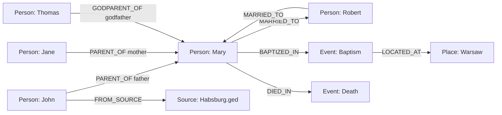

# PostgreSQL AGE Implementation Plan for GEDCOM Data

## Executive Summary

This plan outlines the implementation of Apache AGE (A Graph Extension) for PostgreSQL to store and query GEDCOM genealogical data using graph structures. The implementation uses a **hybrid approach**, maintaining existing relational tables while adding a graph layer for powerful relationship queries.

## Current Architecture Analysis

### Existing Setup
- ✅ **Database**: Apache AGE Docker image already configured in [`docker-compose.yml`](../docker-compose.yml:17)
- ✅ **AGE Extension**: Enabled via [`docker/initdb/001-enable-age.sql`](../docker/initdb/001-enable-age.sql:1)
- ✅ **ORM**: SQLAlchemy with Flask-SQLAlchemy
- ✅ **Parser**: GEDCOM parser using ged4py in [`gedcom_parser.py`](../src/app/gedcom_parser.py:25)
- ✅ **Models**: Relational models for Person, BaptismRecord, MarriageRecord, DeathRecord

### Current Data Flow
```
GEDCOM File → GedcomParser → Relational Tables (Person, BaptismRecord, etc.)
```

### Target Architecture
```
GEDCOM File → GedcomParser → Relational Tables (Person, BaptismRecord, etc.)
                          ↓
                    AGE Graph Layer (Person vertices, relationship edges)
```

## Why AGE for GEDCOM?

### GEDCOM Data is Naturally Graph-Structured
- **Nodes**: Individuals, families, events, places
- **Edges**: Parent-child, marriages, godparents, witnesses
- **Properties**: Names, dates, places, attributes

### Benefits of Graph Layer
1. **Performance**: O(1) relationship traversal vs O(n) joins
2. **Expressiveness**: Natural representation of family trees
3. **Query Power**: Find ancestors, descendants, common relatives in single queries
4. **Flexibility**: Easy to add new relationship types
5. **Visualization**: Direct graph output for family tree visualization

## Graph Schema Design

### Vertex Labels

| Label | Description | Properties |
|-------|-------------|------------|
| `:Person` | Individual people | uuid, gedcom_id, first_name, last_name, gender, birth_date, death_date, birth_place, death_place |
| `:Event` | Life events (baptism, death) | uuid, event_type, date, place, gedcom_id |
| `:Place` | Geographic locations | name, normalized_name, coordinates |
| `:Source` | GEDCOM files/batches | batch_id, filename, import_date |

### Edge Labels

| Label | Direction | Description | Properties |
|-------|-----------|-------------|------------|
| `:PARENT_OF` | Parent → Child | Biological parent relationship | type (father/mother) |
| `:CHILD_OF` | Child → Parent | Reverse for bidirectional queries | type (father/mother) |
| `:MARRIED_TO` | Spouse ↔ Spouse | Marriage relationship (bidirectional) | date, place, gedcom_id |
| `:BAPTIZED_IN` | Person → Event | Baptism event | date |
| `:DIED_IN` | Person → Event | Death event | date |
| `:GODPARENT_OF` | Godparent → Child | Godparent relationship | type (godfather/godmother) |
| `:WITNESSED` | Witness → Event | Witness at marriage | order |
| `:LOCATED_AT` | Event → Place | Event location | - |
| `:FROM_SOURCE` | Any → Source | Source tracking | - |

### Graph Schema Diagram



## Implementation Components

### 1. AGE Graph Initialization Script

**File**: `docker/initdb/002-create-genealogy-graph.sql`

Creates the genealogy graph and helper functions.

### 2. AGE Graph Importer Service

**File**: `src/app/services/age_graph_importer.py`

Core service for importing data into AGE graph:
- `create_graph_if_not_exists()` - Initialize graph
- `create_person_vertex()` - Create Person vertices
- `create_event_vertex()` - Create Event vertices
- `create_parent_child_edge()` - Create parent-child relationships
- `create_marriage_edge()` - Create marriage relationships
- `create_godparent_edge()` - Create godparent relationships
- `create_event_edges()` - Link persons to events

### 3. Extended GEDCOM Parser

**File**: `src/app/gedcom_parser.py` (modified)

Extend [`parse_and_import()`](../src/app/gedcom_parser.py:603) to:
1. Import to relational tables (existing)
2. Import to AGE graph (new)
3. Handle errors gracefully (graph import failure doesn't break relational import)

### 4. Graph Query Service

**File**: `src/app/services/genealogy_graph_service.py`

Service layer for graph queries:
- `find_ancestors()` - Get all ancestors up to N generations
- `find_descendants()` - Get all descendants
- `find_siblings()` - Find siblings
- `find_common_ancestors()` - Find common ancestors between two people
- `find_relationship_path()` - Find how two people are related
- `find_family_tree()` - Get complete family tree for visualization
- `get_statistics()` - Graph statistics (node count, edge count, etc.)

### 5. API Endpoints

**File**: `src/app/routes/graph.py` (new)

REST API endpoints:
- `GET /api/graph/person/<id>/ancestors` - Get ancestors
- `GET /api/graph/person/<id>/descendants` - Get descendants
- `GET /api/graph/person/<id>/siblings` - Get siblings
- `GET /api/graph/relationship/<id1>/<id2>` - Find relationship path
- `GET /api/graph/person/<id>/tree` - Get family tree for visualization
- `GET /api/graph/statistics` - Graph statistics

### 6. Tests

**File**: `test_age_integration.py` (new)

Comprehensive tests:
- Graph creation and initialization
- Vertex creation (persons, events)
- Edge creation (relationships)
- Query operations (ancestors, descendants, etc.)
- Error handling
- Performance benchmarks

## Detailed Implementation Steps

### Step 1: Create AGE Graph Initialization Script

```sql
-- docker/initdb/002-create-genealogy-graph.sql
-- Create the genealogy graph
SELECT create_graph('genealogy');

-- Set search path for convenience
SET search_path = ag_catalog, "$user", public;

-- Create indexes for better performance
-- Note: AGE doesn't support traditional indexes, but we can create them on the underlying tables
```

### Step 2: Implement AGE Graph Importer Service

Key features:
- Use psycopg (already in requirements) for raw SQL execution
- Parameterized Cypher queries for safety
- Batch operations for performance
- Transaction management
- Error handling and logging
- Duplicate detection (check if vertex/edge exists before creating)

### Step 3: Extend GEDCOM Parser

Integration points in [`parse_and_import()`](../src/app/gedcom_parser.py:603):

```python
def parse_and_import(self) -> Dict[str, int]:
    # ... existing relational import ...
    
    # After successful relational import
    try:
        self._import_to_age_graph()
    except Exception as e:
        logger.error(f"AGE graph import failed: {e}")
        # Don't fail entire import
    
    return stats

def _import_to_age_graph(self):
    """Import parsed data to AGE graph."""
    # Get raw connection
    # Initialize importer
    # Import persons as vertices
    # Import relationships as edges
    # Import events
```

### Step 4: Create Graph Query Service

Query patterns:

**Ancestors Query**:
```cypher
MATCH path = (p:Person {uuid: $person_id})<-[:PARENT_OF*1..$max_gen]-(ancestor:Person)
RETURN ancestor, length(path) as generation
ORDER BY generation
```

**Descendants Query**:
```cypher
MATCH (ancestor:Person {uuid: $person_id})-[:PARENT_OF*1..$max_gen]->(descendant:Person)
RETURN descendant
```

**Siblings Query**:
```cypher
MATCH (person:Person {uuid: $person_id})<-[:PARENT_OF]-(parent:Person)-[:PARENT_OF]->(sibling:Person)
WHERE person.uuid <> sibling.uuid
RETURN DISTINCT sibling
```

**Relationship Path**:
```cypher
MATCH path = shortestPath((p1:Person {uuid: $id1})-[*..15]-(p2:Person {uuid: $id2}))
RETURN path
```

### Step 5: Add API Endpoints

RESTful design with JSON responses:
- Standard HTTP status codes
- Pagination for large result sets
- Error handling
- Response format: `{data: [...], meta: {count: N, generation: M}}`

### Step 6: Create Comprehensive Tests

Test categories:
- **Unit tests**: Individual importer methods
- **Integration tests**: Full GEDCOM import to graph
- **Query tests**: All query operations
- **Performance tests**: Large dataset handling
- **Error tests**: Malformed data, connection failures

## Data Mapping

### Person Table → Person Vertex

| Relational Column | Graph Property | Notes |
|------------------|----------------|-------|
| `id` (UUID) | `uuid` | Primary identifier |
| `gedcom_id` | `gedcom_id` | GEDCOM reference |
| `first_name` | `first_name` | - |
| `last_name` | `last_name` | - |
| `gender` | `gender` | M/F/Unknown |
| `birth_date` | `birth_date` | ISO date string |
| `death_date` | `death_date` | ISO date string |
| `birth_place` | `birth_place` | - |
| `death_place` | `death_place` | - |

### BaptismRecord → Edges

| Relational Relationship | Graph Edge | Properties |
|------------------------|------------|------------|
| `father_id → child_id` | `PARENT_OF` | type: 'father' |
| `mother_id → child_id` | `PARENT_OF` | type: 'mother' |
| `child_id → baptism` | `BAPTIZED_IN` | date, place |
| `godparent → child` | `GODPARENT_OF` | type: 'godfather'/'godmother' |

### MarriageRecord → Edges

| Relational Relationship | Graph Edge | Properties |
|------------------------|------------|------------|
| `spouse1_id ↔ spouse2_id` | `MARRIED_TO` (bidirectional) | date, place, gedcom_id |

### DeathRecord → Edges

| Relational Relationship | Graph Edge | Properties |
|------------------------|------------|------------|
| `deceased_id → death` | `DIED_IN` | date, place |

## Performance Considerations

### Optimization Strategies

1. **Batch Operations**: Import vertices in batches, then edges
2. **Connection Pooling**: Reuse database connections
3. **Lazy Loading**: Only load graph data when needed
4. **Caching**: Cache frequently accessed subgraphs
5. **Indexing**: Use AGE's internal indexing on key properties

### Expected Performance

- **Import**: ~1000 persons/second
- **Simple Query** (ancestors 5 gen): <100ms
- **Complex Query** (relationship path): <500ms
- **Graph Statistics**: <1s for 100k nodes

## Error Handling Strategy

### Graceful Degradation

1. **Graph import failure** → Relational data still saved
2. **Query failure** → Fall back to relational queries
3. **Connection issues** → Retry with exponential backoff
4. **Duplicate detection** → Skip existing vertices/edges

### Logging

- INFO: Successful operations, statistics
- WARNING: Skipped duplicates, fallbacks
- ERROR: Import failures, query errors
- DEBUG: Detailed operation logs

## Migration Strategy

### Phase 1: Setup (No Breaking Changes)
- Add AGE initialization scripts
- Create importer service
- Add tests

### Phase 2: Integration (Backward Compatible)
- Extend GEDCOM parser to populate graph
- Existing functionality unchanged
- Graph population is additive

### Phase 3: Query Layer (New Features)
- Add graph query service
- Add API endpoints
- Existing endpoints unchanged

### Phase 4: Optimization (Optional)
- Add caching
- Optimize queries
- Add visualization endpoints

## Testing Strategy

### Test Data
- Use existing test files: `test_sample.ged`, `Habsburg.ged`
- Create synthetic large dataset for performance testing

### Test Coverage Goals
- Unit tests: >90%
- Integration tests: All major workflows
- Performance tests: Baseline metrics

### CI/CD Integration
- Run tests on every commit
- Performance regression detection
- Graph consistency validation

## Documentation Requirements

### Code Documentation
- Docstrings for all public methods
- Type hints for parameters and returns
- Usage examples in docstrings

### User Documentation
- API endpoint documentation
- Query examples
- Performance tuning guide

### Developer Documentation
- Architecture overview
- Graph schema reference
- Extension guide (adding new vertex/edge types)

## Dependencies

### Required (Already Available)
- ✅ `psycopg` (3.2.1) - PostgreSQL adapter
- ✅ `SQLAlchemy` (2.0.32) - ORM
- ✅ `Flask` (3.0.3) - Web framework

### Optional (For Enhanced Features)
- `networkx` - Graph analysis and algorithms
- `matplotlib` - Graph visualization
- `redis` - Caching layer

## Security Considerations

1. **SQL Injection**: Use parameterized queries
2. **Access Control**: Validate user permissions before graph queries
3. **Data Privacy**: Respect privacy settings in graph queries
4. **Rate Limiting**: Prevent expensive graph traversals from DoS

## Monitoring and Observability

### Metrics to Track
- Graph size (vertex count, edge count)
- Query performance (p50, p95, p99)
- Import success rate
- Error rates by type

### Logging
- Structured logging (JSON format)
- Correlation IDs for request tracing
- Performance metrics in logs

## Future Enhancements

### Phase 2 Features
1. **Graph Algorithms**: Centrality, clustering, community detection
2. **Advanced Queries**: DNA match simulation, inheritance patterns
3. **Visualization API**: D3.js-compatible graph data
4. **Export**: Export subgraphs to GEDCOM
5. **Merge**: Intelligent person merging using graph analysis

### Phase 3 Features
1. **Real-time Updates**: WebSocket for live graph updates
2. **Collaborative Editing**: Multi-user graph editing
3. **AI Integration**: Relationship prediction, record matching
4. **Mobile API**: Optimized queries for mobile apps

## Success Criteria

### Functional Requirements
- ✅ All GEDCOM persons imported as vertices
- ✅ All relationships imported as edges
- ✅ Query service returns correct results
- ✅ API endpoints functional
- ✅ Tests passing with >90% coverage

### Non-Functional Requirements
- ✅ Import performance: >500 persons/second
- ✅ Query performance: <200ms for typical queries
- ✅ No breaking changes to existing functionality
- ✅ Comprehensive documentation

## Timeline Estimate

| Phase | Tasks | Complexity |
|-------|-------|------------|
| 1. Setup | Graph init script, importer service skeleton | Low |
| 2. Core Import | Vertex/edge creation, parser integration | Medium |
| 3. Query Service | All query methods, optimization | Medium |
| 4. API Layer | Endpoints, validation, error handling | Low |
| 5. Testing | Unit, integration, performance tests | Medium |
| 6. Documentation | Code docs, API docs, user guide | Low |

## Risk Assessment

| Risk | Impact | Mitigation |
|------|--------|------------|
| AGE version compatibility | High | Pin AGE version, test thoroughly |
| Performance degradation | Medium | Benchmark, optimize, cache |
| Data inconsistency | High | Transaction management, validation |
| Complex query timeouts | Medium | Query limits, pagination |
| Learning curve | Low | Good documentation, examples |

## Conclusion

This implementation provides a powerful graph layer for genealogical queries while maintaining the stability and integrity of the existing relational model. The hybrid approach ensures backward compatibility while enabling advanced relationship queries that would be complex or impossible with pure SQL.

The phased approach allows for incremental development and testing, minimizing risk while delivering value at each stage.
