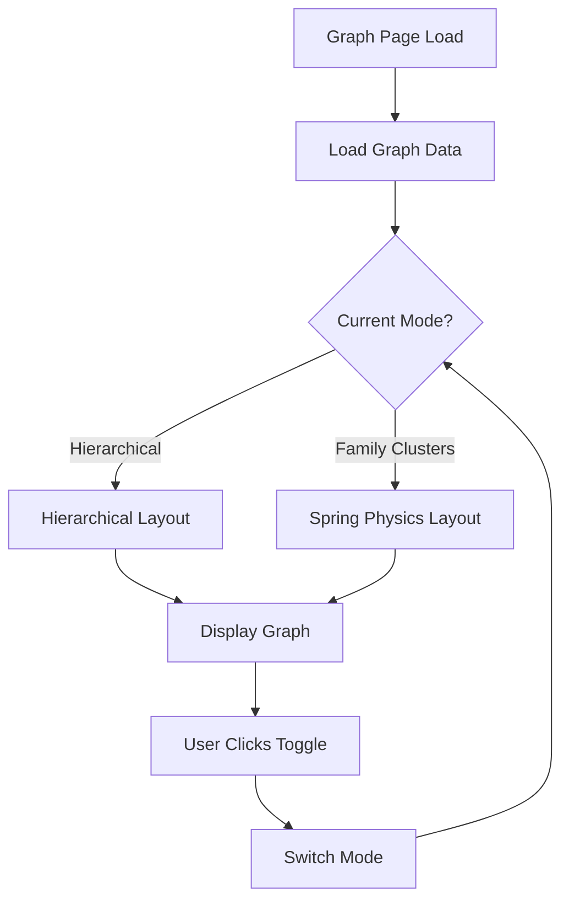

# Family Clusters Visualization Mode - Implementation Plan

## Overview
Implement an alternative graph visualization mode that uses spring physics to naturally group families together. This mode will be switchable from the current hierarchical tree view on the graph page.

## Current State Analysis

### Existing Implementation
- **Current Mode**: Hierarchical tree layout (top-down)
- **File**: [`src/app/templates/graph.html`](src/app/templates/graph.html:1)
- **Library**: vis-network (vis.js)
- **Current Features**:
  - Fixed hierarchical levels for generations
  - Spouses grouped on same level
  - Single parent-child edges for common children
  - Physics disabled for hierarchical mode
  - Marriage edges with 💑 emoji

### Requirements for New Mode
- **Spring physics-based layout** instead of hierarchical
- **Family grouping** using edge weights:
  - **0 weight** for husband-wife connections (strongest attraction)
  - **1 weight** for parent-child connections (normal attraction)
- **Mode switching** via UI toggle button
- **Preserve all existing features** in hierarchical mode

## Architecture Design

### Mode System



### Component Structure

1. **Mode State Management**
   - Store current mode in JavaScript variable
   - Persist mode preference in localStorage
   - Default to hierarchical mode

2. **UI Controls**
   - Add toggle button in controls section
   - Visual indicator of current mode
   - Smooth transition between modes

3. **Layout Configurations**
   - Separate configuration objects for each mode
   - Mode-specific physics settings
   - Edge weight assignments per mode

## Implementation Plan

### 1. Add Mode Toggle UI

**Location**: Controls section in [`graph.html`](src/app/templates/graph.html:66)

**Changes**:
- Add toggle button group after existing controls
- Add visual mode indicator
- Style to match existing design

**UI Design**:
```
[Hierarchical Tree] [Family Clusters] ← Toggle buttons
```

### 2. Implement Mode State Management

**JavaScript Variables**:
```javascript
let currentMode = 'hierarchical'; // or 'clusters'
const MODES = {
    HIERARCHICAL: 'hierarchical',
    CLUSTERS: 'clusters'
};
```

**Functions**:
- `switchMode(newMode)` - Switch between visualization modes
- `saveMode(mode)` - Save preference to localStorage
- `loadMode()` - Load saved preference

### 3. Create Spring Physics Configuration

**Physics Settings for Family Clusters Mode**:

```javascript
const clusterPhysicsOptions = {
    enabled: true,
    solver: 'forceAtlas2Based', // or 'barnesHut'
    forceAtlas2Based: {
        gravitationalConstant: -50,
        centralGravity: 0.01,
        springLength: 100,
        springConstant: 0.08,
        damping: 0.4,
        avoidOverlap: 0.5
    },
    stabilization: {
        enabled: true,
        iterations: 1000,
        updateInterval: 25
    }
};
```

**Edge Weight Configuration**:
- Marriage edges (`MARRIED_TO`): **length: 50, weight: 0** (very strong spring)
- Parent-child edges (`PARENT_OF`): **length: 150, weight: 1** (normal spring)

### 4. Modify Edge Creation Logic

**Current**: Edges created with fixed styling
**New**: Add weight and length properties based on edge type

```javascript
// Marriage edges - zero weight for tight clustering
{
    from: spouse1Id,
    to: spouse2Id,
    length: 50,      // Short distance
    weight: 0,       // Strongest attraction
    // ... other properties
}

// Parent-child edges - weight 1 for normal spacing
{
    from: parentId,
    to: childId,
    length: 150,     // Longer distance
    weight: 1,       // Normal attraction
    // ... other properties
}
```

### 5. Implement Mode Switching Function

**Function**: `switchMode(newMode)`

**Logic**:
1. Validate mode parameter
2. Update current mode variable
3. Save to localStorage
4. Destroy existing network
5. Recreate network with new configuration
6. Update UI indicators
7. Fit view to show all nodes

**Pseudo-code**:
```javascript
function switchMode(newMode) {
    if (newMode === currentMode) return;
    
    currentMode = newMode;
    localStorage.setItem('graphMode', newMode);
    
    // Get current data
    const currentNodes = nodes.get();
    const currentEdges = edges.get();
    
    // Destroy and recreate network
    if (network) {
        network.destroy();
    }
    
    // Apply mode-specific configuration
    const options = (newMode === MODES.HIERARCHICAL) 
        ? getHierarchicalOptions() 
        : getClusterOptions();
    
    network = new vis.Network(container, { nodes, edges }, options);
    
    // Update UI
    updateModeIndicator(newMode);
    
    // Fit view
    setTimeout(() => network.fit(), 100);
}
```

### 6. Refactor Layout Options

**Current**: Single options object
**New**: Two separate configuration functions

```javascript
function getHierarchicalOptions() {
    return {
        layout: {
            hierarchical: {
                enabled: true,
                direction: 'UD',
                sortMethod: 'directed',
                nodeSpacing: 120,
                levelSeparation: 200,
                // ... existing settings
            }
        },
        physics: {
            enabled: false
        },
        // ... other options
    };
}

function getClusterOptions() {
    return {
        layout: {
            hierarchical: {
                enabled: false
            }
        },
        physics: {
            enabled: true,
            solver: 'forceAtlas2Based',
            forceAtlas2Based: {
                gravitationalConstant: -50,
                centralGravity: 0.01,
                springLength: 100,
                springConstant: 0.08,
                damping: 0.4,
                avoidOverlap: 0.5
            },
            stabilization: {
                enabled: true,
                iterations: 1000,
                updateInterval: 25
            }
        },
        // ... other options
    };
}
```

### 7. Update Edge Styling for Clusters Mode

**Marriage Edges in Clusters Mode**:
- Very short length (50px)
- Zero weight (strongest spring)
- Thicker line (width: 4)
- Bright color for visibility

**Parent-Child Edges in Clusters Mode**:
- Medium length (150px)
- Weight of 1 (normal spring)
- Standard styling

### 8. Add Visual Feedback

**During Mode Switch**:
- Show loading indicator
- Disable controls temporarily
- Smooth transition animation

**Mode Indicator**:
- Highlight active mode button
- Update legend if needed
- Show mode name in stats area

## Technical Specifications

### Edge Weight System

The vis-network library uses edge weights in physics calculations:

- **Weight 0**: Strongest spring force (spouses stick together)
- **Weight 1**: Normal spring force (parent-child relationship)
- **Length**: Desired distance between nodes

**Formula**: Spring force = springConstant × (actualDistance - desiredLength) / weight

With weight 0, the division by weight creates infinite force, making spouses cluster tightly.

### Physics Solver Options

**forceAtlas2Based** (Recommended):
- Good for clustering
- Handles different edge weights well
- Smooth stabilization

**barnesHut** (Alternative):
- Faster for large graphs
- Less precise clustering
- Good for 500+ nodes

### Performance Considerations

- **Stabilization time**: ~1-3 seconds for 100 nodes
- **Memory**: Same as hierarchical mode
- **CPU**: Higher during stabilization, then minimal
- **Optimization**: Use `updateInterval: 25` to reduce CPU load

## UI/UX Design

### Mode Toggle Button Design

**Location**: In controls section, after "Clear Ancestor" button

**HTML Structure**:
```html
<div class="control-group">
    <label>View Mode:</label>
    <div class="mode-toggle">
        <button class="btn-mode active" id="modeHierarchical" onclick="switchMode('hierarchical')">
            📊 Tree View
        </button>
        <button class="btn-mode" id="modeClusters" onclick="switchMode('clusters')">
            🌐 Family Clusters
        </button>
    </div>
</div>
```

**CSS Styling**:
```css
.mode-toggle {
    display: flex;
    gap: 5px;
    background: #f0f0f0;
    padding: 3px;
    border-radius: 6px;
}

.btn-mode {
    background: transparent;
    color: #666;
    border: none;
    padding: 8px 16px;
    border-radius: 4px;
    cursor: pointer;
    transition: all 0.3s ease;
    font-weight: 600;
}

.btn-mode.active {
    background: linear-gradient(135deg, #667eea 0%, #764ba2 100%);
    color: white;
    box-shadow: 0 2px 8px rgba(102, 126, 234, 0.3);
}

.btn-mode:hover:not(.active) {
    background: rgba(102, 126, 234, 0.1);
    color: #667eea;
}
```

### Loading State During Mode Switch

**Visual Feedback**:
- Fade out current graph
- Show "Switching to [mode name]..." message
- Fade in new graph
- Duration: ~500ms

## Testing Strategy

### Test Cases

1. **Mode Switching**
   - Switch from hierarchical to clusters
   - Switch from clusters to hierarchical
   - Rapid mode switching
   - Mode persistence across page reloads

2. **Family Grouping in Clusters Mode**
   - Married couples cluster tightly together
   - Children positioned near parents
   - Multiple families form distinct clusters
   - Disconnected families separate naturally

3. **Edge Cases**
   - Single person (no family)
   - Multiple marriages (same person)
   - Large families (10+ children)
   - Complex relationships (remarriages)

4. **Performance**
   - 100 nodes: Should stabilize in < 2 seconds
   - 500 nodes: Should stabilize in < 5 seconds
   - 1000 nodes: Should remain responsive

5. **Visual Quality**
   - No overlapping nodes
   - Clear edge paths
   - Readable labels
   - Proper spacing

### Test Data

Use existing GEDCOM files:
- `data/Habsburg.ged` - Complex royal family
- `data/Simpsons_Cartoon.ged` - Simple family structure
- `data/The_Kennedy_Family.ged` - Multiple generations

## Implementation Steps

### Phase 1: UI and State Management
1. Add mode toggle buttons to HTML
2. Add CSS styling for mode toggle
3. Implement mode state variables
4. Implement localStorage persistence
5. Add mode indicator updates

### Phase 2: Configuration Refactoring
1. Extract current options into `getHierarchicalOptions()`
2. Create `getClusterOptions()` function
3. Add edge weight properties to edge creation
4. Test both configurations independently

### Phase 3: Mode Switching Logic
1. Implement `switchMode()` function
2. Add network destroy/recreate logic
3. Add loading state indicators
4. Test mode switching functionality

### Phase 4: Physics Tuning
1. Test spring physics with sample data
2. Adjust gravitational constants
3. Tune spring lengths and constants
4. Optimize stabilization iterations

### Phase 5: Polish and Testing
1. Add smooth transitions
2. Test with various family structures
3. Performance optimization
4. Documentation updates

## Code Changes Summary

### Files to Modify

1. **[`src/app/templates/graph.html`](src/app/templates/graph.html:1)**
   - Add mode toggle UI (HTML + CSS)
   - Add mode state management (JavaScript)
   - Refactor options into separate functions
   - Implement `switchMode()` function
   - Update edge creation with weights
   - Add loading states

### Estimated Lines of Code

- **HTML**: +30 lines (UI controls)
- **CSS**: +60 lines (styling)
- **JavaScript**: +150 lines (mode logic, configurations)
- **Total**: ~240 lines added/modified

## Benefits

### User Benefits
1. **Flexibility**: Choose visualization that fits their needs
2. **Family Focus**: Clusters mode emphasizes family units
3. **Exploration**: Physics mode allows natural exploration
4. **Comparison**: Can switch modes to see different perspectives

### Technical Benefits
1. **Maintainability**: Separate configurations for each mode
2. **Extensibility**: Easy to add more modes in future
3. **Performance**: Each mode optimized for its purpose
4. **User Preference**: Mode persistence improves UX

## Future Enhancements

### Potential Additions
1. **Hybrid Mode**: Combine hierarchical levels with clustering
2. **Custom Weights**: User-adjustable edge weights
3. **Cluster Highlighting**: Highlight family clusters on hover
4. **Animation**: Smooth morphing between modes
5. **3D Mode**: Three-dimensional family tree visualization
6. **Timeline Mode**: Arrange by birth dates instead of relationships

### Advanced Features
1. **Cluster Labels**: Show family names on clusters
2. **Cluster Boundaries**: Draw boundaries around family groups
3. **Interactive Weights**: Drag slider to adjust clustering strength
4. **Export Views**: Save current layout as image
5. **Comparison View**: Split screen showing both modes

## Documentation Updates

### User Documentation
- Add section to README about visualization modes
- Create usage guide with screenshots
- Document keyboard shortcuts (if added)

### Developer Documentation
- Document mode system architecture
- Explain physics configuration parameters
- Add comments to complex functions
- Update API documentation if needed

## Success Criteria

### Functional Requirements
- ✅ Mode toggle button works correctly
- ✅ Hierarchical mode maintains current behavior
- ✅ Clusters mode groups families together
- ✅ Mode preference persists across sessions
- ✅ Smooth transitions between modes

### Performance Requirements
- ✅ Mode switch completes in < 1 second
- ✅ Clusters mode stabilizes in < 3 seconds (100 nodes)
- ✅ No memory leaks during mode switching
- ✅ Responsive UI during stabilization

### Quality Requirements
- ✅ No overlapping nodes in clusters mode
- ✅ Married couples visibly clustered together
- ✅ Clear visual distinction between modes
- ✅ Consistent styling across modes
- ✅ Accessible UI controls

## Risk Assessment

### Potential Issues

1. **Physics Instability**
   - **Risk**: Nodes may not stabilize properly
   - **Mitigation**: Tune physics parameters, add max iterations

2. **Performance with Large Graphs**
   - **Risk**: Slow stabilization with 500+ nodes
   - **Mitigation**: Use barnesHut solver, reduce iterations

3. **Overlapping Nodes**
   - **Risk**: Nodes may overlap in clusters mode
   - **Mitigation**: Increase avoidOverlap parameter, adjust node spacing

4. **Mode Switching Lag**
   - **Risk**: Delay when switching modes
   - **Mitigation**: Add loading indicator, optimize network recreation

5. **Browser Compatibility**
   - **Risk**: Physics may behave differently across browsers
   - **Mitigation**: Test on Chrome, Firefox, Safari, Edge

## Conclusion

This implementation will provide users with a powerful alternative visualization mode that naturally groups families together using spring physics. The mode switching system is designed to be extensible, allowing for additional visualization modes in the future.

The key innovation is using **zero-weight edges** for marriage relationships, which creates strong spring forces that pull spouses together, while **weight-1 edges** for parent-child relationships maintain normal spacing. This creates natural family clusters without requiring complex positioning algorithms.

The implementation maintains backward compatibility with the existing hierarchical mode while adding significant new functionality for users who prefer a more organic, physics-based family tree visualization.
