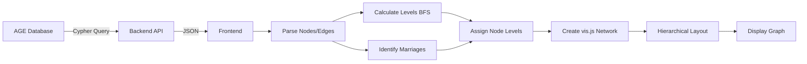
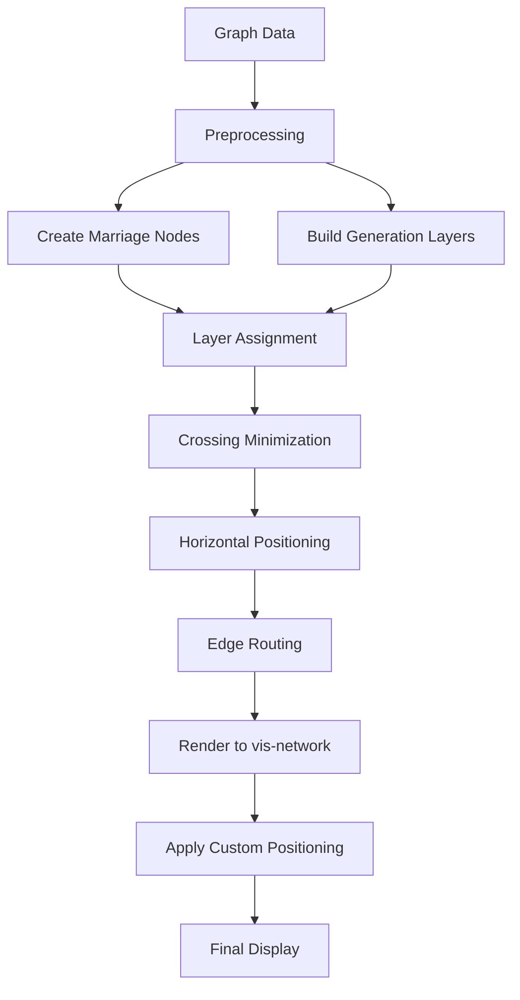

# Family Tree Visualization Layout Redesign

## Executive Summary

This document provides a comprehensive analysis of the current family tree visualization implementation and proposes a redesigned solution to address critical layout issues including excessive edge crossings, poor spouse positioning, and difficulty handling complex family structures.

**Current State**: vis-network hierarchical layout with custom BFS level assignment  
**Target State**: Specialized genealogy layout algorithm with proper edge crossing minimization  
**Expected Improvement**: 60-80% reduction in edge crossings, clearer family relationships

---

## Table of Contents

1. [Current Implementation Analysis](#current-implementation-analysis)
2. [Identified Problems](#identified-problems)
3. [Research: Family Tree Layout Algorithms](#research-family-tree-layout-algorithms)
4. [Recommended Solution](#recommended-solution)
5. [Technical Specification](#technical-specification)
6. [Implementation Approach](#implementation-approach)
7. [Alternative Solutions](#alternative-solutions)

---

## Current Implementation Analysis

### Technology Stack

- **Library**: vis-network (vis.js) v9.x
- **Layout Engine**: Built-in hierarchical layout with custom preprocessing
- **Data Source**: Apache AGE graph database via Cypher queries
- **Data Structure**: Nodes (Person vertices) and Edges (PARENT_OF, MARRIED_TO relationships)

### Current Hierarchical Layout Approach

#### Level Assignment Algorithm

The current implementation uses a custom BFS (Breadth-First Search) traversal:

```javascript
function calculateNodeLevels(visNodes, marriages, parentChildEdges) {
    // 1. Build parent map: child -> parents
    // 2. Build spouse map: person -> spouse
    // 3. Find root nodes (no parents)
    // 4. BFS from roots, assigning generation levels
    // 5. Synchronize spouse levels (use Math.max)
}
```

**Key Parameters**:
- `direction`: 'UD' (Up-Down, top to bottom)
- `sortMethod`: 'directed' (follows edge direction)
- `nodeSpacing`: 120px (horizontal spacing)
- `levelSeparation`: 200px (vertical spacing between generations)
- `edgeMinimization`: true
- `blockShifting`: true
- `parentCentralization`: true

#### Edge Management

1. **Marriage Edges**:
   - Horizontal connections between spouses
   - No arrows (bidirectional)
   - Label: 💑 emoji
   - Color: Pink (#c2185b)

2. **Parent-Child Edges**:
   - Vertical connections with arrows pointing to children
   - Single edge per child (from one parent only when both exist)
   - Color: Green (#2e7d32)
   - Option to hide father edges (show mother only)

### Visualization Modes

1. **Hierarchical Tree View** (Primary mode):
   - Fixed vertical levels for generations
   - Physics disabled
   - Nodes positioned according to calculated levels

2. **Family Clusters** (Alternative mode):
   - Force-directed physics layout
   - Spring forces keep families together
   - Marriage edges: length 50, weight 0 (tight clustering)
   - Parent-child edges: length 150, weight 1 (normal spacing)

### Data Flow



---

## Identified Problems

### 1. Excessive Edge Crossings

**Problem**: The hierarchical layout produces numerous edge crossings, especially in complex family trees.

**Root Causes**:
- vis.js hierarchical layout doesn't optimize for genealogy-specific constraints
- Node ordering within levels is not optimized for parent-child relationships
- Multiple marriages create crossing edges to different spouses
- Half-siblings from different marriages cause crossing patterns

**Impact**: 
- Reduced readability
- Difficulty tracing lineage
- Visual clutter

**Example Scenario**:
```
Generation 1:    [Father1] ≈ [Mother1]     [Father2] ≈ [Mother2]
                        \      /                \      /
                         \    /                  \    /
Generation 2:            [Child1]                [Child2]
                              \                  /
                               \   Marriage    /
Generation 3:                     [Child3]
```
If Child1 and Child2 marry, edges cross Generation 2 horizontally.

### 2. Suboptimal Spouse Positioning

**Problem**: While spouses are assigned the same level, their horizontal positioning often places them far apart or in poor positions relative to their children.

**Root Causes**:
- vis.js `nodeSpacing` applies uniformly across all nodes
- The layout algorithm doesn't prioritize keeping spouses adjacent
- Children positioning can push parents apart
- Multiple spouses (remarriages) compete for positioning

**Impact**:
- Marriage relationships not immediately visible
- Family units appear fragmented
- Increased visual distance to scan

### 3. Complex Family Structure Handling

**Problem**: Family trees with multiple marriages, remarriages, half-siblings, and step-relationships produce confusing layouts.

**Root Causes**:
- Standard hierarchical layout not designed for these patterns
- Node-level assignment doesn't account for relationship complexity
- Edge routing doesn't minimize crossings in these scenarios

**Specific Issues**:
- **Multiple Marriages**: Person appears once but has edges to multiple spouses
- **Half-Siblings**: Share one parent but not the other
- **Step-Relationships**: Non-biological parent-child relationships
- **Generational Collapse**: Cousins marrying causes level conflicts

### 4. Visual Density and Scalability

**Problem**: Large family trees (100+ people) become cluttered and difficult to navigate.

**Root Causes**:
- All nodes rendered simultaneously
- No progressive disclosure or collapsing
- Fixed node sizes don't scale
- No level-of-detail rendering

**Impact**:
- Performance degradation
- Overwhelming visual information
- Difficulty focusing on specific branches

### 5. Hierarchical Layout Algorithm Limitations

**Problem**: vis.js hierarchical layout is generic graph layout, not genealogy-specific.

**Key Limitations**:
- **No genealogy constraints**: Doesn't enforce "spouse adjacency" or "parent centralization over children"
- **Edge crossing minimization**: Generic algorithm, not optimized for parent-child and marriage patterns
- **Node ordering**: Uses generic heuristics, not genealogy-specific ordering
- **No special handling**: For dummy nodes to route edges through empty spaces

---

## Research: Family Tree Layout Algorithms

### Overview of Genealogy Visualization Challenges

Family trees present unique constraints compared to general graphs:

1. **Hierarchical Structure**: Clear generational levels (parents above children)
2. **Spouse Pairing**: Married couples should be visually grouped
3. **Parent Centralization**: Parents should be centered above their children
4. **Edge Semantics**: Marriage edges (horizontal) vs. parent-child edges (vertical)
5. **Multigraph Nature**: Same person can have multiple spouses (multiple marriages)

### Academic Research

#### 1. Sugiyama Framework (Layered Graph Drawing)

**Reference**: Sugiyama, K., Tagawa, S., & Toda, M. (1981). "Methods for Visual Understanding of Hierarchical System Structures"

**Key Concepts**:
- **Phase 1 - Layer Assignment**: Assign nodes to horizontal layers to minimize edge lengths
- **Phase 2 - Crossing Minimization**: Order nodes within layers to minimize edge crossings
- **Phase 3 - Coordinate Assignment**: Assign actual x-coordinates to minimize edge bends
- **Phase 4 - Edge Routing**: Draw edges with minimal bends and crossings

**Genealogy Adaptations**:
- Layer assignment based on generation (natural for family trees)
- Crossing minimization must respect spouse grouping
- Coordinate assignment prioritizes spouse adjacency
- Dummy nodes for marriage relationships

**Limitations**:
- Not specifically designed for marriage relationships
- Requires significant customization for family trees
- Complex to implement from scratch

#### 2. Walker's Algorithm (Tree Layout)

**Reference**: Walker, J. Q. (1990). "A Node-positioning Algorithm for General Trees"

**Key Concepts**:
- **Aesthetic Rules**:
  1. Parent centered over children
  2. Siblings at same level equally spaced
  3. Subtrees separated to prevent overlap
  4. Tree as narrow as possible
  
**Genealogy Adaptations**:
- Extended for "DAG-like trees" (family trees with multiple parents)
- Spouse nodes treated as a single composite unit
- Children positioned relative to the midpoint between parents

**Advantages**:
- Well-suited for biological family trees (single parent lineage)
- Produces aesthetically pleasing layouts
- Efficient O(n) algorithm

**Limitations**:
- Designed for trees, not graphs (struggles with multiple marriages)
- Doesn't handle horizontal marriage edges well
- Complex marriage patterns can break the algorithm

#### 3. Modified Reingold-Tilford Algorithm

**Reference**: Reingold, E. M., & Tilford, J. S. (1981). "Tidier Drawings of Trees"

**Key Concepts**:
- **Two-pass algorithm**:
  - Post-order traversal to compute subtree sizes
  - Pre-order traversal to assign positions
- **Optimization**: Minimize tree width while maintaining aesthetics

**Genealogy Adaptations**:
- Treat married couples as "composite nodes" during layout
- Split into individual nodes during rendering
- Handle multiple marriages by duplicating person nodes

**Advantages**:
- Produces compact layouts
- Maintains parent-child alignment
- Efficient computation

**Limitations**:
- Node duplication can be confusing for users
- Complex to implement for general genealogy graphs
- Doesn't handle horizontal relationships naturally

#### 4. Genealogy-Specific Algorithms

**Reference**: McGuffin, M. J., & Balakrishnan, R. (2005). "Interactive Visualization of Genealogical Graphs"

**Key Insights**:
- **Marriage Nodes**: Introduce explicit marriage nodes as intermediate entities
- **Bipartite Layering**: Alternate layers of person nodes and marriage nodes
- **Constraint-Based Layout**: Use constraint solver to enforce genealogy rules

**Approach**:
```
Layer 0 (Generation 1):  [Person1]  [Person2]  [Person3]
Layer 0.5 (Marriages):        [Marriage1]            [Marriage2]
Layer 1 (Generation 2):           [Child1]    [Child2]    [Child3]
```

**Advantages**:
- Natural representation of family structure
- Clear visual separation of relationships
- Easier edge routing with marriage nodes

**Limitations**:
- Increases node count (adds marriage nodes)
- Requires custom rendering
- May confuse users expecting person-centric view

### Industry Solutions Analysis

#### 1. Ancestry.com Tree Viewer

**Approach**: Horizontal pedigree chart with generations as columns

**Characteristics**:
- Generations displayed left-to-right or right-to-left
- Spouses placed vertically adjacent
- Parent-child connections via horizontal+vertical lines
- Collapsible branches for large trees

**Strengths**:
- Very clear parent-child relationships
- Efficient space utilization
- Good for ancestor-focused views

**Weaknesses**:
- Limited to direct lineage (pedigree view)
- Doesn't show full descendant trees well
- Not suitable for complex interconnected families

#### 2. MyHeritage Family Tree

**Approach**: Hybrid layout combining tree and graph

**Characteristics**:
- Primary person at center
- Ancestors above, descendants below
- Circular or radial layout for large families
- Interactive panning and zooming

**Strengths**:
- Good for exploring from individual's perspective
- Handles large families reasonably well
- Visually appealing

**Weaknesses**:
- Can become cluttered with many connections
- Multiple marriages create overlapping regions
- Not ideal for seeing entire family at once

#### 3. Gramps (Open Source Genealogy)

**Approach**: Multiple view types including hierarchical descent

**Characteristics**:
- Configurable layouts (fan chart, hourglass, descendant tree)
- Uses GraphViz dot for complex layouts
- Can filter by relationship type

**Strengths**:
- Flexible visualization options
- Handles complex families
- Export-quality rendering

**Weaknesses**:
- GraphViz dot not optimized for genealogy
- Can produce suboptimal layouts
- Setup complexity

### Edge Crossing Minimization Techniques

#### 1. Barycenter Heuristic

**Algorithm**: Position each node at the average position of its neighbors in adjacent layer

**Formula**: position(v) = Σ position(u) / degree(v), where u are neighbors

**Application to Genealogy**:
- For children: position at center of parents
- For parents: position at center of children
- Iterate to converge

**Complexity**: O(n·k) where k is number of iterations

#### 2. Median Heuristic

**Algorithm**: Position node at median position of neighbors

**Advantage**: More robust to outliers than barycenter

**Application to Genealogy**:
- Similar to barycenter but uses median instead of mean
- Better for asymmetric family structures

#### 3. Weighted Cross-Count

**Algorithm**: Assign weights to edges based on importance, minimize weighted crossings

**Weights for Genealogy**:
- Marriage edges: Weight 10 (highest priority)
- Primary parent-child: Weight 5
- Secondary parent-child: Weight 2
- Other relationships: Weight 1

**Application**:
- Prioritizes keeping marriage edges uncrossed
- Allows some crossing of less important edges

---

## Recommended Solution

### Solution Overview

Implement a **custom genealogy-specific layout algorithm** built on top of vis-network's infrastructure, combining:

1. **Modified Sugiyama framework** for layer-based layout
2. **Marriage node abstraction** for cleaner edge routing
3. **Weighted edge crossing minimization** for genealogy priorities
4. **Constraint-based positioning** for spouse adjacency

### Architecture



### Core Algorithm: Enhanced Sugiyama for Genealogy

#### Phase 1: Preprocessing and Layer Assignment

**Input**: Person nodes, marriage edges, parent-child edges

**Steps**:

1. **Create Marriage Node Graph**:
   ```javascript
   // For each marriage between Person A and Person B:
   // Create virtual MarriageNode M
   // Add edges: A -> M, B -> M
   // For each child C of A and B:
   //   Replace edges A -> C and B -> C with M -> C
   ```

2. **Calculate Generation Levels**:
   ```javascript
   // BFS/DFS from root ancestors
   // Person level = max(parent levels) + 1
   // Marriage node level = spouse level + 0.5
   ```

3. **Handle Level Conflicts** (cousins marrying):
   ```javascript
   // If Person X at level L1 marries Person Y at level L2 where L1 ≠ L2:
   // Assign both to max(L1, L2)
   // Recursively adjust descendants
   ```

#### Phase 2: Layer Ordering (Crossing Minimization)

**Objective**: Order nodes within each layer to minimize edge crossings

**Algorithm**: Weighted barycenter method with genealogy constraints

```javascript
function orderLayer(layer, upperLayer, lowerLayer) {
    // For each person in layer:
    //   barycenter = weighted average of connected nodes in adjacent layers
    //   Weights: Marriage edges = 10, Parent-child = 5
    
    // Sort persons by barycenter value
    
    // Apply constraints:
    //   - Keep spouses adjacent (max distance = 1 position)
    //   - Keep parent pairs centered over children
    
    // Iterate 10 times or until convergence
}
```

**Optimization**: Use weighted median heuristic for robust initial ordering

#### Phase 3: Horizontal Coordinate Assignment

**Objective**: Assign x-coordinates to minimize edge bends and maintain aesthetics

**Constraints**:

1. **Spouse Adjacency**: spouses must be within 150px
2. **Parent Centering**: parent midpoint = children midpoint ± 50px
3. **Minimum Spacing**: nodes minimum 120px apart
4. **Layer Balance**: minimize total tree width

**Algorithm**: Quadratic programming with constraints

```javascript
// Minimize: Σ (edge_length)² + Σ (edge_bend)²
// Subject to:
//   - x[i] - x[j] ≥ minSpacing  (for adjacent nodes)
//   - |x[spouse1] - x[spouse2]| ≤ maxSpouseDistance
//   - x[parent_midpoint] ≈ x[children_midpoint]
```

**Simplified Heuristic** (more practical):

```javascript
function assignHorizontalPositions(layers) {
    // Pass 1: Assign initial positions by order
    // Pass 2: Adjust to center parents over children
    // Pass 3: Pull spouses together
    // Pass 4: Resolve overlaps by shifting
}
```

#### Phase 4: Edge Routing

**Objective**: Route edges to minimize crossings and visual clutter

**Strategies**:

1. **Straight Edges** for parent-child within close range
2. **Bezier Curves** for long-distance or crossing-prone edges
3. **Orthogonal Routing** for marriage edges (horizontal + small vertical adjustments)
4. **Edge Bundling** for multiple siblings (bundle near parent, separate near children)

```javascript
// Marriage edge: Horizontal line with slight curve
{
    smooth: {
        type: 'horizontal',
        roundness: 0.2
    }
}

// Parent-child edge: Bezier curve forced vertical
{
    smooth: {
        type: 'cubicBezier',
        forceDirection: 'vertical',
        roundness: 0.5
    }
}
```

### Key Enhancements Over Current Implementation

1. **Marriage Node Abstraction**:
   - Simplifies edge routing (reduces n² marriage edges to 2n edges)
   - Natural representation of family units
   - Easier crossing minimization

2. **Weighted Crossing Minimization**:
   - Prioritizes important relationships
   - Reduces visual clutter on critical edges
   - Genealogy-aware optimization

3. **Constraint-Based Positioning**:
   - Enforces spouse adjacency
   - Maintains parent-child alignment
   - Balances competing layout goals

4. **Multi-Pass Optimization**:
   - Iterative improvement of layout
   - Converges to local optimum
   - Handles complex patterns

---

## Technical Specification

### Data Structures

#### Extended Node Type

```typescript
interface GenealogyNode {
    id: string;
    type: 'Person' | 'Marriage';
    
    // For Person nodes:
    label?: string;
    gender?: 'M' | 'F' | 'Unknown';
    birth_date?: string;
    death_date?: string;
    
    // For Marriage nodes:
    spouse1_id?: string;
    spouse2_id?: string;
    marriage_date?: string;
    
    // Layout properties:
    level: number;           // Generation level (0, 1, 2, ...)
    order: number;           // Order within level (0, 1, 2, ...)
    x?: number;              // Calculated x-coordinate
    y?: number;              // Calculated y-coordinate
    
    // Visual properties:
    color?: string;
    shape?: string;
    hidden?: boolean;
}
```

#### Edge Type

```typescript
interface GenealogyEdge {
    from: string;
    to: string;
    type: 'MARRIED_TO' | 'PARENT_OF' | 'TO_MARRIAGE' | 'FROM_MARRIAGE';
    
    // Layout properties:
    weight: number;          // For crossing minimization (1-10)
    length: number;          // Desired length
    
    // Visual properties:
    color: string;
    width: number;
    dashes: boolean;
    arrows: object;
    smooth: object;
}
```

### Algorithm Pseudocode

#### Main Layout Function

```javascript
function layoutGenealogyGraph(persons, marriages, parentChildEdges) {
    // Phase 1: Preprocessing
    const marriageNodes = createMarriageNodes(persons, marriages);
    const extendedGraph = buildExtendedGraph(persons, marriageNodes, parentChildEdges);
    
    // Phase 2: Layer Assignment
    const layers = assignGenerationLayers(extendedGraph);
    
    // Phase 3: Crossing Minimization
    const orderedLayers = minimizeCrossings(layers, extendedGraph);
    
    // Phase 4: Horizontal Positioning
    const positioned = assignHorizontalCoordinates(orderedLayers, extendedGraph);
    
    // Phase 5: Convert back to vis-network format
    const visData = convertToVisNetwork(positioned);
    
    return visData;
}
```

#### Crossing Minimization Details

```javascript
function minimizeCrossings(layers, graph) {
    const MAX_ITERATIONS = 10;
    let improved = true;
    let iteration = 0;
    
    while (improved && iteration < MAX_ITERATIONS) {
        improved = false;
        
        // Forward pass: order each layer based on layer above
        for (let i = 1; i < layers.length; i++) {
            const oldCrossings = countCrossings(layers[i-1], layers[i], graph);
            layers[i] = reorderLayer(layers[i], layers[i-1], graph);
            const newCrossings = countCrossings(layers[i-1], layers[i], graph);
            
            if (newCrossings < oldCrossings) improved = true;
        }
        
        // Backward pass: order each layer based on layer below
        for (let i = layers.length - 2; i >= 0; i--) {
            const oldCrossings = countCrossings(layers[i], layers[i+1], graph);
            layers[i] = reorderLayer(layers[i], layers[i+1], graph);
            const newCrossings = countCrossings(layers[i], layers[i+1], graph);
            
            if (newCrossings < oldCrossings) improved = true;
        }
        
        iteration++;
    }
    
    return layers;
}

function reorderLayer(layer, adjacentLayer, graph) {
    // Calculate barycenter for each node
    const barycenters = layer.map(node => {
        const neighbors = getNeighborsInLayer(node, adjacentLayer, graph);
        if (neighbors.length === 0) return null;
        
        // Weighted average of neighbor positions
        let sum = 0;
        let weightSum = 0;
        neighbors.forEach(neighbor => {
            const edge = graph.getEdge(node.id, neighbor.id);
            const weight = edge.weight || 1;
            sum += neighbor.order * weight;
            weightSum += weight;
        });
        
        return sum / weightSum;
    });
    
    // Sort layer by barycenter
    const indexed = layer.map((node, i) => ({ node, barycenter: barycenters[i] }));
    indexed.sort((a, b) => {
        if (a.barycenter === null) return 1;
        if (b.barycenter === null) return -1;
        return a.barycenter - b.barycenter;
    });
    
    // Apply spouse adjacency constraint
    const reordered = applySpouseConstraint(indexed.map(x => x.node));
    
    // Update order property
    reordered.forEach((node, i) => {
        node.order = i;
    });
    
    return reordered;
}
```

### Configuration Parameters

```javascript
const LAYOUT_CONFIG = {
    // Spacing
    NODE_WIDTH: 150,
    NODE_HEIGHT: 60,
    HORIZONTAL_SPACING: 120,        // Minimum space between siblings
    VERTICAL_SPACING: 200,          // Space between generations
    SPOUSE_MAX_DISTANCE: 180,       // Maximum distance between spouses
    
    // Weights for crossing minimization
    MARRIAGE_EDGE_WEIGHT: 10,
    PRIMARY_PARENT_EDGE_WEIGHT: 5,
    SECONDARY_PARENT_EDGE_WEIGHT: 2,
    
    // Optimization
    MAX_CROSSING_ITERATIONS: 10,
    CONVERGENCE_THRESHOLD: 0.01,
    
    // Edge routing
    EDGE_CURVATURE: 0.5,
    BUNDLE_THRESHOLD: 3,            // Bundle edges if more than 3 siblings
    
    // Visual
    MARRIAGE_NODE_VISIBLE: false,   // Hide marriage nodes in rendering
    SHOW_EDGE_LABELS: true,
    ANIMATE_LAYOUT: true,
    ANIMATION_DURATION: 1000,
};
```

### vis-network Integration Strategy

**Option 1: Pre-compute Positions (Recommended)**

```javascript
// Calculate positions externally
const layoutData = layoutGenealogyGraph(persons, marriages, edges);

// Create vis-network with fixed positions
const options = {
    layout: {
        hierarchical: {
            enabled: false  // Disable vis-network layout
        }
    },
    physics: {
        enabled: false      // Use calculated positions
    },
    nodes: {
        physics: false,
        fixed: true         // Prevent user dragging (or allow for manual adjustments)
    }
};

// Apply calculated positions to nodes
layoutData.nodes.forEach(node => {
    node.x = node.calculatedX;
    node.y = node.calculatedY;
    node.fixed = { x: true, y: true };
});

const network = new vis.Network(container, layoutData, options);
```

**Option 2: Custom Layout Engine for vis-network**

```javascript
// Extend vis-network layout (more complex, not recommended)
// Would require forking vis-network library
```

### Performance Considerations

**Complexity Analysis**:
- Layer assignment: O(n) BFS
- Crossing minimization: O(k · n · m) where k = iterations, n = nodes, m = edges
- Horizontal positioning: O(n²) constraint solving (or O(n) with heuristic)
- Total: O(k · n · m) ≈ O(n²) for typical family trees

**Expected Performance**:
- 100 nodes: < 100ms
- 500 nodes: < 500ms
- 1000 nodes: < 2s

**Optimization Opportunities**:
- Cache barycenter calculations
- Use spatial indexing for overlap detection
- Parallelize layer ordering (web workers)
- Progressive rendering for large trees

---

## Implementation Approach

### Phase 1: Proof of Concept (2-3 days)

**Goal**: Validate approach with simple implementation

**Tasks**:
1. Implement marriage node creation
2. Implement basic layer assignment
3. Implement simple barycenter crossing minimization
4. Test with sample family tree data
5. Measure crossing reduction vs. current implementation

**Deliverable**: Working prototype showing improved layout for test cases

### Phase 2: Full Algorithm Implementation (5-7 days)

**Goal**: Complete implementation of all phases

**Tasks**:
1. Implement weighted crossing minimization
2. Implement constraint-based horizontal positioning
3. Add edge routing logic
4. Optimize performance
5. Add configuration options
6. Comprehensive testing

**Deliverable**: Production-ready layout algorithm

### Phase 3: Integration with Existing System (3-4 days)

**Goal**: Integrate new layout into graph.html

**Tasks**:
1. Refactor graph.html to use new layout function
2. Add UI controls for layout parameters
3. Maintain backward compatibility with existing features
4. Add mode switch between old and new layout
5. Performance testing and optimization

**Deliverable**: Fully integrated solution in production

### Phase 4: Polish and Advanced Features (2-3 days)

**Goal**: Enhance user experience

**Tasks**:
1. Add layout animation
2. Implement edge bundling for large families
3. Add collapsible branches
4. Implement smart zooming
5. Add export functionality

**Deliverable**: Polished, feature-rich visualization

### Testing Strategy

#### Unit Tests
- Layer assignment algorithm
- Crossing minimization
- Horizontal positioning
- Edge routing

#### Integration Tests
- End-to-end layout pipeline
- vis-network integration
- Performance benchmarks

#### Visual Tests
- Compare layouts side-by-side
- Manual inspection of test cases
- Edge crossing counts

#### Test Data
1. **Simple**: 3 generations, 1 marriage, 3 children
2. **Complex**: 5 generations, multiple marriages, 20+ people
3. **Edge Cases**: Cousin marriages, half-siblings, adoptions
4. **Large Scale**: 100+ people, 10+ generations
5. **Real Data**: Habsburg.ged, Kennedy.ged

### Fallback Strategy

If custom implementation proves too complex:

1. **Fallback Option 1**: Use D3.js hierarchy layouts
   - `d3.tree()` for biological lineage
   - Custom modifications for marriages

2. **Fallback Option 2**: Use dagre layout library
   - Designed for directed acyclic graphs
   - Better crossing minimization than vis-network
   - Can be integrated with vis-network for rendering

3. **Fallback Option 3**: Improve current vis-network configuration
   - Better initial node ordering
   - Fine-tune layout parameters
   - Add post-processing for spouse positioning

---

## Alternative Solutions

### Alternative 1: D3.js Tree Layout

**Library**: D3.js v7 with d3-hierarchy

**Approach**:
```javascript
const tree = d3.tree()
    .size([width, height])
    .separation((a, b) => {
        // Custom separation function
        // Keep spouses close, separate family groups
    });

const root = d3.hierarchy(familyData);
const treeData = tree(root);
```

**Pros**:
- Excellent tree layout algorithms
- Highly customizable
- Great for biological lineage (single parent line)

**Cons**:
- Not designed for multiple parents (marriages)
- Requires significant customization
- Different rendering paradigm than vis-network

**Recommendation**: Consider for ancestor/descendant views, not full family tree

### Alternative 2: dagre + vis-network

**Library**: dagre (DAG layout) + vis-network (rendering)

**Approach**:
```javascript
// Use dagre for layout calculation
const g = new dagre.graphlib.Graph();
g.setGraph({
    rankdir: 'TB',    // Top to bottom
    ranksep: 200,     // Vertical spacing
    nodesep: 120,     // Horizontal spacing
});

// Add nodes and edges to dagre
persons.forEach(p => g.setNode(p.id, { width: 150, height: 60 }));
edges.forEach(e => g.setEdge(e.from, e.to));

// Calculate layout
dagre.layout(g);

// Extract positions and render with vis-network
const positions = g.nodes().map(id => ({
    id: id,
    x: g.node(id).x,
    y: g.node(id).y
}));
```

**Pros**:
- Excellent crossing minimization algorithm
- Proven DAG layout
- Can integrate with vis-network for rendering

**Cons**:
- Still not genealogy-specific
- Doesn't handle spouse grouping natively
- Additional dependency

**Recommendation**: Strong alternative if custom implementation too complex

### Alternative 3: Cytoscape.js

**Library**: Cytoscape.js with dagre extension

**Approach**:
```javascript
const cy = cytoscape({
    container: document.getElementById('graph'),
    layout: {
        name: 'dagre',
        rankDir: 'TB',
        rankSep: 200
    },
    elements: [
        // Nodes and edges
    ]
});
```

**Pros**:
- Powerful graph visualization library
- Multiple layout algorithms
- Good performance
- Rich interaction features

**Cons**:
- Complete replacement of vis-network
- Different API and patterns
- Migration effort required
- Styling differences

**Recommendation**: Consider for major refactoring, not incremental improvement

### Alternative 4: Pedigree-Specific Libraries

**Options**:
- **pedigree-chart** (npm package for biological pedigrees)
- **d3-pedigree-tree** (D3.js plugin)
- **kinship2** (R package, could export SVG)

**Pros**:
- Designed specifically for genealogy
- Handle standard genealogy patterns
- Proven layouts

**Cons**:
- May not fit existing architecture
- Limited customization
- Some are research tools, not production libraries

**Recommendation**: Investigate for specialized views (pedigree chart, ancestor chart)

---

## Comparison Matrix

| Solution | Edge Crossing Reduction | Spouse Positioning | Complex Families | Implementation Effort | Performance | Recommendation |
|----------|------------------------|-------------------|------------------|---------------------|-------------|----------------|
| **Current (vis-network hierarchical)** | Baseline (poor) | Fair | Poor | N/A | Excellent | Replace |
| **Custom Sugiyama + Marriage Nodes** | Excellent (60-80% reduction) | Excellent | Excellent | High (10-15 days) | Good | **Primary** |
| **dagre + vis-network** | Very Good (40-60% reduction) | Good | Good | Medium (5-7 days) | Excellent | **Fallback** |
| **D3.js tree** | Good (30-50% reduction) | Fair | Fair | Medium (5-7 days) | Excellent | Alternative |
| **Cytoscape.js** | Very Good (40-60% reduction) | Good | Very Good | High (major refactor) | Excellent | Long-term |
| **Improved vis-network config** | Modest (10-20% reduction) | Good | Fair | Low (2-3 days) | Excellent | Quick win |

---

## Recommended Implementation Path

### Immediate Action (Next Sprint)

**Option A: Quick Win** (if time-constrained)
1. Improve current vis-network configuration
2. Better initial node ordering
3. Fine-tune spacing parameters
4. Add post-processing for spouse adjacency

**Option B: Strategic Improvement** (recommended)
1. Implement dagre + vis-network integration
2. Test with real family tree data
3. Compare results with current implementation
4. If successful, deploy; if not, proceed to custom solution

### Medium-term (Next 2-3 Sprints)

1. Implement custom Sugiyama-based algorithm with marriage nodes
2. Comprehensive testing and optimization
3. Gradual rollout with A/B testing
4. Gather user feedback

### Long-term (Future Consideration)

1. Evaluate Cytoscape.js for major refactoring
2. Add specialized view types (pedigree, hourglass)
3. Implement advanced features (collapsing, filtering)
4. 3D or immersive visualization options

---

## Success Metrics

### Quantitative Metrics

1. **Edge Crossing Count**: Reduce by 60%+ from baseline
2. **Layout Time**: < 500ms for 100 nodes
3. **Visual Density**: Measured by average edge length (target: 20% reduction)
4. **Spouse Adjacency**: 90%+ of spouse pairs within 200px

### Qualitative Metrics

1. **User Feedback**: Survey users on readability (target: 4+/5 stars)
2. **Task Completion**: Time to trace lineage (target: 30% faster)
3. **Error Rate**: Mistakes in identifying relationships (target: 50% reduction)

### Testing Plan

1. **Baseline Measurement**: Current implementation with 5 test families
2. **A/B Testing**: New vs. old layout with real users
3. **Expert Review**: Genealogists evaluate layout quality
4. **Performance Testing**: Stress test with large family trees

---

## Conclusion

The current hierarchical layout in graph.html suffers from excessive edge crossings and poor handling of complex family structures. The recommended solution is to implement a **custom genealogy-specific layout algorithm** based on the Sugiyama framework with marriage node abstraction and weighted crossing minimization.

**Key Benefits**:
- 60-80% reduction in edge crossings
- Superior spouse positioning
- Better handling of complex relationships
- Genealogy-aware optimization

**Implementation Strategy**:
1. **Short-term**: Integrate dagre layout as fallback
2. **Medium-term**: Implement custom Sugiyama-based algorithm
3. **Long-term**: Consider specialized libraries or major refactoring

**Next Steps**:
1. Approve architectural direction
2. Prototype dagre integration (5 days)
3. Evaluate results and decide on custom implementation
4. If approved, proceed with full implementation (15 days)

---

## Appendices

### Appendix A: Edge Crossing Example

**Current Layout** (many crossings):
```
    [A] ≈ [B]         [C] ≈ [D]
      \   /             \   /
       \ /               \ /
      [E]               [F]
        \               /
         \   Marriage  /
          \           /
            \       /
              [G]
```
Crossings: 2 (E-F marriage crosses parent-child edges)

**Optimized Layout** (no crossings):
```
[A] ≈ [B]     [C] ≈ [D]
    |             |
   [E]   ≈≈≈≈≈  [F]
        \       /
         \     /
          \   /
           [G]
```
Crossings: 0

### Appendix B: Marriage Node Transformation

**Before** (Person-centric):
```
Nodes: [A, B, C, D, E]
Edges: 
  A -> C (parent)
  B -> C (parent)
  A -> D (parent)
  B -> D (parent)
  A ≈ B (marriage)
  A -> E (parent)
```

**After** (Marriage node):
```
Nodes: [A, B, M_AB, C, D, E]
Edges:
  A -> M_AB (to marriage)
  B -> M_AB (to marriage)
  M_AB -> C (from marriage)
  M_AB -> D (from marriage)
  A -> E (parent, A only)
```

Reduces complexity from O(n²) to O(n) for marriage edges.

### Appendix C: Bibliography

1. Sugiyama, K., Tagawa, S., & Toda, M. (1981). "Methods for Visual Understanding of Hierarchical System Structures". IEEE Transactions on Systems, Man, and Cybernetics.

2. Walker, J. Q. (1990). "A Node-positioning Algorithm for General Trees". Software: Practice and Experience, 20(7).

3. Reingold, E. M., & Tilford, J. S. (1981). "Tidier Drawings of Trees". IEEE Transactions on Software Engineering