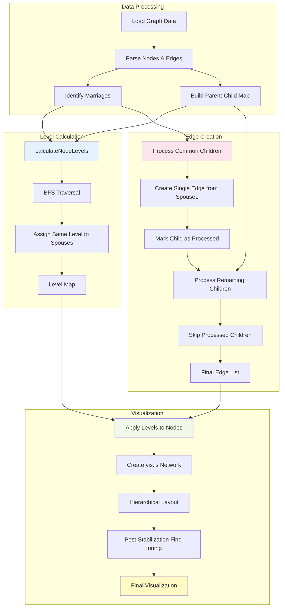

# Graph Visualization Fix Plan

## Overview
Fix two critical issues in the family tree graph visualization:
1. Husband and wife not on the same hierarchical level
2. Double edges from both parents to each child (should be single edge)

## Root Causes

### Problem 1: Spouses on Different Levels
- **Location**: Lines 639-788 in `src/app/templates/graph.html`
- **Issue**: vis.js hierarchical layout determines levels based on edge paths, not group assignments
- **Current approach**: Tries to fix positioning after stabilization, but levels are already set
- **Result**: Spouses end up on different vertical levels in the tree

### Problem 2: Double Edges to Children
- **Location**: Lines 584-637 in `src/app/templates/graph.html`
- **Issue**: Loop processes ALL parent-child edges, creating duplicate edges for common children
- **Current approach**: Attempts to track processed children but still adds edges from both parents
- **Result**: Two arrows pointing from parents to each child instead of one

## Solution Architecture

### Solution 1: Explicit Level Assignment for Spouses

**Approach**: Calculate generation levels before creating the network and assign explicit `level` property to nodes.

**Algorithm**:
1. Build parent-child mapping from edges
2. Identify root nodes (people with no parents)
3. Use BFS traversal to assign generation levels
4. When processing a node, also assign same level to their spouse
5. Apply levels to vis.js nodes using the `level` property

**Key Changes**:
- Add `calculateNodeLevels()` function before network creation
- Assign `level` property to each node in `visNodes`
- Ensure hierarchical layout respects fixed levels

### Solution 2: Single Edge Per Child from Married Couples

**Approach**: Pre-process common children and create edges from only one parent.

**Algorithm**:
1. Identify all married couples and their common children (already done)
2. For each common child, create edge from ONLY spouse1 (not both)
3. Track processed children in a Set
4. When processing remaining parent-child edges, skip already-processed children

**Key Changes**:
- Restructure edge creation logic to handle common children first
- Add edges for common children from spouse1 only
- Skip common children in the general parent-child edge loop

## Detailed Implementation Steps

### Step 1: Add Level Calculation Function

**Location**: After line 371 (inside `<script>` tag, before `loadGraph()` function)

**Code to add**:
```javascript
/**
 * Calculate hierarchical levels for nodes to ensure spouses are on same level.
 * Uses BFS traversal starting from root ancestors.
 */
function calculateNodeLevels(visNodes, marriages, parentChildEdges) {
    const levels = new Map();
    const parentMap = new Map(); // child ID -> Set of parent IDs
    const spouseMap = new Map(); // person ID -> spouse ID
    
    // Build parent map from PARENT_OF edges
    parentChildEdges.forEach(edge => {
        if (!parentMap.has(edge.to)) {
            parentMap.set(edge.to, new Set());
        }
        parentMap.get(edge.to).add(edge.from);
    });
    
    // Build spouse map from marriages
    marriages.forEach(marriage => {
        spouseMap.set(marriage.spouse1Id, marriage.spouse2Id);
        spouseMap.set(marriage.spouse2Id, marriage.spouse1Id);
    });
    
    // Find root nodes (people with no parents in the graph)
    const nodeIds = visNodes.map(n => n.id);
    const roots = nodeIds.filter(id => !parentMap.has(id) || parentMap.get(id).size === 0);
    
    // If no roots found (circular references or all have parents), 
    // use nodes with minimum parent count
    if (roots.length === 0) {
        const minParents = Math.min(...Array.from(parentMap.values()).map(s => s.size));
        roots.push(...nodeIds.filter(id => 
            parentMap.has(id) && parentMap.get(id).size === minParents
        ));
    }
    
    // BFS to assign levels
    const queue = roots.map(id => ({ id, level: 0 }));
    const visited = new Set();
    
    while (queue.length > 0) {
        const { id, level } = queue.shift();
        
        // Skip if already visited
        if (visited.has(id)) {
            // If we encounter a node again at a different level, use the minimum level
            if (levels.has(id) && levels.get(id) > level) {
                levels.set(id, level);
            }
            continue;
        }
        
        visited.add(id);
        levels.set(id, level);
        
        // Assign same level to spouse
        const spouseId = spouseMap.get(id);
        if (spouseId && !visited.has(spouseId)) {
            visited.add(spouseId);
            levels.set(spouseId, level);
        }
        
        // Add children to queue at next level
        parentChildEdges.forEach(edge => {
            if (edge.from === id && !visited.has(edge.to)) {
                queue.push({ id: edge.to, level: level + 1 });
            }
            // Also check spouse's children
            if (spouseId && edge.from === spouseId && !visited.has(edge.to)) {
                queue.push({ id: edge.to, level: level + 1 });
            }
        });
    }
    
    // Assign levels to any remaining unvisited nodes (disconnected components)
    nodeIds.forEach(id => {
        if (!levels.has(id)) {
            levels.set(id, 0);
        }
    });
    
    return levels;
}
```

### Step 2: Restructure Edge Creation Logic

**Location**: Replace lines 584-637

**Current problematic code**:
```javascript
// Add parent-child edges, but only one edge per child from married couples
const processedChildren = new Set();

parentChildEdges.forEach(edge => {
    const parentId = edge.from;
    const childId = edge.to;
    
    // Check if this child has already been processed
    if (processedChildren.has(childId)) {
        return; // Skip duplicate edge
    }
    
    // Check if this parent is married and this child is a common child
    let isCommonChild = false;
    for (const [coupleKey, couple] of marriedCouples.entries()) {
        if ((couple.spouse1Id === parentId || couple.spouse2Id === parentId) &&
            couple.commonChildren.has(childId)) {
            isCommonChild = true;
            processedChildren.add(childId);
            break;
        }
    }
    
    // Add the edge (only once per common child)
    visEdges.push({
        // ... edge properties
    });
});
```

**New code**:
```javascript
// Build edges: handle common children first, then individual parent-child relationships
const processedChildren = new Set();

// Step 1: Add edges for common children (one edge per child from spouse1)
marriedCouples.forEach((couple, coupleKey) => {
    couple.commonChildren.forEach(childId => {
        // Create single edge from spouse1 to common child
        visEdges.push({
            from: couple.spouse1Id,
            to: childId,
            label: '',
            color: {
                color: '#2e7d32',
                highlight: '#ff6f00',
                hover: '#ff6f00'
            },
            width: 3,
            dashes: false,
            arrows: {
                to: {
                    enabled: true,
                    scaleFactor: 0.8
                }
            },
            font: {
                size: 16,
                align: 'middle',
                strokeWidth: 0
            },
            smooth: {
                enabled: true,
                type: 'cubicBezier',
                forceDirection: 'vertical',
                roundness: 0.5
            }
        });
        
        // Mark child as processed
        processedChildren.add(childId);
    });
});

// Step 2: Add edges for non-common children (children of single parents or non-married parents)
parentChildEdges.forEach(edge => {
    const parentId = edge.from;
    const childId = edge.to;
    
    // Skip if already processed (common child)
    if (processedChildren.has(childId)) {
        return;
    }
    
    // Add edge for non-common child
    visEdges.push({
        from: parentId,
        to: childId,
        label: '',
        color: {
            color: '#2e7d32',
            highlight: '#ff6f00',
            hover: '#ff6f00'
        },
        width: 3,
        dashes: false,
        arrows: {
            to: {
                enabled: true,
                scaleFactor: 0.8
            }
        },
        font: {
            size: 16,
            align: 'middle',
            strokeWidth: 0
        },
        smooth: {
            enabled: true,
            type: 'cubicBezier',
            forceDirection: 'vertical',
            roundness: 0.5
        }
    });
});
```

### Step 3: Apply Levels to Nodes

**Location**: Replace lines 639-648

**Current code**:
```javascript
// Assign levels to nodes to ensure spouses are on same level
visNodes.forEach(node => {
    const groupId = spouseGroups.get(node.id);
    if (groupId) {
        // Mark nodes that are part of a marriage
        node.group = groupId;
        // Add a fixed property to help with positioning
        node.fixed = { x: false, y: false };
    }
});
```

**New code**:
```javascript
// Calculate and assign hierarchical levels to ensure spouses are on same level
const nodeLevels = calculateNodeLevels(visNodes, marriedCouples, parentChildEdges);

visNodes.forEach(node => {
    // Assign calculated level
    const level = nodeLevels.get(node.id);
    if (level !== undefined) {
        node.level = level;
    }
    
    // Keep group assignment for visual grouping
    const groupId = spouseGroups.get(node.id);
    if (groupId) {
        node.group = groupId;
    }
});
```

### Step 4: Update Hierarchical Layout Options

**Location**: Modify lines 660-674 (options.layout.hierarchical)

**Current code**:
```javascript
layout: {
    hierarchical: {
        enabled: true,
        direction: 'UD',
        sortMethod: 'directed',
        nodeSpacing: 80,
        levelSeparation: 200,
        treeSpacing: 250,
        blockShifting: true,
        edgeMinimization: false,
        parentCentralization: true,
        shakeTowards: 'leaves'
    }
},
```

**New code**:
```javascript
layout: {
    hierarchical: {
        enabled: true,
        direction: 'UD',
        sortMethod: 'directed',
        nodeSpacing: 120,        // Increased to give spouses more room
        levelSeparation: 200,
        treeSpacing: 250,
        blockShifting: true,
        edgeMinimization: true,  // Re-enable for better edge routing
        parentCentralization: true,
        shakeTowards: 'leaves'
    }
},
```

### Step 5: Simplify Post-Stabilization Positioning

**Location**: Replace lines 728-788

**Current code**: Complex manual positioning logic that tries to fix spouse positions

**New code**: Simplified version that only fine-tunes horizontal spacing
```javascript
// After stabilization, fine-tune spouse horizontal positioning
network.once('stabilizationIterationsDone', function() {
    const positions = network.getPositions();
    const updates = [];
    
    // For each marriage, ensure spouses are positioned close together horizontally
    marriedCouples.forEach((couple, coupleKey) => {
        const spouse1Id = couple.spouse1Id;
        const spouse2Id = couple.spouse2Id;
        
        if (positions[spouse1Id] && positions[spouse2Id]) {
            const pos1 = positions[spouse1Id];
            const pos2 = positions[spouse2Id];
            
            // Calculate midpoint
            const midX = (pos1.x + pos2.x) / 2;
            const avgY = (pos1.y + pos2.y) / 2; // Should already be same Y due to level
            
            // Position spouses close together horizontally
            const spacing = 150; // Horizontal spacing between spouses
            
            updates.push({
                id: spouse1Id,
                x: midX - spacing / 2,
                y: avgY
            });
            
            updates.push({
                id: spouse2Id,
                x: midX + spacing / 2,
                y: avgY
            });
        }
    });
    
    // Apply position updates
    if (updates.length > 0) {
        nodes.update(updates);
        // Re-fit the view after positioning
        setTimeout(() => {
            network.fit({
                animation: {
                    duration: 500,
                    easingFunction: 'easeInOutQuad'
                }
            });
        }, 100);
    }
});
```

## Testing Plan

### Test Case 1: Spouse Level Alignment
**Setup**: Load a family tree with married couples
**Expected**: 
- Husband and wife appear on the same horizontal level
- Marriage edge connects them horizontally
- Both spouses are visually grouped together

### Test Case 2: Single Edge to Children
**Setup**: Load a family tree with married couples who have children
**Expected**:
- Only ONE arrow from parents to each child
- Arrow originates from one parent (spouse1)
- No duplicate arrows visible

### Test Case 3: Multiple Generations
**Setup**: Load a family tree with 3+ generations
**Expected**:
- Each generation on a distinct level
- Married couples in each generation aligned horizontally
- Clear parent-child relationships with single edges

### Test Case 4: Complex Family Structures
**Setup**: Load a tree with:
- Multiple marriages
- Children from different marriages
- Remarriages
**Expected**:
- All spouses properly aligned with their partners
- Children correctly connected to appropriate parents
- No duplicate edges

## Mermaid Diagram: Solution Architecture



## Implementation Checklist

- [ ] Add `calculateNodeLevels()` function after line 371
- [ ] Restructure edge creation logic (replace lines 584-637)
- [ ] Apply calculated levels to nodes (replace lines 639-648)
- [ ] Update hierarchical layout options (modify lines 660-674)
- [ ] Simplify post-stabilization positioning (replace lines 728-788)
- [ ] Test with sample family tree data
- [ ] Verify spouse alignment
- [ ] Verify single edges to children
- [ ] Test with complex family structures
- [ ] Document changes in commit message

## Expected Outcomes

1. **Spouse Alignment**: Married couples will appear on the same horizontal level in the family tree
2. **Clean Edges**: Each child will have exactly one incoming edge from their parents
3. **Better Layout**: More organized and readable family tree structure
4. **Consistent Behavior**: Works correctly for simple and complex family structures

## Notes

- The solution uses explicit level assignment which overrides vis.js automatic level calculation
- BFS traversal ensures consistent level assignment across the tree
- Spouse map ensures both partners get the same level during traversal
- Edge deduplication happens before vis.js network creation, not during layout
