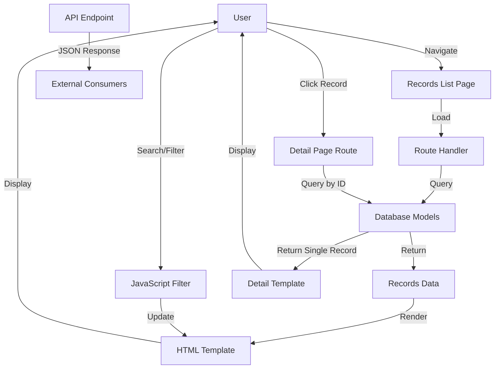

# Records Display Pages Implementation Plan

## Overview
Add dedicated pages for displaying baptism, marriage, and death records in the Korzen genealogical system. These pages will follow the existing design patterns established by the persons page.

## Current State Analysis

### Existing Pages
- **Home Page** ([`index.html`](../src/app/templates/index.html:1)) - File upload and management
- **Persons Page** ([`persons.html`](../src/app/templates/persons.html:1)) - List of all persons with search/filter
- **Graph Visualizer** ([`graph.html`](../src/app/templates/graph.html:1)) - Family tree visualization

### Database Models
The system already has comprehensive models for:
- [`BaptismRecord`](../src/app/models.py:173) - Baptism records with child, parents, godparents
- [`MarriageRecord`](../src/app/models.py:264) - Marriage records with spouses, witnesses, banns
- [`DeathRecord`](../src/app/models.py:348) - Death records with deceased, sacraments, burial info

### Design Pattern
The existing persons page provides a template for:
- Responsive table layout with search and filters
- Statistics cards showing counts
- Consistent styling with gradient backgrounds
- Mobile-responsive design with hidden columns
- Navigation links to other pages

## Implementation Plan

### 1. Baptisms Page

#### Route Handlers
Add to [`src/app/routes/main.py`](../src/app/routes/main.py:1):

**List View Route**
```python
@bp.route("/baptisms")
def list_baptisms():
    """Display list of all baptism records."""
    baptisms = BaptismRecord.query.order_by(
        BaptismRecord.baptism_date.desc().nullslast()
    ).all()
    return render_template("baptisms.html", baptisms=baptisms)
```

**API Endpoint**
```python
@bp.route("/api/baptisms", methods=["GET"])
def api_list_baptisms():
    """API endpoint to get list of all baptism records."""
    baptisms = BaptismRecord.query.order_by(
        BaptismRecord.baptism_date.desc().nullslast()
    ).all()
    
    baptisms_data = []
    for baptism in baptisms:
        baptisms_data.append({
            'id': str(baptism.id),
            'baptism_date': baptism.baptism_date.isoformat() if baptism.baptism_date else None,
            'birth_date': baptism.birth_date.isoformat() if baptism.birth_date else None,
            'child_name': baptism.child_name,
            'child_gender': baptism.child_gender,
            'father_name': f"{baptism.father_name or ''} {baptism.father_surname or ''}".strip(),
            'mother_name': f"{baptism.mother_name or ''} {baptism.mother_maiden_name or ''}".strip(),
            'parish': baptism.parish,
            'village': baptism.village,
            'legitimate': baptism.legitimate
        })
    
    return jsonify({"baptisms": baptisms_data, "count": len(baptisms_data)}), 200
```

**Detail View Route**
```python
@bp.route("/baptisms/<baptism_id>")
def baptism_detail(baptism_id):
    """Display detailed view of a single baptism record."""
    baptism = db.session.get(BaptismRecord, baptism_id)
    if not baptism:
        return render_template("error.html", error="Baptism record not found"), 404
    return render_template("baptism_detail.html", baptism=baptism)
```

#### HTML Template: `baptisms.html`

**Key Features:**
- Table columns: Baptism Date, Child Name, Gender, Parents, Parish, Village
- Search by: child name, parent names, parish, village
- Filters: Gender, Legitimacy status, Date range
- Statistics: Total baptisms, by gender, legitimate vs illegitimate
- Clickable rows linking to detail pages
- Mobile-responsive with hidden columns

**Table Structure:**
| Baptism Date | Child Name | Gender | Father | Mother | Parish | Village | Actions |
|--------------|------------|--------|--------|--------|--------|---------|---------|

#### HTML Template: `baptism_detail.html`

**Sections:**
1. **Child Information** - Name, gender, birth date, baptism date
2. **Parents** - Father and mother with links to person records
3. **Grandparents** - Paternal and maternal grandparents
4. **Godparents** - Godfather and godmother information
5. **Location** - Parish, village, house number
6. **Record Details** - Record number, page number, priest name
7. **Original Text** - Latin text, transcription, translation
8. **Notes** - Additional notes

### 2. Marriages Page

#### Route Handlers
Add to [`src/app/routes/main.py`](../src/app/routes/main.py:1):

**List View Route**
```python
@bp.route("/marriages")
def list_marriages():
    """Display list of all marriage records."""
    marriages = MarriageRecord.query.order_by(
        MarriageRecord.marriage_date.desc().nullslast()
    ).all()
    return render_template("marriages.html", marriages=marriages)
```

**API Endpoint**
```python
@bp.route("/api/marriages", methods=["GET"])
def api_list_marriages():
    """API endpoint to get list of all marriage records."""
    marriages = MarriageRecord.query.order_by(
        MarriageRecord.marriage_date.desc().nullslast()
    ).all()
    
    marriages_data = []
    for marriage in marriages:
        marriages_data.append({
            'id': str(marriage.id),
            'marriage_date': marriage.marriage_date.isoformat() if marriage.marriage_date else None,
            'spouse1_name': f"{marriage.spouse1_name or ''} {marriage.spouse1_surname or ''}".strip(),
            'spouse1_status': marriage.spouse1_status,
            'spouse2_name': f"{marriage.spouse2_name or ''} {marriage.spouse2_surname or ''}".strip(),
            'spouse2_status': marriage.spouse2_status,
            'parish': marriage.parish,
            'village': marriage.village,
            'banns_count': marriage.banns_count
        })
    
    return jsonify({"marriages": marriages_data, "count": len(marriages_data)}), 200
```

**Detail View Route**
```python
@bp.route("/marriages/<marriage_id>")
def marriage_detail(marriage_id):
    """Display detailed view of a single marriage record."""
    marriage = db.session.get(MarriageRecord, marriage_id)
    if not marriage:
        return render_template("error.html", error="Marriage record not found"), 404
    return render_template("marriage_detail.html", marriage=marriage)
```

#### HTML Template: `marriages.html`

**Key Features:**
- Table columns: Marriage Date, Spouse 1, Spouse 2, Status, Parish, Village
- Search by: spouse names, parish, village
- Filters: Marital status (bachelor/spinster, widower/widow), Date range
- Statistics: Total marriages, by status types
- Clickable rows linking to detail pages

**Table Structure:**
| Marriage Date | Spouse 1 | Status | Spouse 2 | Status | Parish | Village | Actions |
|---------------|----------|--------|----------|--------|--------|---------|---------|

#### HTML Template: `marriage_detail.html`

**Sections:**
1. **Marriage Information** - Date, parish, village
2. **Spouse 1 Details** - Name, status, age, residence, parents
3. **Spouse 2 Details** - Name, maiden name, status, age, residence, parents
4. **Banns** - Count and dates of banns
5. **Witnesses** - List of witnesses with locations
6. **Record Details** - Record number, page number, priest name
7. **Original Text** - Latin text, transcription, translation
8. **Notes** - Additional notes

### 3. Deaths Page

#### Route Handlers
Add to [`src/app/routes/main.py`](../src/app/routes/main.py:1):

**List View Route**
```python
@bp.route("/deaths")
def list_deaths():
    """Display list of all death records."""
    deaths = DeathRecord.query.order_by(
        DeathRecord.death_date.desc().nullslast()
    ).all()
    return render_template("deaths.html", deaths=deaths)
```

**API Endpoint**
```python
@bp.route("/api/deaths", methods=["GET"])
def api_list_deaths():
    """API endpoint to get list of all death records."""
    deaths = DeathRecord.query.order_by(
        DeathRecord.death_date.desc().nullslast()
    ).all()
    
    deaths_data = []
    for death in deaths:
        deaths_data.append({
            'id': str(death.id),
            'death_date': death.death_date.isoformat() if death.death_date else None,
            'burial_date': death.burial_date.isoformat() if death.burial_date else None,
            'deceased_name': f"{death.deceased_name or ''} {death.deceased_surname or ''}".strip(),
            'deceased_maiden_name': death.deceased_maiden_name,
            'marital_status': death.marital_status,
            'age_years': death.age_years,
            'age_description': death.age_description,
            'parish': death.parish,
            'village': death.village,
            'cemetery': death.cemetery,
            'cause_of_death': death.cause_of_death,
            'sacraments_received': death.sacraments_received
        })
    
    return jsonify({"deaths": deaths_data, "count": len(deaths_data)}), 200
```

**Detail View Route**
```python
@bp.route("/deaths/<death_id>")
def death_detail(death_id):
    """Display detailed view of a single death record."""
    death = db.session.get(DeathRecord, death_id)
    if not death:
        return render_template("error.html", error="Death record not found"), 404
    return render_template("death_detail.html", death=death)
```

#### HTML Template: `deaths.html`

**Key Features:**
- Table columns: Death Date, Deceased Name, Age, Marital Status, Parish, Village, Cemetery
- Search by: deceased name, parish, village, cemetery, cause of death
- Filters: Marital status, Age range, Sacraments received
- Statistics: Total deaths, by marital status, average age, sacraments stats
- Clickable rows linking to detail pages

**Table Structure:**
| Death Date | Deceased Name | Age | Marital Status | Parish | Village | Cemetery | Actions |
|------------|---------------|-----|----------------|--------|---------|----------|---------|

#### HTML Template: `death_detail.html`

**Sections:**
1. **Deceased Information** - Name, maiden name, marital status, age
2. **Dates** - Death date, burial date
3. **Location** - Parish, village, cemetery
4. **Family** - Spouse, father, mother
5. **Cause of Death** - Description
6. **Sacraments** - Whether received, details
7. **Record Details** - Record number, page number, priest name
8. **Original Text** - Latin text, transcription, translation
9. **Notes** - Additional notes

### 4. Navigation Updates

Update navigation links in all existing templates:

#### [`index.html`](../src/app/templates/index.html:1)
Add links after "View Persons" button:
```html
<a href="/baptisms" class="btn-nav-persons">⛪ Baptisms</a>
<a href="/marriages" class="btn-nav-persons">💒 Marriages</a>
<a href="/deaths" class="btn-nav-persons">🕊️ Deaths</a>
```

#### [`persons.html`](../src/app/templates/persons.html:1)
Update nav-links section:
```html
<div class="nav-links">
    <a href="/" class="btn-nav">🏠 Home</a>
    <a href="/baptisms" class="btn-nav">⛪ Baptisms</a>
    <a href="/marriages" class="btn-nav">💒 Marriages</a>
    <a href="/deaths" class="btn-nav">🕊️ Deaths</a>
    <a href="/graph" class="btn-nav">🌳 Graph Visualizer</a>
</div>
```

#### [`graph.html`](../src/app/templates/graph.html:1)
Add similar navigation links.

### 5. Shared Components

#### Error Template: `error.html`
Create a simple error page for 404s and other errors:
```html
<!DOCTYPE html>
<html lang="en">
<head>
    <meta charset="UTF-8">
    <title>Error - Korzen</title>
    <!-- Shared styles -->
</head>
<body>
    <div class="container">
        <h1>⚠️ Error</h1>
        <p>{{ error }}</p>
        <a href="/" class="btn-nav">🏠 Return Home</a>
    </div>
</body>
</html>
```

### 6. Model Imports

Update imports in [`src/app/routes/main.py`](../src/app/routes/main.py:10):
```python
from ..models import (
    UploadedFile, 
    Person, 
    BaptismRecord, 
    MarriageRecord, 
    DeathRecord
)
```

## Design Specifications

### Color Scheme
- Primary gradient: `#667eea` to `#764ba2` (purple)
- Success: `#4caf50` (green)
- Error: `#f44336` (red)
- Info: `#2196f3` (blue)
- Warning: `#ff9800` (orange)

### Typography
- Font family: `-apple-system, BlinkMacSystemFont, 'Segoe UI', Roboto, Oxygen, Ubuntu, Cantarell, sans-serif`
- Headings: Bold, larger sizes
- Body: Regular weight, readable sizes

### Responsive Breakpoints
- Mobile: `max-width: 768px`
  - Hide less important columns
  - Stack filters vertically
  - Reduce padding

### Icons
- Baptisms: ⛪
- Marriages: 💒
- Deaths: 🕊️
- Persons: 👥
- Home: 🏠
- Graph: 🌳

## Data Flow Diagram



## Implementation Sequence

### Phase 1: List Pages
1. Create baptisms.html template
2. Add baptisms route handler
3. Add baptisms API endpoint
4. Create marriages.html template
5. Add marriages route handler
6. Add marriages API endpoint
7. Create deaths.html template
8. Add deaths route handler
9. Add deaths API endpoint

### Phase 2: Detail Pages
10. Create baptism_detail.html template
11. Add baptism detail route handler
12. Create marriage_detail.html template
13. Add marriage detail route handler
14. Create death_detail.html template
15. Add death detail route handler

### Phase 3: Navigation & Polish
16. Update navigation in index.html
17. Update navigation in persons.html
18. Update navigation in graph.html
19. Create error.html template
20. Test all pages and links

## Testing Checklist

### Functional Testing
- [ ] Baptisms list page loads correctly
- [ ] Marriages list page loads correctly
- [ ] Deaths list page loads correctly
- [ ] Search functionality works on all pages
- [ ] Filters work correctly
- [ ] Statistics display accurate counts
- [ ] Detail pages load with correct data
- [ ] Navigation links work between all pages
- [ ] API endpoints return correct JSON

### Responsive Testing
- [ ] Pages display correctly on desktop
- [ ] Pages display correctly on tablet
- [ ] Pages display correctly on mobile
- [ ] Tables are scrollable on small screens
- [ ] Hidden columns work on mobile

### Data Testing
- [ ] Empty state displays when no records
- [ ] Large datasets render without performance issues
- [ ] Special characters in names display correctly
- [ ] Date formatting is consistent
- [ ] Null values display as "—" or appropriate placeholder

### Cross-browser Testing
- [ ] Chrome/Chromium
- [ ] Firefox
- [ ] Safari
- [ ] Edge

## Future Enhancements

### Potential Features
1. **Export functionality** - Export records to CSV/PDF
2. **Advanced filtering** - Date ranges, multiple criteria
3. **Sorting** - Click column headers to sort
4. **Pagination** - For large datasets
5. **Record linking** - Click person names to view their person page
6. **Statistics dashboard** - Aggregate statistics and charts
7. **Print-friendly views** - CSS for printing records
8. **Batch operations** - Select multiple records for actions
9. **Record editing** - Admin interface to edit records
10. **Image attachments** - Link scanned documents to records

### Performance Optimizations
1. **Database indexing** - Add indexes on frequently queried fields
2. **Query optimization** - Use eager loading for relationships
3. **Caching** - Cache frequently accessed data
4. **Lazy loading** - Load detail data on demand
5. **Virtual scrolling** - For very large lists

## Notes

- All templates should follow the existing design pattern from persons.html
- Maintain consistent styling across all pages
- Ensure accessibility with proper ARIA labels and semantic HTML
- Use the same gradient and color scheme throughout
- Keep mobile responsiveness in mind for all layouts
- Add proper error handling for missing records
- Include loading states for API calls
- Validate all user inputs on search/filter
