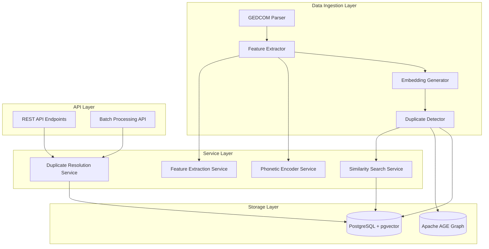
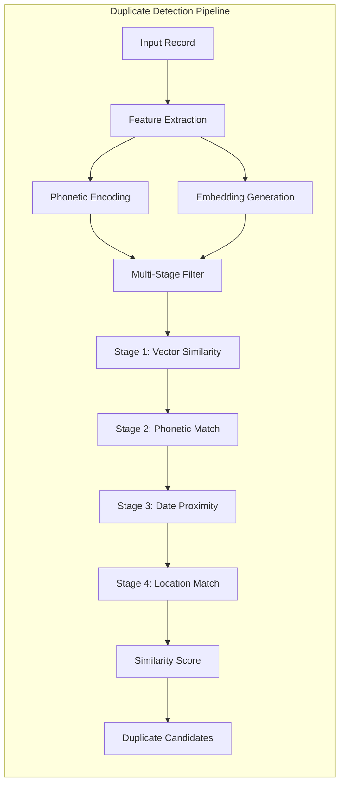

# Vector Embedding-Based Duplicate Detection System - Implementation Plan

## Executive Summary

This document outlines the implementation plan for a sophisticated duplicate detection system for genealogical records using vector embeddings, phonetic matching (Daitch-Mokotoff for Slavic names), and PostgreSQL pgvector extension. The system will detect duplicate Person and Event records (baptisms, marriages, deaths) through multi-stage filtering combining vector similarity, phonetic matching, date proximity, and location matching.

## Table of Contents

1. [Current State Analysis](#current-state-analysis)
2. [System Architecture](#system-architecture)
3. [Database Schema Changes](#database-schema-changes)
4. [Service Layer Design](#service-layer-design)
5. [Integration Points](#integration-points)
6. [Migration Strategy](#migration-strategy)
7. [Testing Approach](#testing-approach)
8. [Performance Considerations](#performance-considerations)
9. [Implementation Phases](#implementation-phases)
10. [API Endpoints](#api-endpoints)
11. [Configuration](#configuration)
12. [Monitoring and Observability](#monitoring-and-observability)

---

## Current State Analysis

### Existing Infrastructure

**Database Stack:**
- PostgreSQL with Apache AGE graph extension
- SQLAlchemy ORM with Flask-SQLAlchemy
- Alembic for migrations

**Models (from [`src/app/models.py`](src/app/models.py:1)):**
- `Person` - Core entity with name, dates, locations, parent relationships
- `BaptismRecord` - Baptism events with child, parents, godparents
- `MarriageRecord` - Marriage events with spouses, witnesses
- `DeathRecord` - Death events with deceased person details
- `RecordBatch` - Tracks import batches

**Current Duplicate Detection:**
- Basic GEDCOM ID tracking (see [`GEDCOM_DUPLICATE_DETECTION.md`](GEDCOM_DUPLICATE_DETECTION.md:1))
- Prevents re-import of same GEDCOM file
- Uses `gedcom_id` field for exact matching
- No fuzzy matching or similarity detection

**GEDCOM Parser (from [`src/app/gedcom_parser.py`](src/app/gedcom_parser.py:1)):**
- Parses GEDCOM files using ged4py library
- Creates Person and Event records
- Handles parent-child relationships
- Imports to Apache AGE graph

**Existing Dependencies (from [`requirements.txt`](requirements.txt:1)):**
- Flask 3.0.3
- SQLAlchemy 2.0.32
- psycopg 3.2.1 (PostgreSQL adapter)
- numpy 2.4.4
- scipy 1.17.1
- gensim 4.4.0 (for embeddings)

### Limitations of Current System

1. **No fuzzy matching** - Only exact GEDCOM ID matches
2. **No phonetic matching** - Cannot detect name variations (e.g., "Jan" vs "Johann")
3. **No similarity scoring** - Cannot rank potential duplicates
4. **No cross-source detection** - Cannot find duplicates across different GEDCOM files
5. **No Slavic name handling** - Critical for Polish/Eastern European genealogy

---

## System Architecture

### High-Level Architecture



### Component Architecture



### Data Flow

1. **Ingestion**: GEDCOM file → Parser → Raw records
2. **Feature Extraction**: Raw records → Features (names, dates, locations)
3. **Encoding**: Features → Phonetic codes + Vector embeddings
4. **Storage**: Embeddings → pgvector index
5. **Detection**: New record → Vector search → Candidate matches
6. **Filtering**: Candidates → Multi-stage filter → Ranked duplicates
7. **Resolution**: Duplicates → Manual review or auto-merge

---

## Database Schema Changes

### 1. Add pgvector Extension

```sql
-- Enable pgvector extension
CREATE EXTENSION IF NOT EXISTS vector;
```

### 2. Person Table Enhancements

Add columns to `persons` table:

```python
# In Person model (src/app/models.py)

# Phonetic encoding fields
first_name_dm = db.Column(String(50), nullable=True, index=True)  # Daitch-Mokotoff code
last_name_dm = db.Column(String(50), nullable=True, index=True)
maiden_name_dm = db.Column(String(50), nullable=True, index=True)

# Vector embedding (128 dimensions)
embedding = db.Column(Vector(128), nullable=True)

# Duplicate detection metadata
is_duplicate = db.Column(Boolean, default=False, index=True)
canonical_person_id = db.Column(
    UUID(as_uuid=True),
    ForeignKey("persons.id"),
    nullable=True
)
duplicate_confidence = db.Column(Float, nullable=True)  # 0.0 to 1.0
duplicate_checked_at = db.Column(DateTime(timezone=True), nullable=True)
```

### 3. Event Record Enhancements

Add to `BaptismRecord`, `MarriageRecord`, `DeathRecord`:

```python
# Vector embedding for event
embedding = db.Column(Vector(128), nullable=True)

# Duplicate detection
is_duplicate = db.Column(Boolean, default=False, index=True)
canonical_record_id = db.Column(
    UUID(as_uuid=True),
    ForeignKey("baptism_records.id"),  # or respective table
    nullable=True
)
duplicate_confidence = db.Column(Float, nullable=True)
duplicate_checked_at = db.Column(DateTime(timezone=True), nullable=True)
```

### 4. New Tables

#### DuplicateCandidate Table

Stores potential duplicate pairs for review:

```python
class DuplicateCandidate(db.Model):
    """Stores potential duplicate record pairs for review."""
    __tablename__ = "duplicate_candidates"
    
    id = db.Column(UUID(as_uuid=True), primary_key=True, default=uuid4)
    
    # Record type: 'person', 'baptism', 'marriage', 'death'
    record_type = db.Column(String(20), nullable=False, index=True)
    
    # Record IDs
    record1_id = db.Column(UUID(as_uuid=True), nullable=False, index=True)
    record2_id = db.Column(UUID(as_uuid=True), nullable=False, index=True)
    
    # Similarity scores
    overall_similarity = db.Column(Float, nullable=False, index=True)
    vector_similarity = db.Column(Float, nullable=True)
    phonetic_similarity = db.Column(Float, nullable=True)
    date_similarity = db.Column(Float, nullable=True)
    location_similarity = db.Column(Float, nullable=True)
    
    # Matching details (JSONB for flexibility)
    match_details = db.Column(JSONB, nullable=True)
    
    # Review status
    status = db.Column(
        String(20), 
        nullable=False, 
        default='pending',
        index=True
    )  # pending, confirmed, rejected, auto_merged
    
    reviewed_by = db.Column(String(100), nullable=True)
    reviewed_at = db.Column(DateTime(timezone=True), nullable=True)
    
    # Metadata
    detected_at = db.Column(DateTime(timezone=True), default=datetime.utcnow)
    created_at = db.Column(DateTime(timezone=True), default=datetime.utcnow)
    
    # Indexes
    __table_args__ = (
        Index('idx_duplicate_record1', 'record_type', 'record1_id'),
        Index('idx_duplicate_record2', 'record_type', 'record2_id'),
        Index('idx_duplicate_status', 'status', 'overall_similarity'),
    )
```

#### DuplicateResolution Table

Tracks merge/resolution actions:

```python
class DuplicateResolution(db.Model):
    """Tracks duplicate resolution actions (merges, rejections)."""
    __tablename__ = "duplicate_resolutions"
    
    id = db.Column(UUID(as_uuid=True), primary_key=True, default=uuid4)
    
    candidate_id = db.Column(
        UUID(as_uuid=True),
        ForeignKey("duplicate_candidates.id"),
        nullable=False
    )
    
    # Resolution action: 'merged', 'rejected', 'marked_duplicate'
    action = db.Column(String(20), nullable=False)
    
    # Which record was kept (for merges)
    canonical_record_id = db.Column(UUID(as_uuid=True), nullable=True)
    
    # Which record was marked as duplicate
    duplicate_record_id = db.Column(UUID(as_uuid=True), nullable=True)
    
    # Merge details
    merge_strategy = db.Column(String(50), nullable=True)  # 'keep_all', 'prefer_newer', etc.
    merged_fields = db.Column(JSONB, nullable=True)
    
    # Audit trail
    resolved_by = db.Column(String(100), nullable=False)
    resolved_at = db.Column(DateTime(timezone=True), default=datetime.utcnow)
    notes = db.Column(Text, nullable=True)
```

### 5. Indexes

```sql
-- Vector similarity indexes (using HNSW for fast approximate search)
CREATE INDEX idx_person_embedding ON persons 
USING hnsw (embedding vector_cosine_ops);

CREATE INDEX idx_baptism_embedding ON baptism_records 
USING hnsw (embedding vector_cosine_ops);

CREATE INDEX idx_marriage_embedding ON marriage_records 
USING hnsw (embedding vector_cosine_ops);

CREATE INDEX idx_death_embedding ON death_records 
USING hnsw (embedding vector_cosine_ops);

-- Phonetic indexes for fast lookup
CREATE INDEX idx_person_first_name_dm ON persons (first_name_dm);
CREATE INDEX idx_person_last_name_dm ON persons (last_name_dm);
CREATE INDEX idx_person_maiden_name_dm ON persons (maiden_name_dm);

-- Composite indexes for common queries
CREATE INDEX idx_person_names_dates ON persons (last_name, first_name, birth_date);
CREATE INDEX idx_person_duplicate_status ON persons (is_duplicate, duplicate_confidence);
```

---

## Service Layer Design

### 1. Phonetic Encoder Service

**File**: `src/app/services/phonetic_encoder.py`

**Purpose**: Encode names using Daitch-Mokotoff phonetic algorithm for Slavic names.

**Key Features**:
- Daitch-Mokotoff encoding for Slavic names (Polish, Russian, Ukrainian, etc.)
- Handles multiple phonetic codes per name (DM can produce multiple codes)
- Fallback to Soundex for non-Slavic names
- Caching for performance

**Interface**:
```python
class PhoneticEncoder:
    """Encodes names using Daitch-Mokotoff phonetic algorithm."""
    
    def encode_name(self, name: str) -> List[str]:
        """
        Encode a name using Daitch-Mokotoff algorithm.
        
        Args:
            name: Name to encode
            
        Returns:
            List of phonetic codes (DM can produce multiple codes)
        """
        pass
    
    def encode_person(self, person: Person) -> Dict[str, List[str]]:
        """
        Encode all names for a person.
        
        Returns:
            Dict with keys: first_name_dm, last_name_dm, maiden_name_dm
        """
        pass
    
    def compare_codes(self, codes1: List[str], codes2: List[str]) -> float:
        """
        Compare two sets of phonetic codes.
        
        Returns:
            Similarity score 0.0 to 1.0
        """
        pass
```

**Implementation Notes**:
- Use `jellyfish` library for Daitch-Mokotoff encoding
- Add to requirements.txt: `jellyfish>=1.0.0`
- Handle edge cases: empty names, special characters, multiple surnames

### 2. Feature Extraction Service

**File**: `src/app/services/feature_extractor.py`

**Purpose**: Extract and normalize features from records for embedding generation.

**Key Features**:
- Extract structured features from Person/Event records
- Normalize dates, locations, names
- Handle missing data gracefully
- Generate feature vectors for embedding

**Interface**:
```python
class FeatureExtractor:
    """Extracts features from genealogical records."""
    
    def extract_person_features(self, person: Person) -> Dict[str, Any]:
        """
        Extract features from a Person record.
        
        Returns:
            Dict with normalized features:
            - names: [first_name, last_name, maiden_name]
            - dates: [birth_date, death_date]
            - locations: [birth_place, death_place]
            - gender: M/F/Unknown
            - phonetic_codes: [dm_codes]
        """
        pass
    
    def extract_event_features(
        self, 
        event: Union[BaptismRecord, MarriageRecord, DeathRecord]
    ) -> Dict[str, Any]:
        """Extract features from an event record."""
        pass
    
    def normalize_location(self, location: str) -> str:
        """Normalize location string for comparison."""
        pass
    
    def normalize_date(self, date: datetime) -> str:
        """Normalize date for comparison."""
        pass
```

### 3. Embedding Generator Service

**File**: `src/app/services/embedding_generator.py`

**Purpose**: Generate 128-dimensional vector embeddings from features.

**Key Features**:
- Generate embeddings from structured features
- Use pre-trained model or train custom model
- Consistent dimensionality (128D)
- Efficient batch processing

**Interface**:
```python
class EmbeddingGenerator:
    """Generates vector embeddings for genealogical records."""
    
    def __init__(self, model_path: Optional[str] = None):
        """
        Initialize with optional custom model.
        
        Args:
            model_path: Path to pre-trained model (optional)
        """
        pass
    
    def generate_person_embedding(self, features: Dict[str, Any]) -> np.ndarray:
        """
        Generate 128D embedding for a person.
        
        Args:
            features: Extracted features from FeatureExtractor
            
        Returns:
            128-dimensional numpy array
        """
        pass
    
    def generate_event_embedding(self, features: Dict[str, Any]) -> np.ndarray:
        """Generate 128D embedding for an event."""
        pass
    
    def batch_generate(
        self, 
        features_list: List[Dict[str, Any]]
    ) -> np.ndarray:
        """
        Generate embeddings for multiple records efficiently.
        
        Returns:
            Array of shape (N, 128)
        """
        pass
```

**Implementation Strategy**:
- **Option 1**: Use sentence transformers (e.g., `all-MiniLM-L6-v2`) with custom feature encoding
- **Option 2**: Train custom model on genealogical data
- **Option 3**: Use weighted combination of feature embeddings

**Recommended Approach**: Start with Option 1 (sentence transformers) for quick implementation, then train custom model if needed.

### 4. Similarity Search Service

**File**: `src/app/services/similarity_search.py`

**Purpose**: Find similar records using vector similarity and multi-stage filtering.

**Key Features**:
- Vector similarity search using pgvector
- Multi-stage filtering pipeline
- Configurable similarity thresholds
- Efficient candidate retrieval

**Interface**:
```python
class SimilaritySearchService:
    """Searches for similar records using vector embeddings."""
    
    def __init__(
        self,
        vector_threshold: float = 0.75,
        phonetic_threshold: float = 0.80,
        date_threshold_days: int = 365,
        location_threshold: float = 0.70
    ):
        """Initialize with configurable thresholds."""
        pass
    
    def find_similar_persons(
        self, 
        person: Person,
        limit: int = 10
    ) -> List[Tuple[Person, float]]:
        """
        Find similar persons using multi-stage filtering.
        
        Returns:
            List of (person, similarity_score) tuples, sorted by score
        """
        pass
    
    def find_similar_events(
        self,
        event: Union[BaptismRecord, MarriageRecord, DeathRecord],
        limit: int = 10
    ) -> List[Tuple[Any, float]]:
        """Find similar event records."""
        pass
    
    def _stage1_vector_search(
        self, 
        embedding: np.ndarray,
        table: str,
        limit: int = 50
    ) -> List[UUID]:
        """
        Stage 1: Fast vector similarity search.
        Returns top N candidates based on cosine similarity.
        """
        pass
    
    def _stage2_phonetic_filter(
        self,
        candidates: List[Person],
        target_person: Person
    ) -> List[Person]:
        """
        Stage 2: Filter by phonetic similarity.
        Removes candidates with low phonetic match.
        """
        pass
    
    def _stage3_date_filter(
        self,
        candidates: List[Person],
        target_person: Person
    ) -> List[Person]:
        """
        Stage 3: Filter by date proximity.
        Removes candidates with dates too far apart.
        """
        pass
    
    def _stage4_location_filter(
        self,
        candidates: List[Person],
        target_person: Person
    ) -> List[Person]:
        """
        Stage 4: Filter by location similarity.
        Final filtering stage.
        """
        pass
    
    def calculate_similarity_score(
        self,
        record1: Any,
        record2: Any
    ) -> Dict[str, float]:
        """
        Calculate detailed similarity scores.
        
        Returns:
            Dict with scores:
            - overall: 0.0 to 1.0
            - vector: 0.0 to 1.0
            - phonetic: 0.0 to 1.0
            - date: 0.0 to 1.0
            - location: 0.0 to 1.0
        """
        pass
```

### 5. Duplicate Detector Service

**File**: `src/app/services/duplicate_detector.py`

**Purpose**: Orchestrate duplicate detection pipeline and manage candidates.

**Key Features**:
- Coordinate all detection services
- Create DuplicateCandidate records
- Batch processing support
- Progress tracking

**Interface**:
```python
class DuplicateDetectorService:
    """Orchestrates duplicate detection pipeline."""
    
    def __init__(
        self,
        phonetic_encoder: PhoneticEncoder,
        feature_extractor: FeatureExtractor,
        embedding_generator: EmbeddingGenerator,
        similarity_search: SimilaritySearchService
    ):
        """Initialize with required services."""
        pass
    
    def detect_person_duplicates(
        self,
        person: Person,
        auto_create_candidates: bool = True
    ) -> List[DuplicateCandidate]:
        """
        Detect duplicates for a single person.
        
        Args:
            person: Person to check
            auto_create_candidates: Create DuplicateCandidate records
            
        Returns:
            List of duplicate candidates
        """
        pass
    
    def detect_event_duplicates(
        self,
        event: Union[BaptismRecord, MarriageRecord, DeathRecord],
        auto_create_candidates: bool = True
    ) -> List[DuplicateCandidate]:
        """Detect duplicates for an event record."""
        pass
    
    def batch_detect_duplicates(
        self,
        record_type: str,
        batch_size: int = 100,
        progress_callback: Optional[Callable] = None
    ) -> Dict[str, int]:
        """
        Detect duplicates for all records of a type.
        
        Args:
            record_type: 'person', 'baptism', 'marriage', 'death'
            batch_size: Records to process per batch
            progress_callback: Optional callback for progress updates
            
        Returns:
            Statistics dict with counts
        """
        pass
    
    def process_new_record(
        self,
        record: Any,
        record_type: str
    ) -> Optional[List[DuplicateCandidate]]:
        """
        Process a newly imported record for duplicates.
        Called during GEDCOM import.
        """
        pass
```

### 6. Duplicate Resolution Service

**File**: `src/app/services/duplicate_resolver.py`

**Purpose**: Handle duplicate resolution actions (merge, reject, mark).

**Interface**:
```python
class DuplicateResolverService:
    """Handles duplicate resolution actions."""
    
    def merge_persons(
        self,
        canonical_id: UUID,
        duplicate_id: UUID,
        merge_strategy: str = 'keep_all',
        resolved_by: str = 'system'
    ) -> Person:
        """
        Merge two person records.
        
        Args:
            canonical_id: ID of person to keep
            duplicate_id: ID of person to mark as duplicate
            merge_strategy: How to merge fields
            resolved_by: User or system identifier
            
        Returns:
            Updated canonical person
        """
        pass
    
    def reject_duplicate(
        self,
        candidate_id: UUID,
        resolved_by: str,
        notes: Optional[str] = None
    ) -> DuplicateCandidate:
        """Mark a candidate as not a duplicate."""
        pass
    
    def mark_as_duplicate(
        self,
        candidate_id: UUID,
        canonical_id: UUID,
        resolved_by: str
    ) -> DuplicateCandidate:
        """Mark a record as duplicate without merging."""
        pass
```

---

## Integration Points

### 1. GEDCOM Parser Integration

**File**: [`src/app/gedcom_parser.py`](src/app/gedcom_parser.py:1)

**Integration Points**:

```python
class GedcomParser:
    def __init__(self, filepath: str, uploaded_file_id: str):
        # ... existing code ...
        
        # Add duplicate detection services
        self.phonetic_encoder = PhoneticEncoder()
        self.feature_extractor = FeatureExtractor()
        self.embedding_generator = EmbeddingGenerator()
        self.duplicate_detector = DuplicateDetectorService(
            self.phonetic_encoder,
            self.feature_extractor,
            self.embedding_generator,
            SimilaritySearchService()
        )
    
    def create_person_from_individual(self, individual: Individual) -> Person:
        # ... existing duplicate check by gedcom_id ...
        
        # Create person
        person = Person(...)
        
        # Generate phonetic codes
        phonetic_codes = self.phonetic_encoder.encode_person(person)
        person.first_name_dm = phonetic_codes.get('first_name_dm', [None])[0]
        person.last_name_dm = phonetic_codes.get('last_name_dm', [None])[0]
        person.maiden_name_dm = phonetic_codes.get('maiden_name_dm', [None])[0]
        
        # Generate embedding
        features = self.feature_extractor.extract_person_features(person)
        embedding = self.embedding_generator.generate_person_embedding(features)
        person.embedding = embedding.tolist()  # Convert numpy array to list
        
        # Check for duplicates (after person is added to session)
        db.session.add(person)
        db.session.flush()
        
        # Detect duplicates
        candidates = self.duplicate_detector.detect_person_duplicates(
            person, 
            auto_create_candidates=True
        )
        
        if candidates:
            logger.info(f"Found {len(candidates)} potential duplicates for {person.first_name} {person.last_name}")
        
        return person
```

### 2. API Routes Integration

**File**: [`src/app/routes/main.py`](src/app/routes/main.py:1)

Add new routes for duplicate management (see [API Endpoints](#api-endpoints) section).

### 3. Batch Processing Integration

Create new route for batch duplicate detection:

```python
@bp.route("/api/duplicates/batch-detect", methods=["POST"])
def batch_detect_duplicates():
    """Trigger batch duplicate detection for existing records."""
    data = request.get_json()
    record_type = data.get('record_type', 'person')
    
    # Initialize services
    detector = DuplicateDetectorService(...)
    
    # Run batch detection
    stats = detector.batch_detect_duplicates(record_type)
    
    return jsonify(stats), 200
```

---

## Migration Strategy

### Phase 1: Database Schema Migration

**Migration File**: `src/migrations/versions/add_vector_duplicate_detection.py`

```python
"""Add vector duplicate detection support

Revision ID: xxx
Revises: yyy
Create Date: 2026-05-16

"""
from alembic import op
import sqlalchemy as sa
from sqlalchemy.dialects import postgresql
from pgvector.sqlalchemy import Vector

def upgrade():
    # Enable pgvector extension
    op.execute('CREATE EXTENSION IF NOT EXISTS vector')
    
    # Add columns to persons table
    op.add_column('persons', sa.Column('first_name_dm', sa.String(50), nullable=True))
    op.add_column('persons', sa.Column('last_name_dm', sa.String(50), nullable=True))
    op.add_column('persons', sa.Column('maiden_name_dm', sa.String(50), nullable=True))
    op.add_column('persons', sa.Column('embedding', Vector(128), nullable=True))
    op.add_column('persons', sa.Column('is_duplicate', sa.Boolean(), default=False))
    op.add_column('persons', sa.Column('canonical_person_id', postgresql.UUID(as_uuid=True), nullable=True))
    op.add_column('persons', sa.Column('duplicate_confidence', sa.Float(), nullable=True))
    op.add_column('persons', sa.Column('duplicate_checked_at', sa.DateTime(timezone=True), nullable=True))
    
    # Add indexes
    op.create_index('idx_person_first_name_dm', 'persons', ['first_name_dm'])
    op.create_index('idx_person_last_name_dm', 'persons', ['last_name_dm'])
    op.create_index('idx_person_duplicate_status', 'persons', ['is_duplicate', 'duplicate_confidence'])
    
    # Create vector index (HNSW for fast approximate search)
    op.execute('''
        CREATE INDEX idx_person_embedding ON persons 
        USING hnsw (embedding vector_cosine_ops)
    ''')
    
    # Add foreign key for canonical_person_id
    op.create_foreign_key(
        'fk_person_canonical',
        'persons', 'persons',
        ['canonical_person_id'], ['id']
    )
    
    # Repeat for baptism_records, marriage_records, death_records
    # ... (similar columns and indexes)
    
    # Create duplicate_candidates table
    op.create_table(
        'duplicate_candidates',
        sa.Column('id', postgresql.UUID(as_uuid=True), primary_key=True),
        sa.Column('record_type', sa.String(20), nullable=False),
        sa.Column('record1_id', postgresql.UUID(as_uuid=True), nullable=False),
        sa.Column('record2_id', postgresql.UUID(as_uuid=True), nullable=False),
        sa.Column('overall_similarity', sa.Float(), nullable=False),
        sa.Column('vector_similarity', sa.Float(), nullable=True),
        sa.Column('phonetic_similarity', sa.Float(), nullable=True),
        sa.Column('date_similarity', sa.Float(), nullable=True),
        sa.Column('location_similarity', sa.Float(), nullable=True),
        sa.Column('match_details', postgresql.JSONB(), nullable=True),
        sa.Column('status', sa.String(20), nullable=False, default='pending'),
        sa.Column('reviewed_by', sa.String(100), nullable=True),
        sa.Column('reviewed_at', sa.DateTime(timezone=True), nullable=True),
        sa.Column('detected_at', sa.DateTime(timezone=True), nullable=False),
        sa.Column('created_at', sa.DateTime(timezone=True), nullable=False),
    )
    
    # Create indexes for duplicate_candidates
    op.create_index('idx_duplicate_record1', 'duplicate_candidates', ['record_type', 'record1_id'])
    op.create_index('idx_duplicate_record2', 'duplicate_candidates', ['record_type', 'record2_id'])
    op.create_index('idx_duplicate_status', 'duplicate_candidates', ['status', 'overall_similarity'])
    
    # Create duplicate_resolutions table
    op.create_table(
        'duplicate_resolutions',
        sa.Column('id', postgresql.UUID(as_uuid=True), primary_key=True),
        sa.Column('candidate_id', postgresql.UUID(as_uuid=True), nullable=False),
        sa.Column('action', sa.String(20), nullable=False),
        sa.Column('canonical_record_id', postgresql.UUID(as_uuid=True), nullable=True),
        sa.Column('duplicate_record_id', postgresql.UUID(as_uuid=True), nullable=True),
        sa.Column('merge_strategy', sa.String(50), nullable=True),
        sa.Column('merged_fields', postgresql.JSONB(), nullable=True),
        sa.Column('resolved_by', sa.String(100), nullable=False),
        sa.Column('resolved_at', sa.DateTime(timezone=True), nullable=False),
        sa.Column('notes', sa.Text(), nullable=True),
    )
    
    # Add foreign key
    op.create_foreign_key(
        'fk_resolution_candidate',
        'duplicate_resolutions', 'duplicate_candidates',
        ['candidate_id'], ['id']
    )

def downgrade():
    # Drop tables and indexes
    op.drop_table('duplicate_resolutions')
    op.drop_table('duplicate_candidates')
    
    # Drop indexes and columns from persons
    op.execute('DROP INDEX IF EXISTS idx_person_embedding')
    op.drop_index('idx_person_duplicate_status')
    op.drop_index('idx_person_last_name_dm')
    op.drop_index('idx_person_first_name_dm')
    
    op.drop_constraint('fk_person_canonical', 'persons', type_='foreignkey')
    op.drop_column('persons', 'duplicate_checked_at')
    op.drop_column('persons', 'duplicate_confidence')
    op.drop_column('persons', 'canonical_person_id')
    op.drop_column('persons', 'is_duplicate')
    op.drop_column('persons', 'embedding')
    op.drop_column('persons', 'maiden_name_dm')
    op.drop_column('persons', 'last_name_dm')
    op.drop_column('persons', 'first_name_dm')
    
    # Repeat for other tables...
    
    # Drop pgvector extension (optional - may be used by other features)
    # op.execute('DROP EXTENSION IF EXISTS vector')
```

### Phase 2: Backfill Existing Records

Create a management command to generate embeddings for existing records:

**File**: `src/app/cli/backfill_embeddings.py`

```python
import click
from flask.cli import with_appcontext
from ..models import Person, BaptismRecord, MarriageRecord, DeathRecord
from ..services.phonetic_encoder import PhoneticEncoder
from ..services.feature_extractor import FeatureExtractor
from ..services.embedding_generator import EmbeddingGenerator
from ..extensions import db

@click.command('backfill-embeddings')
@click.option('--record-type', default='all', help='Record type: person, baptism, marriage, death, or all')
@click.option('--batch-size', default=100, help='Batch size for processing')
@with_appcontext
def backfill_embeddings(record_type, batch_size):
    """Generate embeddings for existing records."""
    
    phonetic_encoder = PhoneticEncoder()
    feature_extractor = FeatureExtractor()
    embedding_generator = EmbeddingGenerator()
    
    if record_type in ['person', 'all']:
        click.echo('Processing persons...')
        process_persons(phonetic_encoder, feature_extractor, embedding_generator, batch_size)
    
    if record_type in ['baptism', 'all']:
        click.echo('Processing baptism records...')
        process_baptisms(feature_extractor, embedding_generator, batch_size)
    
    # Similar for marriage and death records
    
    click.echo('Backfill complete!')

def process_persons(encoder, extractor, generator, batch_size):
    """Process person records in batches."""
    total = Person.query.count()
    processed = 0
    
    for offset in range(0, total, batch_size):
        persons = Person.query.offset(offset).limit(batch_size).all()
        
        for person in persons:
            # Generate phonetic codes
            codes = encoder.encode_person(person)
            person.first_name_dm = codes.get('first_name_dm', [None])[0]
            person.last_name_dm = codes.get('last_name_dm', [None])[0]
            person.maiden_name_dm = codes.get('maiden_name_dm', [None])[0]
            
            # Generate embedding
            features = extractor.extract_person_features(person)
            embedding = generator.generate_person_embedding(features)
            person.embedding = embedding.tolist()
            
            processed += 1
            if processed % 100 == 0:
                click.echo(f'Processed {processed}/{total} persons')
        
        db.session.commit()
```

### Phase 3: Initial Duplicate Detection

Run batch duplicate detection after backfill:

```bash
# Backfill embeddings
flask backfill-embeddings --record-type=all

# Run duplicate detection
curl -X POST http://localhost:5000/api/duplicates/batch-detect \
  -H "Content-Type: application/json" \
  -d '{"record_type": "person"}'
```

---

## Testing Approach

### 1. Unit Tests

**Test Files Structure**:
```
tests/
├── test_phonetic_encoder.py
├── test_feature_extractor.py
├── test_embedding_generator.py
├── test_similarity_search.py
├── test_duplicate_detector.py
└── test_duplicate_resolver.py
```

**Example Test**: `tests/test_phonetic_encoder.py`

```python
import pytest
from src.app.services.phonetic_encoder import PhoneticEncoder
from src.app.models import Person

class TestPhoneticEncoder:
    def setup_method(self):
        self.encoder = PhoneticEncoder()
    
    def test_encode_slavic_name(self):
        """Test Daitch-Mokotoff encoding for Slavic names."""
        codes = self.encoder.encode_name("Kowalski")
        assert len(codes) > 0
        assert all(isinstance(code, str) for code in codes)
    
    def test_encode_person(self):
        """Test encoding all names for a person."""
        person = Person(
            first_name="Jan",
            last_name="Kowalski",
            maiden_name="Nowak"
        )
        codes = self.encoder.encode_person(person)
        
        assert 'first_name_dm' in codes
        assert 'last_name_dm' in codes
        assert 'maiden_name_dm' in codes
    
    def test_compare_similar_names(self):
        """Test comparison of phonetically similar names."""
        codes1 = self.encoder.encode_name("Jan")
        codes2 = self.encoder.encode_name("Johann")
        
        similarity = self.encoder.compare_codes(codes1, codes2)
        assert similarity > 0.7  # Should be similar
    
    def test_handle_empty_name(self):
        """Test handling of empty/None names."""
        codes = self.encoder.encode_name(None)
        assert codes == []
        
        codes = self.encoder.encode_name("")
        assert codes == []
```

### 2. Integration Tests

**Test File**: `tests/integration/test_duplicate_detection_pipeline.py`

```python
import pytest
from datetime import date
from src.app import create_app
from src.app.extensions import db
from src.app.models import Person, DuplicateCandidate
from src.app.services.duplicate_detector import DuplicateDetectorService

@pytest.fixture
def app():
    app = create_app('testing')
    with app.app_context():
        db.create_all()
        yield app
        db.drop_all()

class TestDuplicateDetectionPipeline:
    def test_detect_exact_duplicate(self, app):
        """Test detection of exact duplicate persons."""
        with app.app_context():
            # Create two identical persons
            person1 = Person(
                first_name="Jan",
                last_name="Kowalski",
                birth_date=date(1900, 1, 1),
                birth_place="Kraków"
            )
            person2 = Person(
                first_name="Jan",
                last_name="Kowalski",
                birth_date=date(1900, 1, 1),
                birth_place="Kraków"
            )
            
            db.session.add_all([person1, person2])
            db.session.commit()
            
            # Run duplicate detection
            detector = DuplicateDetectorService(...)
            candidates = detector.detect_person_duplicates(person2)
            
            assert len(candidates) > 0
            assert candidates[0].overall_similarity > 0.95
    
    def test_detect_phonetic_duplicate(self, app):
        """Test detection of phonetically similar names."""
        with app.app_context():
            person1 = Person(
                first_name="Jan",
                last_name="Kowalski",
                birth_date=date(1900, 1, 1)
            )
            person2 = Person(
                first_name="Johann",
                last_name="Kowalsky",
                birth_date=date(1900, 1, 2)
            )
            
            db.session.add_all([person1, person2])
            db.session.commit()
            
            detector = DuplicateDetectorService(...)
            candidates = detector.detect_person_duplicates(person2)
            
            assert len(candidates) > 0
            assert candidates[0].phonetic_similarity > 0.8
```

### 3. Performance Tests

**Test File**: `tests/performance/test_vector_search_performance.py`

```python
import pytest
import time
from src.app.services.similarity_search import SimilaritySearchService

class TestVectorSearchPerformance:
    def test_search_performance_1000_records(self, app, sample_persons):
        """Test vector search performance with 1000 records."""
        with app.app_context():
            search_service = SimilaritySearchService()
            
            start_time = time.time()
            results = search_service.find_similar_persons(
                sample_persons[0],
                limit=10
            )
            elapsed = time.time() - start_time
            
            assert elapsed < 0.5  # Should complete in < 500ms
            assert len(results) <= 10
    
    def test_batch_processing_performance(self, app):
        """Test batch duplicate detection performance."""
        with app.app_context():
            detector = DuplicateDetectorService(...)
            
            start_time = time.time()
            stats = detector.batch_detect_duplicates(
                record_type='person',
                batch_size=100
            )
            elapsed = time.time() - start_time
            
            # Should process at least 10 records per second
            assert stats['processed'] / elapsed > 10
```

---

## Performance Considerations

### 1. Vector Index Optimization

**HNSW Index Parameters**:
```sql
-- Optimize HNSW index for search speed vs accuracy tradeoff
CREATE INDEX idx_person_embedding ON persons
USING hnsw (embedding vector_cosine_ops)
WITH (m = 16, ef_construction = 64);

-- m: Number of connections per layer (default 16)
-- ef_construction: Size of dynamic candidate list (default 64)
-- Higher values = better accuracy, slower build time
```

**Query Optimization**:
```python
# Use ef_search parameter for query-time accuracy control
def _stage1_vector_search(self, embedding, table, limit=50):
    """Stage 1: Fast vector similarity search."""
    query = text(f"""
        SET LOCAL hnsw.ef_search = 100;
        SELECT id, embedding <=> :embedding AS distance
        FROM {table}
        WHERE embedding IS NOT NULL
        ORDER BY embedding <=> :embedding
        LIMIT :limit
    """)
    
    result = db.session.execute(
        query,
        {'embedding': embedding.tolist(), 'limit': limit}
    )
    return [row.id for row in result]
```

### 2. Batch Processing Strategy

**Chunked Processing**:
```python
def batch_detect_duplicates(self, record_type, batch_size=100):
    """Process records in chunks to avoid memory issues."""
    total = Person.query.count()
    
    for offset in range(0, total, batch_size):
        # Process batch
        persons = Person.query.offset(offset).limit(batch_size).all()
        
        # Generate embeddings in batch
        features_list = [
            self.feature_extractor.extract_person_features(p)
            for p in persons
        ]
        embeddings = self.embedding_generator.batch_generate(features_list)
        
        # Update records
        for person, embedding in zip(persons, embeddings):
            person.embedding = embedding.tolist()
        
        db.session.commit()
        
        # Clear session to free memory
        db.session.expire_all()
```

### 3. Caching Strategy

**Phonetic Code Caching**:
```python
from functools import lru_cache

class PhoneticEncoder:
    @lru_cache(maxsize=10000)
    def encode_name(self, name: str) -> List[str]:
        """Encode name with LRU cache for performance."""
        if not name:
            return []
        
        # Daitch-Mokotoff encoding
        return jellyfish.dm_soundex(name)
```

### 4. Performance Benchmarks

**Expected Performance**:
- Vector search (1000 records): < 50ms
- Phonetic encoding: < 1ms per name
- Embedding generation: < 10ms per record
- Full duplicate detection: < 100ms per record
- Batch processing: > 10 records/second

---

## Implementation Phases

### Phase 1: Foundation (Week 1-2)

**Goals**: Set up infrastructure and core services

**Tasks**:
- [ ] Install pgvector extension
- [ ] Create database migration for schema changes
- [ ] Add new dependencies to requirements.txt
- [ ] Implement PhoneticEncoder service
- [ ] Implement FeatureExtractor service
- [ ] Write unit tests for core services

**Deliverables**:
- Migration file for database schema
- PhoneticEncoder with Daitch-Mokotoff support
- FeatureExtractor with normalization logic
- Unit test suite (>80% coverage)

**Dependencies**:
```txt
# Add to requirements.txt
pgvector==0.2.5
jellyfish==1.0.3
sentence-transformers==2.5.1
```

### Phase 2: Embedding Generation (Week 3)

**Goals**: Implement embedding generation and storage

**Tasks**:
- [ ] Implement EmbeddingGenerator service
- [ ] Choose/configure embedding model
- [ ] Create backfill CLI command
- [ ] Test embedding generation on sample data
- [ ] Optimize batch processing

**Deliverables**:
- EmbeddingGenerator service
- CLI command for backfilling embeddings
- Performance benchmarks
- Documentation for embedding model

### Phase 3: Similarity Search (Week 4)

**Goals**: Implement multi-stage similarity search

**Tasks**:
- [ ] Implement SimilaritySearchService
- [ ] Implement vector search with pgvector
- [ ] Implement phonetic filtering
- [ ] Implement date/location filtering
- [ ] Tune similarity thresholds
- [ ] Write integration tests

**Deliverables**:
- SimilaritySearchService with 4-stage pipeline
- Configurable threshold system
- Integration test suite
- Performance optimization

### Phase 4: Duplicate Detection (Week 5)

**Goals**: Implement duplicate detection pipeline

**Tasks**:
- [ ] Implement DuplicateDetectorService
- [ ] Create DuplicateCandidate model
- [ ] Integrate with GEDCOM parser
- [ ] Implement batch detection
- [ ] Add progress tracking
- [ ] Test on real data

**Deliverables**:
- DuplicateDetectorService
- GEDCOM parser integration
- Batch processing capability
- Real-world test results

### Phase 5: Resolution & API (Week 6)

**Goals**: Implement duplicate resolution and API endpoints

**Tasks**:
- [ ] Implement DuplicateResolverService
- [ ] Create API endpoints for duplicate management
- [ ] Implement merge logic
- [ ] Add audit trail
- [ ] Create UI mockups (optional)
- [ ] Write API documentation

**Deliverables**:
- DuplicateResolverService
- REST API endpoints
- API documentation
- Resolution workflow

### Phase 6: Testing & Optimization (Week 7-8)

**Goals**: Comprehensive testing and performance tuning

**Tasks**:
- [ ] Run full test suite
- [ ] Performance testing with large datasets
- [ ] Optimize slow queries
- [ ] Tune HNSW index parameters
- [ ] Load testing
- [ ] Security review
- [ ] Documentation review

**Deliverables**:
- Complete test coverage report
- Performance benchmark results
- Optimization recommendations
- Final documentation

---

## API Endpoints

### 1. Duplicate Detection Endpoints

#### POST /api/duplicates/detect
Detect duplicates for a specific record.

**Request**:
```json
{
  "record_type": "person",
  "record_id": "uuid-here",
  "threshold": 0.80
}
```

**Response**:
```json
{
  "candidates": [
    {
      "id": "candidate-uuid",
      "record1_id": "uuid1",
      "record2_id": "uuid2",
      "overall_similarity": 0.92,
      "vector_similarity": 0.95,
      "phonetic_similarity": 0.90,
      "date_similarity": 0.88,
      "location_similarity": 0.95,
      "match_details": {
        "matching_fields": ["first_name", "last_name", "birth_date"],
        "differing_fields": ["birth_place"]
      },
      "status": "pending"
    }
  ],
  "count": 1
}
```

#### POST /api/duplicates/batch-detect
Trigger batch duplicate detection.

**Request**:
```json
{
  "record_type": "person",
  "batch_size": 100,
  "threshold": 0.80
}
```

**Response**:
```json
{
  "status": "processing",
  "job_id": "job-uuid",
  "estimated_records": 1500
}
```

#### GET /api/duplicates/batch-status/:job_id
Check batch detection status.

**Response**:
```json
{
  "job_id": "job-uuid",
  "status": "completed",
  "progress": {
    "processed": 1500,
    "total": 1500,
    "candidates_found": 45
  },
  "started_at": "2026-05-16T10:00:00Z",
  "completed_at": "2026-05-16T10:15:00Z"
}
```

### 2. Candidate Management Endpoints

#### GET /api/duplicates/candidates
List duplicate candidates with filtering and pagination.

**Query Parameters**:
- `record_type`: Filter by record type
- `status`: Filter by status (pending, confirmed, rejected)
- `min_similarity`: Minimum similarity score
- `limit`: Results per page
- `offset`: Pagination offset

**Response**:
```json
{
  "candidates": [...],
  "total": 45,
  "limit": 20,
  "offset": 0
}
```

#### GET /api/duplicates/candidates/:id
Get detailed information about a candidate.

**Response**:
```json
{
  "id": "candidate-uuid",
  "record_type": "person",
  "record1": {
    "id": "uuid1",
    "first_name": "Jan",
    "last_name": "Kowalski",
    "birth_date": "1900-01-01",
    "birth_place": "Kraków"
  },
  "record2": {
    "id": "uuid2",
    "first_name": "Johann",
    "last_name": "Kowalsky",
    "birth_date": "1900-01-02",
    "birth_place": "Krakow"
  },
  "similarity_scores": {...},
  "match_details": {...},
  "status": "pending"
}
```

### 3. Resolution Endpoints

#### POST /api/duplicates/candidates/:id/merge
Merge two duplicate records.

**Request**:
```json
{
  "canonical_id": "uuid1",
  "duplicate_id": "uuid2",
  "merge_strategy": "keep_all",
  "resolved_by": "user@example.com",
  "notes": "Confirmed duplicate after manual review"
}
```

**Response**:
```json
{
  "status": "merged",
  "canonical_record": {...},
  "resolution_id": "resolution-uuid"
}
```

#### POST /api/duplicates/candidates/:id/reject
Reject a duplicate candidate.

**Request**:
```json
{
  "resolved_by": "user@example.com",
  "notes": "Not a duplicate - different persons"
}
```

**Response**:
```json
{
  "status": "rejected",
  "candidate_id": "candidate-uuid"
}
```

#### GET /api/duplicates/stats
Get duplicate detection statistics.

**Response**:
```json
{
  "total_candidates": 45,
  "by_status": {
    "pending": 30,
    "confirmed": 10,
    "rejected": 5
  },
  "by_record_type": {
    "person": 35,
    "baptism": 5,
    "marriage": 3,
    "death": 2
  },
  "avg_similarity": 0.87,
  "high_confidence_count": 15
}
```

---

## Configuration

### Application Configuration

**File**: `src/app/config.py`

```python
class Config:
    # ... existing config ...
    
    # Duplicate Detection Settings
    DUPLICATE_DETECTION_ENABLED = os.getenv('DUPLICATE_DETECTION_ENABLED', 'true').lower() == 'true'
    
    # Similarity Thresholds
    VECTOR_SIMILARITY_THRESHOLD = float(os.getenv('VECTOR_SIMILARITY_THRESHOLD', '0.75'))
    PHONETIC_SIMILARITY_THRESHOLD = float(os.getenv('PHONETIC_SIMILARITY_THRESHOLD', '0.80'))
    DATE_THRESHOLD_DAYS = int(os.getenv('DATE_THRESHOLD_DAYS', '365'))
    LOCATION_SIMILARITY_THRESHOLD = float(os.getenv('LOCATION_SIMILARITY_THRESHOLD', '0.70'))
    OVERALL_SIMILARITY_THRESHOLD = float(os.getenv('OVERALL_SIMILARITY_THRESHOLD', '0.80'))
    
    # Embedding Model
    EMBEDDING_MODEL_PATH = os.getenv('EMBEDDING_MODEL_PATH', 'sentence-transformers/all-MiniLM-L6-v2')
    EMBEDDING_DIMENSION = int(os.getenv('EMBEDDING_DIMENSION', '128'))
    
    # Batch Processing
    DUPLICATE_DETECTION_BATCH_SIZE = int(os.getenv('DUPLICATE_DETECTION_BATCH_SIZE', '100'))
    AUTO_MERGE_THRESHOLD = float(os.getenv('AUTO_MERGE_THRESHOLD', '0.98'))
```

### Environment Variables

**File**: `.env.example`

```bash
# Duplicate Detection Configuration
DUPLICATE_DETECTION_ENABLED=true

# Similarity Thresholds (0.0 to 1.0)
VECTOR_SIMILARITY_THRESHOLD=0.75
PHONETIC_SIMILARITY_THRESHOLD=0.80
LOCATION_SIMILARITY_THRESHOLD=0.70
OVERALL_SIMILARITY_THRESHOLD=0.80

# Date threshold in days
DATE_THRESHOLD_DAYS=365

# Embedding Model
EMBEDDING_MODEL_PATH=sentence-transformers/all-MiniLM-L6-v2
EMBEDDING_DIMENSION=128

# Batch Processing
DUPLICATE_DETECTION_BATCH_SIZE=100
AUTO_MERGE_THRESHOLD=0.98
```

---

## Monitoring and Observability

### 1. Logging

**Configure structured logging**:

```python
import logging
import json
from datetime import datetime

class DuplicateDetectionLogger:
    """Structured logger for duplicate detection events."""
    
    def __init__(self):
        self.logger = logging.getLogger('duplicate_detection')
    
    def log_detection(self, record_type, record_id, candidates_found, duration_ms):
        """Log duplicate detection event."""
        self.logger.info(json.dumps({
            'event': 'duplicate_detection',
            'record_type': record_type,
            'record_id': str(record_id),
            'candidates_found': candidates_found,
            'duration_ms': duration_ms,
            'timestamp': datetime.utcnow().isoformat()
        }))
    
    def log_resolution(self, candidate_id, action, resolved_by):
        """Log duplicate resolution event."""
        self.logger.info(json.dumps({
            'event': 'duplicate_resolution',
            'candidate_id': str(candidate_id),
            'action': action,
            'resolved_by': resolved_by,
            'timestamp': datetime.utcnow().isoformat()
        }))
```

### 2. Health Checks

**Endpoint**: `GET /api/health/duplicate-detection`

```python
@bp.route('/api/health/duplicate-detection')
def duplicate_detection_health():
    """Health check for duplicate detection system."""
    try:
        # Check pgvector extension
        result = db.session.execute(text("SELECT extname FROM pg_extension WHERE extname = 'vector'"))
        has_pgvector = result.fetchone() is not None
        
        # Check if embeddings exist
        result = db.session.execute(text("SELECT COUNT(*) FROM persons WHERE embedding IS NOT NULL"))
        embeddings_count = result.fetchone()[0]
        
        # Check pending candidates
        pending_count = DuplicateCandidate.query.filter_by(status='pending').count()
        
        return jsonify({
            'status': 'healthy',
            'pgvector_enabled': has_pgvector,
            'records_with_embeddings': embeddings_count,
            'pending_candidates': pending_count,
            'timestamp': datetime.utcnow().isoformat()
        }), 200
        
    except Exception as e:
        return jsonify({
            'status': 'unhealthy',
            'error': str(e),
            'timestamp': datetime.utcnow().isoformat()
        }), 500
```

---

## Summary

This implementation plan provides a comprehensive roadmap for building a vector embedding-based duplicate detection system for genealogical records. The system leverages:

1. **Daitch-Mokotoff phonetic encoding** for Slavic name matching
2. **128-dimensional vector embeddings** for semantic similarity
3. **PostgreSQL pgvector** for efficient similarity search
4. **Multi-stage filtering** combining vector, phonetic, date, and location matching
5. **Configurable thresholds** for flexibility
6. **Batch processing** for existing records
7. **REST API** for duplicate management
8. **Comprehensive testing** and monitoring

### Key Benefits

- **Accurate**: Multi-stage filtering reduces false positives
- **Scalable**: pgvector HNSW indexes enable fast search on large datasets
- **Flexible**: Configurable thresholds adapt to different use cases
- **Maintainable**: Clean service layer architecture
- **Observable**: Comprehensive logging and metrics

### Next Steps

1. Review and approve this plan
2. Set up development environment with pgvector
3. Begin Phase 1 implementation (Foundation)
4. Iterate based on testing results
5. Deploy to production with monitoring

### Success Criteria

- Detect >95% of true duplicates
- <5% false positive rate
- <100ms average detection time per record
- >10 records/second batch processing
- Complete API documentation
- >80% test coverage

---

**Document Version**: 1.0
**Last Updated**: 2026-05-16
**Author**: Architecture Team
**Status**: Ready for Review